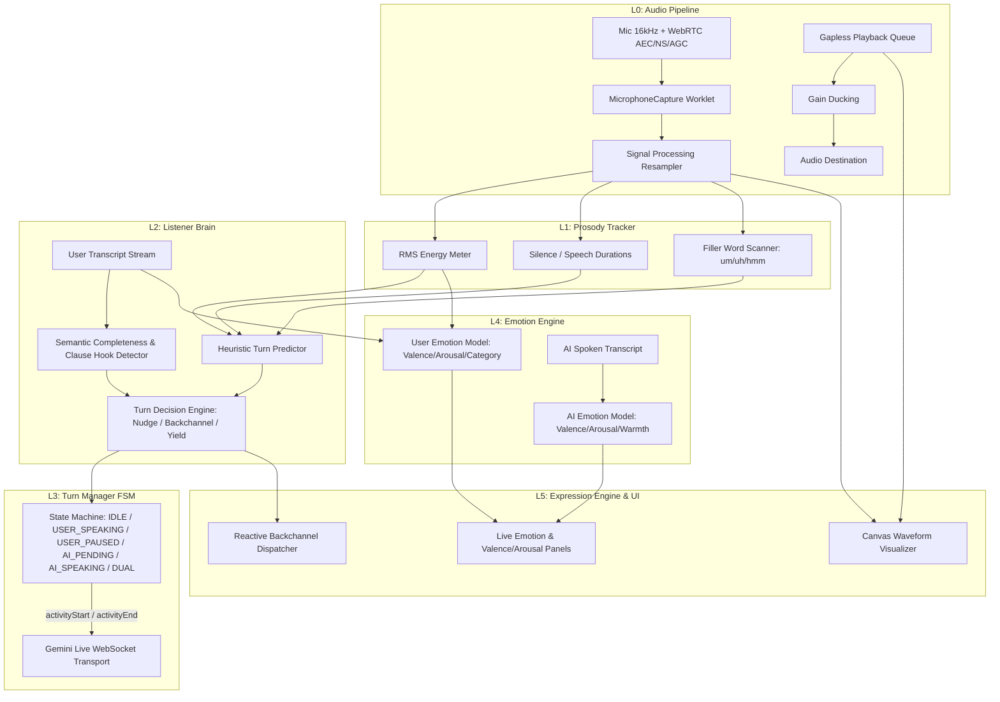

# NeuroDuplex Full-Duplex Voice AI Architecture — Implementation Plan

This plan details the production-grade implementation of the **NeuroDuplex 6-layer conversational voice system** into MindPal, transforming the voice capability into a true full-duplex conversational partner with prosody tracking, intelligent listener brain, turn-taking FSM, bidirectional emotion modeling, reactive backchannels, and a live emotional/waveform UI.

---

## Architectural Overview: 6-Layer Production System



---

## Layer-by-Layer Specifications

### Layer 0: Audio Pipeline Hardening
- **WebRTC Constraints**: Enforce `echoCancellation: true`, `noiseSuppression: true`, `autoGainControl: true`, `channelCount: 1`.
- **Capture**: 16 kHz mono PCM16LE streaming via AudioWorklet with seamless resampling and zero phase drift.
- **Playback**: Gapless 24 kHz audio buffer scheduling with instant barge-in cancellation (`flushPlayback` ramps gain to 0 in 15ms and clears the queue on user interruption).
- **Ducking**: Dynamic gain ducking on output during backchannel playback.

### Layer 1: Prosody & Acoustic Feature Tracker (`prosody_tracker.js`)
- Real-time frame energy and RMS computation in dBFS with exponential moving average.
- Continuous tracking of `silenceMs` and `speechMs`.
- Live filler-burst detector (`um`, `uh`, `hmm`, `err`, `like`, `you know`) indicating user is mid-thought.
- Event emission for acoustic transitions.

### Layer 2: Listener Brain (`listener_brain.js`)
- **Clause Hook & Continuation Analysis**: Detects trailing connectors ("and then", "so then", "because", "i was thinking that", trailing ellipsis/fillers) preventing premature turn interruptions during long stories.
- **Semantic Completeness**: Detects terminal punctuation (`.`, `!`, `?`) and closure phrases ("that's it", "the end", "anyway", "yeah that's all").
- **Tiered Turn-Taking & Nudging**:
  - `silenceMs > 1200ms` mid-story: Emits gentle micro-backchannel ("mm?", "go on", "take your time").
  - `silenceMs > 3500ms`: Emits gentle check ("did you finish, or are you still thinking?").
  - `silenceMs > 750ms` + complete thought: Yields turn to AI (`activityEnd`) for instant response.

### Layer 3: Turn Manager FSM (`turn_manager.js` & `session_orchestrator.js`)
- Full duplex state machine: `IDLE`, `USER_SPEAKING`, `USER_PAUSED`, `AI_PENDING`, `AI_SPEAKING`, `DUAL`.
- Precise coordination of `activityStart` (when user starts speaking) and `activityEnd` (when listener brain decides user finished turn).
- Handles true simultaneous double-talk (`DUAL`) without crashing or dropping connection.

### Layer 4: Bidirectional Emotion Engine (`emotion_engine.js`)
- **User Emotion Model**: Rolling window transcript + acoustic energy analysis evaluating:
  - **Valence** (-1.0 negative to +1.0 positive)
  - **Arousal** (0.0 calm to 1.0 excited/agitated)
  - **Emotion Category** (neutral, happy, excited, empathetic, concerned, frustrated, curious, reflective)
  - **Emoji & Primary Label**
- **AI Emotion Model**: Evaluates AI's expressed conversational tone and mirrors appropriate empathetic warmth.

### Layer 5: Expression Engine & UI Overlay (`expression_engine.js`, `waveform_visualizer.js`, `controller.js`)
- **Reactive Backchannels**: Sub-second empathetic interjections delivered at ducked volume.
- **UI Overlay Overhaul**:
  - Left panel: User emotional state (emoji, label, Valence, Arousal, Voice Energy bars, live prosody metrics).
  - Center panel: Real-time dual-color waveform visualizer (Cyan for User, Magenta for AI, Amber for Dual), live captions, listener brain log.
  - Right panel: AI emotional state & reactive expressions stream.

---

## Proposed Code Changes

### 1. New Feature Modules (`frontend/js/features/voice/`)

#### [NEW] [prosody_tracker.js](file:///e:/Synthos/MindPal/frontend/js/features/voice/capture/prosody_tracker.js)
- Computes RMS, energy averages, tracks speech/silence durations, and identifies spoken filler bursts.

#### [NEW] [listener_brain.js](file:///e:/Synthos/MindPal/frontend/js/features/voice/orchestrator/listener_brain.js)
- Implements heuristic clause hook analysis, thought completeness detection, and intelligent turn-yielding rules.

#### [NEW] [emotion_engine.js](file:///e:/Synthos/MindPal/frontend/js/features/voice/orchestrator/emotion_engine.js)
- Computes user and AI Valence-Arousal coordinates, emotion labels, and emojis.

#### [NEW] [expression_engine.js](file:///e:/Synthos/MindPal/frontend/js/features/voice/orchestrator/expression_engine.js)
- Manages reactive conversational backchannels and speech synthesis ducking.

#### [NEW] [waveform_visualizer.js](file:///e:/Synthos/MindPal/frontend/js/features/voice/ui/waveform_visualizer.js)
- High-performance canvas-based real-time audio waveform visualizer supporting user/AI/dual state color themes.

---

### 2. Modified Existing Modules

#### [MODIFY] [capabilities.js](file:///e:/Synthos/MindPal/frontend/js/features/voice/capture/capabilities.js)
- Ensure WebRTC constraints specify `echoCancellation: true`, `noiseSuppression: true`, `autoGainControl: true`.

#### [MODIFY] [session_orchestrator.js](file:///e:/Synthos/MindPal/frontend/js/features/voice/orchestrator/session_orchestrator.js)
- Integrate `ListenerBrain`, `ProsodyTracker`, `EmotionEngine`, and `ExpressionEngine` into the full-duplex orchestrator lifecycle.
- Implement explicit activity start/end signals with fallback timeout safety.

#### [MODIFY] [server_message_parser.js](file:///e:/Synthos/MindPal/frontend/js/features/voice/protocol/server_message_parser.js)
- Ensure all thinking/reasoning parts are completely filtered from user-facing transcripts.

#### [MODIFY] [protocol_contract.js](file:///e:/Synthos/MindPal/frontend/js/features/voice/protocol/protocol_contract.js)
- Add affective dialogue, manual/automatic VAD toggling, and clean conversational instructions.

#### [MODIFY] [controller.js](file:///e:/Synthos/MindPal/frontend/js/features/voice/ui/controller.js)
- Wire emotion metrics, live prosody statistics, reactive tags, and canvas visualizer into the voice overlay UI.

#### [MODIFY] [index.html](file:///e:/Synthos/MindPal/frontend/index.html)
- Enhance the voice modal markup with side emotional status panels, metric cards, and responsive center visualizer.

---

## Verification Plan

### Automated Tests
- Run full Node.js test suite across all voice layer contracts:
  ```bash
  npm test
  ```
- Run backend pytest suite:
  ```bash
  python -m pytest tests/ -q
  ```
- Add dedicated test suites for the new components:
  - `tests/test_voice_prosody.mjs`
  - `tests/test_listener_brain.mjs`
  - `tests/test_emotion_engine.mjs`

### Manual Verification
1. Open MindPal Voice in browser.
2. Speak continuously with long compound sentences and pause mid-story ("I was thinking about the project, and then... um...") — verify the AI does not interrupt prematurely, holds the turn, and offers subtle backchannels.
3. Finish the story with a clear closing sentence — verify the AI immediately detects turn completion and delivers a natural spoken response.
4. Speak while the AI is responding — verify instant barge-in / interruption (playback flushes immediately, turn flips to user).
5. Verify live User/AI emotional state meters (Valence/Arousal/Energy) and canvas waveform respond in real time.
