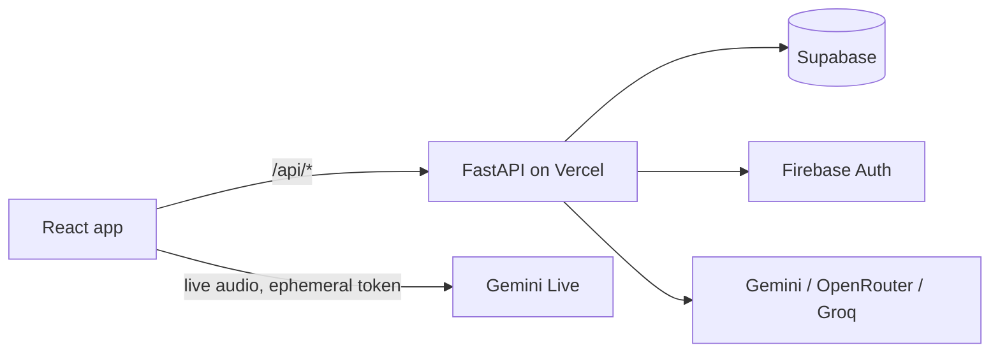

# MindPal

A wellness companion for reflection and emotional support, with text chat,
full-duplex live voice, and memory that adapts to each person. MindPal is not a
crisis line or a clinical service; crisis resources are always one step away.



## Quick start

Python 3.12, Node.js 24.

```bash
python -m venv .venv && .venv/Scripts/python -m pip install -r requirements-dev.lock
npm ci && npm run build
ENVIRONMENT=development MINDPAL_STORAGE_PROVIDER=memory ENABLE_FIREBASE=false \
  .venv/Scripts/python -m uvicorn backend.main:app --port 8765 --reload
```

Tests: `.venv/Scripts/python -m pytest` and `npm test`.

## Documentation

Start at [docs/README.md](docs/README.md): architecture, memory and learning,
live voice, safety, operations, development, and decision records.
