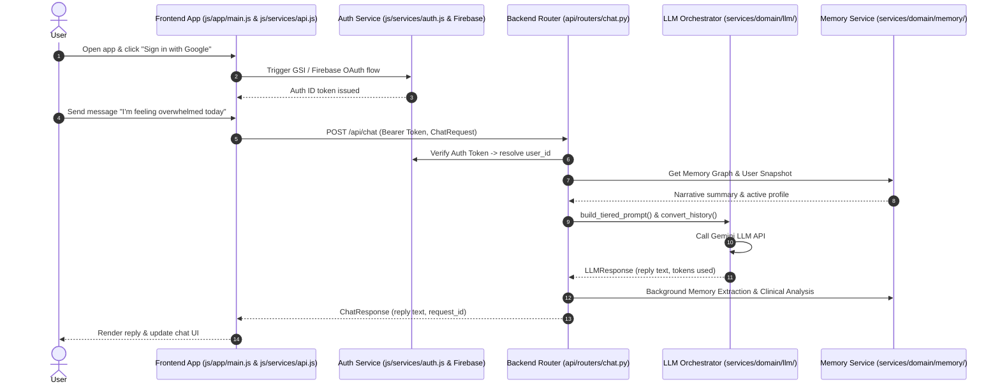

# Core User Journey Trace

## Overview & Sequence Diagram

This document traces the primary user journey end-to-end across both frontend UI and backend services:
`Sign In` -> `Chat Interaction` -> `Clinical Screening` -> `Next Session Continuity`.

---

## Hand-off Protocol Details

1. **Authentication Hand-off**:
   - `frontend/js/services/auth.js` intercepts Google OAuth callback, obtains Firebase JWT, and sets `Authorization: Bearer <token>` on all outbound API requests.
   - `backend/api/dependencies.py` verifies token and populates `request.state.session.user_id_hash`.

2. **Chat Handoff**:
   - `frontend/js/services/api.js` (`sendMessage`) converts user input into `ChatRequest(message=..., history=...)`.
   - Backend `chat.py` router authenticates request, loads user snapshot and memory graph, constructs prompt via `prompt_builder.py`, and calls Gemini provider.

3. **Screening & Memory Handoff**:
   - After responding to chat, backend executes `extract_clinical_inline` and `persist_memory_graph_inline` in the background without delaying response return.
