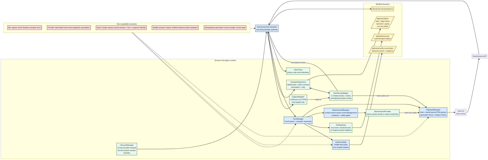

# MindPal Full-Duplex Voice: Target Architecture

**Date:** 2026-08-18
**Target model:** `gemini-2.5-flash-native-audio-preview-12-2025`
**Transport:** Gemini Live API, `v1beta`, direct browser WebSocket with server-issued one-use ephemeral tokens
**Status:** Architecture design; production runtime is not modified by this document

## Purpose

This specification defines the new MindPal Voice architecture for a reliable full-duplex experience without changing the current Gemini model. It explains what full duplex means for MindPal, how audio and semantic turns flow, which components own each responsibility, how tools and evidence behave, and how the current monolithic runtime should be reorganized.

The target is not uncontrolled speech overlap. The target is **simultaneous audio transport with natural interruption, low-latency response, safe playback cancellation, optional non-blocking tools, and strict protection against stale audio or stale facts**.

Google documents Gemini 2.5 Flash Live as a low-latency native-audio Live model with bidirectional audio, automatic VAD, barge-in, function calling, non-blocking functions, scheduling, proactive audio, and affective dialogue.[1] The current MindPal source already targets this model but deliberately disables several capabilities until the exact ephemeral-token transport is validated.[2]

## Executive architecture



The central design change is simple:

> **`VoiceSessionOrchestrator` becomes the only lifecycle and state authority. Every other component either adapts an external system, evaluates a pure policy, or manages one isolated resource.**

The current `runtime.js` combines these responsibilities in one controller with approximately 1,769 lines and roughly 97 state fields.[3] The new design replaces that implicit coordination with explicit event contracts and identity fences.

## What full duplex means in MindPal

Full duplex has three layers. They must be designed separately.

| Layer | Meaning | Target behavior |
| --- | --- | --- |
| **Transport duplex** | Mic audio can be sent while model audio is received | Always-on capture stream while session is active, including during model playback and tool work |
| **Conversation duplex** | User can naturally interrupt the assistant | Provider VAD detects speech, Gemini cancels generation, orchestrator invalidates old playback, user turn takes ownership |
| **Expressive duplex** | The assistant can remain responsive while work continues | Non-blocking tools, idle-scheduled results, optional short acknowledgements, and proactive behavior only after capability validation |

The model should not continue speaking over a user who has clearly started a new turn. Simultaneous transport is required; simultaneous semantic ownership is not. The provider’s `interrupted` event remains the authority for cancelling model generation and browser playback.[1]

## Core invariants

These rules are more important than individual features. They prevent the old failure patterns from returning.

| Invariant | Owner | Consequence |
| --- | --- | --- |
| Microphone capture never finalizes a semantic turn | `CaptureAdapter` and `TurnManager` | Local RMS is a quality signal; provider VAD or explicit hybrid finalization owns turn boundaries |
| Provider interruption owns playback cancellation | `GeminiLiveAdapter` and `PlaybackManager` | Local barge-in state may show intent, but only the provider interruption event flushes model audio |
| The orchestrator is the only lifecycle mutator | `VoiceSessionOrchestrator` | Adapters emit events; they do not directly change session phase |
| Every async artifact carries current identity | `TurnContext` and `ArtifactFence` | Old tool results, evidence, audio, and callbacks become no-ops |
| Volatile facts require verified evidence before audio release | `EvidenceGate` | The model cannot speak a current fact from memory or untrusted browser search |
| Tool trust is structural, not option-based | `ToolGateway` | Browser fallback cannot be accidentally enabled by omitting a call option |
| Playback has an explicit generation | `PlaybackManager` | Old `onended` callbacks cannot affect current playback state |
| Provider session renewal is separate from product call lifetime | `TransportSupervisor` and `LifecycleManager` | A 30-minute MindPal call consists of renewed provider sessions, not one assumed 30-minute socket |
| Internal control messages use a typed command path | `CommandRouter` inside orchestrator | Greetings, evidence, lifecycle, and continuity messages cannot casually collide with user audio |

## Target runtime flow

### 1. Start

The user opens Voice through `voice_live.js`. The UI calls the public `VoiceSession API`, not the internal modules directly. The API creates a new `sessionGeneration` and passes callbacks or an event subscription to the orchestrator.

The orchestrator starts the `CaptureAdapter` first, requests the ephemeral token through `TransportSupervisor`, and opens the Gemini WebSocket. The transport supervisor owns authentication refresh, App Check, one-use token renewal, GoAway handling, resumption, and retry budgets.

The provider adapter sends the setup message containing the model, `AUDIO` response modality, `Kore` voice, automatic VAD, transcription configuration, session resumption handle when available, and the validated capability profile.

When `setupComplete` arrives, the provider adapter emits `provider.ready`. The orchestrator transitions to `LISTENING` and sends the initial greeting through the typed command router.

### 2. Continuous input

The `CaptureAdapter` continuously reads microphone frames through AudioWorklet, with ScriptProcessor as a compatibility fallback. It normalizes frames to raw 16-bit PCM at 16 kHz and sends `audio.in` events to the provider adapter.

The capture adapter may calculate RMS, adaptive noise floor, local speech confidence, and input-device health. It must not decide that a user turn has ended. It must not clear playback. It must not call tools.

The provider adapter sends the PCM to Gemini through `realtimeInput.audio`. Gemini’s automatic VAD determines speech activity, semantic yield, and interruption.

### 3. Model output

Gemini returns normalized provider events. The provider adapter converts raw WebSocket messages into events such as:

```text
provider.ready
provider.input_transcript_delta
provider.output_transcript_delta
provider.audio_chunk
provider.turn_complete
provider.interrupted
provider.tool_call
provider.go_away
provider.error
provider.closed
```

The orchestrator attaches each event to the active session, turn, response, and playback identities. It then forwards valid audio chunks to `PlaybackManager` and transcript deltas to the UI transcript projection.

### 4. Full-duplex interruption

When the user begins speaking while MindPal is speaking, the capture adapter continues sending mic audio. The local UI may display `USER_INTERRUPTING_MODEL`, but it does not stop playback by itself.

Gemini VAD detects the interruption and sends `provider.interrupted`. The orchestrator then:

1. Marks the current model response as interrupted.
2. Increments `playbackGeneration`.
3. Commands `PlaybackManager` to fade and clear only the old generation.
4. Cancels or marks stale tool/evidence work attached to the interrupted response.
5. Creates or continues the new user `TurnContext`.
6. Projects `LISTENING` or `USER_SPEAKING` to the UI.

This makes barge-in deterministic. A delayed audio callback from the old response cannot set the new state back to `speaking`.

### 5. Turn ownership

`TurnManager` owns semantic turn identity. A `TurnContext` is created when provider input transcription establishes a meaningful user turn and is updated as transcription deltas arrive.

```ts
export type TurnContext = {
  sessionGeneration: number;
  turnId: string;
  providerResponseId: string | null;
  topicEpoch: number;
  phase: "user-speaking" | "waiting-yield" | "model-thinking" | "model-speaking" | "interrupted" | "complete";
  userTranscript: string;
  requiresEvidence: boolean;
  evidenceStatus: "not-required" | "pending" | "verified" | "failed";
  activeToolIds: string[];
  playbackGeneration: number;
  createdAt: number;
};
```

The important rule is that the turn ID is created once and passed to all asynchronous work. Query strings and independent counters are not enough to establish ownership.

### 6. Tools

`ToolGateway` exposes three separate classes of tools:

| Tool class | Examples | Execution path |
| --- | --- | --- |
| Local deterministic | `current_time`, date calculation | Browser-local adapter with no network |
| Authenticated backend | profile, memory, recent chat | `/api/tools/execute` with auth and App Check |
| Verified external evidence | current facts and web search | `/api/voice/verify-current-fact`, never browser fallback |

The current model can support non-blocking function calling, but it should only be enabled after the exact MindPal ephemeral-token transport passes a capability probe.[1] [2]

When enabled, tool declarations use scheduling by risk:

| Tool result type | Scheduling |
| --- | --- |
| Silent fact/evidence preparation | `SILENT` |
| Memory/profile lookup | `WHEN_IDLE` |
| Background research | `WHEN_IDLE` |
| Explicit user-requested immediate action | `INTERRUPT` only with a product-specific safety policy |

The model may request a tool, but the gateway and evidence gate decide whether the result can influence spoken output.

### 7. Evidence gate

`EvidenceGate` classifies the active user turn for volatile facts. It can begin a backend verification request as soon as the transcript is sufficiently stable, but it never releases evidence into model input or playback unless:

```text
sessionGeneration == current
turnId == active turn
query matches the active evidence request
provider turn boundary is valid
verification result is authenticated and non-empty
```

If the user interrupts or changes topic, the evidence result is discarded for conversational purposes even if the backend request finishes successfully.

### 8. Playback

`PlaybackManager` receives PCM chunks tagged with `sessionGeneration`, `providerResponseId`, and `playbackGeneration`. It owns decoding, scheduling, gain ramps, analyser connection, speaker mute, and interruption flush.

The queue never directly mutates orchestrator state. Instead, it emits:

```text
playback.started
playback.chunk_scheduled
playback.generation_flushed
playback.generation_ended
playback.device_error
```

When a stale chunk or stale `onended` callback arrives, the playback manager ignores it. The orchestrator derives the user-facing speaking state from events belonging to the current generation only.

### 9. Internal commands

The current runtime sends greetings, local-time results, evidence bridges, session notices, background research, and continuity reseeds through one generic `sendTextToModel()` path. The target architecture uses a typed `CommandRouter`:

```text
command.greeting
command.local_time_result
command.evidence_bridge
command.verified_evidence
command.tool_update
command.session_warning
command.continuity_seed
```

The router maps each command to the correct Gemini transport operation:

| Command | Gemini operation |
| --- | --- |
| Initial greeting | `clientContent` or validated realtime text after setup |
| Normal continuous user audio | `realtimeInput.audio` |
| User text injection | `realtimeInput.text` or 2.5-supported `clientContent`, according to turn state |
| Function result | `toolResponse.functionResponses` |
| Verified evidence | Typed command at a legal turn boundary, attached to active `TurnContext` |
| Reconnect continuity | Initial history/context seed only, not a casual mid-turn text injection |

Because Gemini 2.5 supports incremental `clientContent` more broadly than Gemini 3.1, this capability can be evaluated for deterministic control messages, but all transport behavior must be verified against the actual constrained ephemeral-token endpoint before production use.[1]

### 10. Recovery and session renewal

`TransportSupervisor` owns the provider connection and does not own conversation meaning. It renews one-use credentials for each physical socket, preserves the product call ID, attempts provider resumption once when a valid handle exists, and otherwise requests a continuity reseed.

`LifecycleManager` owns separate clocks:

| Clock | Policy |
| --- | --- |
| Provider socket/session | Renew before provider limit; Google documents audio-only Live sessions as limited to 15 minutes, with session management for extensions.[4] |
| Product call | MindPal maximum 30 minutes |
| User inactivity | Warn after 2 minutes, end after 3 minutes only when genuinely idle |
| Tool/evidence | Per-task timeout and cancellation tied to TurnContext |

Recovery must never create a second active socket, duplicate greetings, or reuse a playback generation from the old provider session.

### 11. Persistence

`SessionPersistence` receives a structured `VoiceSessionClose` object after the orchestrator has stopped all resources:

```ts
export type VoiceSessionClose = {
  sessionId: string;
  reason: "user-stop" | "timeout" | "inactive" | "transport-failure" | "device-ended";
  startedAt: string;
  endedAt: string;
  durationMs: number;
  reconnectCount: number;
  completedTurnCount: number;
  incompleteTurn: boolean;
  userTranscript: string;
  aiTranscript: string;
  incognito: boolean;
};
```

Persistence is no longer an incidental UI callback. It becomes an explicit session boundary with a retryable failure contract.

## Target state machine

```text
IDLE
  -> CONNECTING
  -> LISTENING
  -> USER_SPEAKING
  -> MODEL_THINKING
  -> MODEL_SPEAKING
  -> LISTENING

MODEL_SPEAKING
  -> USER_INTERRUPTING_MODEL
  -> LISTENING

MODEL_THINKING
  -> TOOL_PENDING
  -> MODEL_SPEAKING
  -> LISTENING

ANY_ACTIVE_STATE
  -> RECOVERING
  -> CONNECTING
  -> LISTENING

ANY_ACTIVE_STATE
  -> STOPPING
  -> IDLE
```

Only the orchestrator can perform these transitions. Adapters produce events that the orchestrator accepts or rejects.

## Proposed source tree

The tree below is the target organization. It is intentionally separate from the current files so migration can happen incrementally.

```text
frontend/js/voice/
├── index.js                              # Public VoiceSession API
├── architecture/
│   ├── events.js                         # Normalized event names and constructors
│   ├── commands.js                       # Typed internal command names
│   ├── ids.js                            # session/turn/response/playback IDs
│   ├── invariants.js                     # Runtime assertions and stale checks
│   └── types.js                          # JSDoc/TypeScript-style contracts
├── orchestrator/
│   ├── voice_session_orchestrator.js     # Sole state/lifecycle authority
│   ├── voice_state_reducer.js            # Explicit state transitions
│   ├── command_router.js                 # Typed model/control message routing
│   └── session_snapshot.js               # UI-safe immutable projections
├── capture/
│   ├── capture_adapter.js                # AudioContext and microphone ownership
│   ├── pcm_encoder.js                    # Float32 -> PCM16/base64
│   ├── capture_quality.js                # RMS/noise floor/speech confidence
│   └── pcm_capture_worklet.js            # Existing worklet moved here
├── provider/
│   ├── gemini_live_adapter.js             # Gemini WebSocket adapter
│   ├── gemini_event_normalizer.js        # Raw server messages -> normalized events
│   ├── gemini_setup_builder.js           # Model/VAD/audio/tool setup
│   ├── gemini_capability_profile.js      # Validated 2.5 capability flags
│   └── gemini_transport_contract.js      # Provider contract assertions
├── transport/
│   ├── transport_supervisor.js           # Socket generation and ownership
│   ├── credential_manager.js             # Ephemeral token refresh
│   ├── resumption_manager.js             # GoAway/resume/reseed
│   ├── retry_policy.js                   # Backoff, pause, rate-limit handling
│   └── network_monitor.js                # Browser online/offline signals
├── turns/
│   ├── turn_manager.js                   # TurnContext lifecycle
│   ├── turn_classifier.js                # Volatile fact/local-time classification
│   ├── interruption_manager.js           # Barge-in and supersession
│   └── continuity_ledger.js              # Bounded continuity snapshot
├── tools/
│   ├── tool_gateway.js                   # Structural tool trust boundary
│   ├── local_tool_gateway.js             # current_time/date calculation
│   ├── backend_tool_gateway.js           # Authenticated /tools/execute
│   ├── verified_fact_gateway.js          # Authenticated fact verification
│   ├── tool_scheduler.js                 # WHEN_IDLE/SILENT policy
│   └── tool_contracts.js                 # Validated tool schemas
├── evidence/
│   ├── evidence_gate.js                  # Turn-scoped freshness gate
│   ├── volatile_fact_policy.js           # Current-fact classifier
│   └── evidence_lifecycle.js             # Pending/verified/failed/cancelled
├── playback/
│   ├── playback_manager.js               # Queue and generation fencing
│   ├── pcm_decoder.js                    # Base64 PCM -> AudioBuffer
│   ├── playback_generation.js            # Current response identity
│   └── audio_output_graph.js             # Compressor/analyser/gain/speaker
├── lifecycle/
│   ├── lifecycle_manager.js              # Product and inactivity clocks
│   ├── session_limits.js                 # 30-min product / provider renewal
│   └── close_reasons.js                  # Structured shutdown reasons
├── observability/
│   ├── voice_trace.js                    # Privacy-safe event trace
│   ├── metrics.js                        # Latency/drop/interruption counters
│   └── diagnostics.js                    # Transport close metadata
└── compatibility/
    ├── legacy_runtime_bridge.js          # Temporary adapter to old runtime
    └── migration_flags.js                # Rollout and rollback controls

backend/
├── api/
│   ├── voice_router.py                   # Existing token/fact/diagnostic routes
│   └── voice_capabilities_router.py      # Capability probe and profile endpoint
├── voice/
│   ├── token_service.py                  # Ephemeral token lifecycle
│   ├── capability_registry.py            # Model/transport capability profiles
│   ├── evidence_service.py               # Verified fact orchestration
│   └── session_diagnostics.py            # Structured server-side diagnostics
└── tools/
    └── voice_tool_policy.py              # Voice-specific backend tool rules

tests/voice/
├── unit/
│   ├── test_turn_manager.mjs
│   ├── test_playback_generation.mjs
│   ├── test_evidence_gate.mjs
│   ├── test_tool_gateway.mjs
│   └── test_recovery_policy.mjs
├── contract/
│   ├── test_gemini_setup_contract.mjs
│   ├── test_provider_event_normalizer.mjs
│   └── test_ephemeral_token_contract.py
├── integration/
│   ├── test_full_duplex_trace.mjs
│   ├── test_barge_in_trace.mjs
│   ├── test_tool_while_speaking_trace.mjs
│   ├── test_evidence_supersession_trace.mjs
│   └── test_reconnect_continuity_trace.mjs
└── fixtures/
    ├── provider_events/
    ├── audio_timing/
    └── capability_probe/
```

## Module ownership table

| Module | Owns | Must never do |
| --- | --- | --- |
| `CaptureAdapter` | Mic permission, audio frames, device state, local quality | Decide semantic yield, call tools, clear playback |
| `GeminiLiveAdapter` | Provider WebSocket, setup, raw event parsing | Mutate UI state or decide product policy |
| `TransportSupervisor` | Token renewal, socket generation, resume/retry | Interpret user meaning or release evidence |
| `TurnManager` | Turn IDs, semantic ownership, supersession | Decode audio or perform network calls |
| `EvidenceGate` | Volatile-fact verification and release | Trust model memory or browser search |
| `ToolGateway` | Tool classification, execution, scheduling | Let arbitrary callers enable unsafe fallback |
| `PlaybackManager` | Audio decode, queue, fade, flush, generation | Decide whether a fact is true |
| `LifecycleManager` | Product limits, provider renewal deadlines, inactivity | End a busy conversation based only on silence |
| `SessionPersistence` | Structured close and retryable persistence | Own live playback or provider transport |
| `VoiceTrace` | Privacy-safe event timing and counters | Store raw audio or unrestricted transcript content |

## Feature set of the new architecture

### Reliable barge-in

The user can interrupt naturally. Microphone capture remains continuous, Gemini VAD detects the new speech, the provider cancels generation, and `PlaybackManager` clears only the interrupted response generation.

### Low-latency simultaneous transport

Input audio and output audio flow concurrently over the same Live session. The backend is not placed in the audio hot path; it is used for ephemeral credentials, tools, evidence, and persistence.

### Non-blocking tools

After the exact transport is validated, Gemini 2.5 provider functions can run with `NON_BLOCKING`. MindPal continues the conversational stream while low-risk tools run and schedules results for idle delivery.

### Safe current facts

Current public facts are verified through the authenticated backend evidence route. A search result can never speak into a newer turn, and no browser-side search fallback can satisfy the evidence gate.

### Stale-output prevention

Every audio chunk, tool result, evidence response, and reconnect callback is checked against current session, turn, provider response, and playback generation identities.

### Reconnect continuity

Provider session renewal is transparent to the product call. The orchestrator preserves the call identity and continuity snapshot while the transport supervisor refreshes one-use credentials and resumes or reseeds the provider session.

### Multilingual voice behavior

The native-audio model can naturally switch languages, while MindPal’s conversation policy continues to control language matching, safety, and response style. Explicit translation behavior should remain a separate mode using the translation-specialized model, not the main assistant path.[5]

### Explainable observability

The system records privacy-safe traces such as `turn_id`, event type, latency, tool status, interruption count, reconnect count, and playback generation. It does not store raw audio by default.

## Migration plan

### Stage 0: capability and contract lock

Before changing behavior, confirm the exact production model ID and run a capability probe for Gemini 2.5 native audio on the current ephemeral-token WebSocket. Test continuous input, barge-in, non-blocking tools, `WHEN_IDLE`, `SILENT`, proactive setup, affective setup, and reconnect/resumption.

**Exit condition:** capability profile is stored and the production setup only sends fields proven valid for the exact transport.

### Stage 1: identity fencing inside the existing runtime

Add `sessionGeneration`, `turnId`, `providerResponseId`, and `playbackGeneration` to the current runtime without moving files yet. Reject stale audio, evidence, tool, and reconnect results.

**Exit condition:** stale-result tests pass without changing the visible product flow.

### Stage 2: extract PlaybackManager

Move PCM decoding, scheduling, gain ramps, fade, flush, and active-source tracking out of `runtime.js`.

**Exit condition:** interruption and reconnect traces show no old audio or stale `onended` state mutation.

### Stage 3: extract TransportSupervisor and GeminiLiveAdapter

Move WebSocket creation, setup, raw event parsing, token renewal, GoAway, retry, and resumption into provider/transport modules.

**Exit condition:** the orchestrator receives only normalized provider events and contains no provider-specific socket code.

### Stage 4: extract TurnManager, EvidenceGate, and ToolGateway

Move semantic turn state, fact verification, background research, and tool trust boundaries into their own modules. Remove the generic browser-fallback option from the active voice path.

**Exit condition:** every async result is turn-scoped and current-fact audio is impossible without verified evidence.

### Stage 5: enable Gemini 2.5 duplex features incrementally

Enable provider functions first for harmless tools, then non-blocking scheduling, then affective dialog and proactive audio only if the capability probe proves the exact transport stable.

**Exit condition:** full-duplex trace tests pass for long speech, interruption, tool work while speaking, evidence failure, and reconnect.

### Stage 6: remove legacy runtime bridge

Once the new orchestrator owns all production traffic, delete or archive the old monolithic runtime and update documentation so only one model and one architecture are described.

## Test scenarios required before production rollout

| Scenario | Expected behavior |
| --- | --- |
| User speaks for 90 seconds | Mic stream remains active; no false inactivity; no fake repeated acknowledgements |
| User interrupts 30-second model response | Provider interruption arrives; old playback generation fades and stops; next turn owns the UI |
| Tool runs while user continues speaking | Audio transport remains duplex; tool result does not cut off the user |
| Tool result arrives while model is speaking | `WHEN_IDLE` result waits safely; no stale response overlaps the active turn |
| Current-fact question with successful verification | No speculative fact audio; verified answer speaks only for the active turn |
| Current-fact question followed by topic change | Old evidence is discarded; it cannot speak into the new topic |
| GoAway during playback | New token/socket resumes or reseeds; no duplicate greeting; old playback generation is invalid |
| Mic device ends | Structured device-ended close reason; UI can offer retry without corrupting state |
| 15-minute provider renewal | Product call continues through a new provider session with continuity intact |
| 30-minute product limit | Product session ends cleanly regardless of transport renewals |
| Incognito call | No transcript persistence, while transport cleanup still completes |

## Final design decision

MindPal should keep **Gemini 2.5 Flash Native Audio** and reorganize the browser Voice system around a single orchestrator plus isolated adapters and managers. The model already provides the right foundation. The current weaknesses are caused by hidden concurrency, shared mutable state, mixed trust boundaries, and playback/recovery logic living in one runtime.

The new architecture makes full duplex safe by separating two ideas that are currently mixed together:

- **Audio may flow in both directions continuously.**
- **Only one current semantic response and one current playback generation may own the conversation.**

That separation gives MindPal the natural behavior of full-duplex voice without allowing stale model audio, stale tools, stale evidence, or reconnect events to corrupt a newer turn.

## Advanced listening presence: context-aware backchannels

The advanced duplex experience must not leave MindPal silent while the user tells a long story. During a meaningful uninterrupted story, MindPal should communicate that it is following the user through sparse, short, context-aware acknowledgements such as “yeah,” “I hear you,” “mm-hm,” “that makes sense,” “go on,” or “I feel you.”

This requires a dedicated **`BackchannelManager`**. It must not be implemented as a timer that randomly says “uh-huh,” and it must not inject a full conversational turn every few seconds. The assistant must remain primarily a listener until the user yields.

### What the backchannel manager does

`BackchannelManager` receives provider input-transcription deltas, local speech-quality signals, current `TurnContext`, language, topic/emotion hints, and the time since the last acknowledgement. It produces one of three decisions:

```text
NO_BACKCHANNEL
SHORT_BACKCHANNEL
FULL_RESPONSE_AFTER_YIELD
```

A short backchannel is a micro-response, normally less than 1.2 seconds, that acknowledges the user without taking ownership of the turn. The manager must attach every backchannel to the current `turnId` and `playbackGeneration`.

| Context | Possible acknowledgement style | Never do |
| --- | --- | --- |
| User is explaining a long event | “mm-hm,” “go on,” “I’m with you” | Interrupt the story with analysis |
| User expresses sadness or pain | “I hear you,” “that sounds really hard” | Diagnose or escalate without evidence |
| User is angry or frustrated | “yeah, I get why that upset you” | Mirror aggression or intensify conflict |
| User is describing a complex decision | “I’m following,” “keep going” | Jump to advice before the dilemma is complete |
| User pauses briefly while continuing | “mm-hm” or silence | Treat a short pause as a finished turn |
| User appears to have yielded | No backchannel; allow the main response | Add a filler before the answer |

### The timing policy

Backchannels should be sparse and rhythmically natural. The manager should require all of the following before emitting one:

| Gate | Purpose |
| --- | --- |
| The user has spoken continuously for a minimum interval, initially 8–12 seconds | Avoid reacting to every short sentence |
| A stable input-transcription or semantic chunk has arrived | Avoid guessing from raw microphone energy |
| The user is not in a safety-critical or current-fact gate | Avoid delaying or confusing safety/evidence handling |
| The provider has not already started a full model response | Avoid competing with the main answer |
| At least 5–8 seconds have passed since the last backchannel | Prevent repetitive filler speech |
| The current audio output queue is empty or contains only a short backchannel | Prevent overlap with the user and main response |
| The current turn has not been interrupted or superseded | Reject stale acknowledgements |

The timing values are starting defaults, not universal truths. They should be tuned from real conversation traces. The system should prefer one well-timed acknowledgement over many frequent ones.

### How context is selected

The backchannel manager should not send raw transcript text to a generic phrase selector without state. It should receive a compact, structured context:

```ts
export type BackchannelContext = {
  turnId: string;
  sessionGeneration: number;
  language: "en" | "ar" | "auto" | string;
  topic: "story" | "sadness" | "anger" | "decision" | "achievement" | "neutral";
  emotion: "neutral" | "sad" | "frustrated" | "anxious" | "excited" | "overwhelmed";
  speechDurationMs: number;
  pauseDurationMs: number;
  transcriptConfidence: number;
  lastMeaningfulChunk: string;
  lastBackchannelAt: number;
  userHasYielded: boolean;
  safetyGate: "none" | "crisis" | "medical" | "current-fact";
};
```

The context classifier should be conservative. For example, a user telling a detailed business story should receive attentive acknowledgements, not a productivity answer. A user expressing self-harm risk should enter the existing direct safety path and should not receive a casual “mm-hm” filler.

## How Gemini 2.5 participates in backchannels

Gemini 2.5 supports native audio, automatic VAD, function calling, proactive audio, and affective dialogue.[1] However, Google’s documented `proactive audio` behavior means the model can decide whether to respond; it is not a dedicated guaranteed “backchannel now” API. The exact current ephemeral-token transport must therefore be probed before MindPal enables proactive or affective configuration.[2]

The recommended implementation has two stages.

### Stage A: same-session model backchannels

First, test a same-session approach on the current Gemini 2.5 Live connection. The model setup prompt explicitly defines a listening mode:

```text
When the user is telling a long story, keep listening until they yield.
You may produce one very short, natural acknowledgement only when there is a
safe conversational opening. Use the user's language. Prefer “mm-hm”, “yeah,
I'm with you”, “I hear you”, or “go on”. Never begin analysis, advice, or a
long answer while the user is still speaking. Never acknowledge more often
than once every several seconds. Never use a backchannel during crisis,
medical, or current-fact verification handling.
```

MindPal then enables `proactive_audio` and, if appropriate, `enable_affective_dialog` only in the capability probe. The provider remains responsible for deciding whether the model can safely speak without interrupting the user.

**Risk:** an internal prompt or `realtimeInput.text` can accidentally become a normal model turn. Same-session backchannels are therefore convenient but must be tested carefully. They should be enabled only after the provider probe demonstrates that the model can produce a micro-acknowledgement and return to listening without starting a full response.

### Stage B: orchestrated backchannel lane using the same model

If the same-session approach is unstable, use the same Gemini 2.5 model in a separate, tightly constrained backchannel lane. This is not a model change; it is a separate use of the same model profile.

```text
Main Gemini Live session:
  continuous user audio -> semantic conversation -> full answer audio

Backchannel Gemini Live session:
  compact transcript/context -> one short acknowledgement audio -> close/idle
```

The backchannel lane must be constrained to a tiny response contract: one short acknowledgement, no advice, no questions, no tools, no fact claims, no safety response, and a maximum output duration. Its audio is mixed through `PlaybackManager` at a lower gain and is cancelled immediately if the main provider emits `interrupted`, the user resumes strong speech, or the turn changes.

This lane provides stronger application control, but it adds latency, cost, a second provider session, and another recovery path. It should be a fallback or an experiment, not the first production implementation.

### Recommended decision

Use this order:

1. Keep continuous duplex audio and provider-owned barge-in as the foundation.
2. Implement `BackchannelManager` and test same-session Gemini 2.5 listening behavior with proactive/affective capability flags disabled first.
3. Probe same-session `proactive_audio` and `enable_affective_dialog` on the exact ephemeral-token transport.
4. Use a separate same-model backchannel lane only if the provider cannot reliably produce short acknowledgements inside the main session.
5. Keep a deterministic local fallback vocabulary only as a last-resort degraded mode, never as the primary “intelligent” behavior.

## Backchannel audio mixing and interruption

`PlaybackManager` gains a second priority class:

| Audio class | Priority | Queue rule |
| --- | --- | --- |
| Main response | Highest | Normal response generation and complete answer |
| Backchannel | Low | At most one short clip; cancellable; never delays main response |
| System cue | Reserved | Only safety, reconnect, or user-visible lifecycle cues |

Backchannel audio should be mixed softly, with a short fade-in and fade-out. It must never be appended behind a long main response queue. If the user speaks while a backchannel is playing, the backchannel is flushed immediately. If a main response begins, the backchannel is discarded.

The playback identity becomes:

```text
sessionGeneration
turnId
providerResponseId
playbackGeneration
audioClass: main | backchannel | system
```

A stale backchannel is therefore rejected exactly like stale main audio.

## Backchannel failure behavior

A failed or slow backchannel must be invisible to the user. The main conversation must not wait for it, and a backchannel timeout must never trigger reconnect or end the call.

| Failure | Required behavior |
| --- | --- |
| Backchannel generation slow | Cancel or skip; continue listening |
| Backchannel provider error | Disable backchannels for the current turn; keep main session alive |
| Main model starts responding | Cancel queued backchannel immediately |
| User resumes strong speech | Fade/flush backchannel immediately |
| Topic changes | Invalidate all pending backchannels from old turn |
| Crisis or medical signal | Suppress casual backchannels and follow the safety policy |
| Current-fact verification | Suppress casual backchannels until the evidence path is resolved |

## Additional target files

Add these files to the proposed tree:

```text
frontend/js/voice/
├── backchannel/
│   ├── backchannel_manager.js          # Decides whether and when to acknowledge
│   ├── backchannel_policy.js           # Timing, topic, safety, and cooldown rules
│   ├── backchannel_context.js          # Compact structured listening context
│   ├── backchannel_provider.js         # Same-session Gemini or optional same-model lane
│   ├── backchannel_mixer.js            # Low-priority cancellable audio mixing
│   └── backchannel_templates.js        # Language/register-safe fallback phrases
└── playback/
    ├── playback_manager.js             # Main and backchannel audio classes
    └── playback_generation.js          # Generation and stale-audio fencing
```

## Acceptance tests for advanced listening

| Scenario | Expected behavior |
| --- | --- |
| User tells a 60-second story | One or two context-appropriate acknowledgements; no full answer before yield |
| User speaks rapidly without a safe pause | No interruption; backchannel may be skipped |
| User pauses for 400 ms mid-sentence | No “are you finished?” and no full response |
| User says something sad | Brief empathic acknowledgement, then continued listening |
| User changes topic after a backchannel is scheduled | Old backchannel is discarded |
| User interrupts a backchannel | Audio fades immediately; new user turn owns playback |
| Main response begins while backchannel is queued | Backchannel is cancelled; main response wins |
| Crisis language appears | Casual acknowledgement is suppressed; safety policy takes control |
| Arabic or multilingual story | Backchannel matches the detected language/register; no English filler leakage |
| Provider backchannel capability fails | Main duplex conversation remains fully functional, but backchannels degrade silently |

The final full-duplex experience should feel like a thoughtful human listener: present, responsive, and emotionally aware, but not constantly interrupting. The defining quality is not the number of “yeah” sounds; it is the **timing, relevance, restraint, and immediate cancellation when the user takes the floor**.

## Human-style thinking and progress cues

Listening backchannels solve presence while the user is speaking. A second layer is required when MindPal needs time to think, search, look up memory, calculate, or verify something. In those moments, a silent gap feels broken and a technical label feels robotic. MindPal should produce a short, natural **response-staging cue** before the real answer when the operation is expected to take long enough to be noticeable.

This layer is called `ResponseStagingManager`. It does not expose internal process names. It converts an operation into a human conversational intention:

| Internal situation | Natural cue examples | Forbidden wording |
| --- | --- | --- |
| Complex reasoning | “Let me think about that for a moment.” / “I want to give that a proper thought.” | “I am running inference.” |
| Current-fact verification | “Give me a second—I’m checking that properly.” | “I am calling web_search.” |
| Memory lookup | “Let me look back at what I remember about that.” | “I am querying your memory database.” |
| Calculation | “Let me work that out carefully.” | “Executing calculator tool.” |
| Background research | “I’m going to check a couple of details before I answer.” | “Background task started.” |
| Safety-sensitive interpretation | “I want to respond carefully to what you just said.” | “Safety classifier activated.” |
| Reconnect/continuity | “I’m still with you—give me a second.” | “WebSocket reconnecting.” |

The cue must be spoken only when it serves the user. If the operation finishes quickly, MindPal should skip the cue and answer immediately. A cue is not permission to stall, and it must never become a repeated filler.

### Response-staging states

`ResponseStagingManager` adds four explicit states between listening and answering:

```text
READY_TO_ANSWER
THINKING_CUE_PENDING
THINKING_CUE_PLAYING
OPERATION_IN_PROGRESS
ANSWER_RELEASED
```

The actual flow is:

```text
User yields
  -> classify response need
  -> if immediate: answer directly
  -> if operation expected to take time: play one human cue
  -> perform or await operation
  -> validate result against current TurnContext
  -> answer naturally from the result
```

The cue and the answer are separate response artifacts. If the user interrupts the cue or changes topic, the operation and cue are cancelled or marked stale, and no old answer is released.

### Timing rules

| Rule | Starting value | Purpose |
| --- | ---: | --- |
| Do not cue for fast operations | Skip if expected/observed latency is below 400–600 ms | Avoid unnecessary filler |
| Cue maximum duration | 1.5 seconds | Preserve conversational rhythm |
| One cue per operation | Exactly one | Prevent “let me think” loops |
| Research/check cue delay | 500–800 ms after operation begins | Avoid announcing trivial waits |
| Maximum silent wait after cue | Operation-specific, normally 8–12 seconds | If exceeded, give one concise truthful update |
| Cue cancellation | Immediate on user interruption or topic supersession | User always regains the floor |

The latency thresholds should be tuned using actual Voice traces. The first production version should err toward **fewer cues**, because an unnecessary acknowledgement is less damaging than a constant stream of artificial filler.

### How the model and application divide the work

The model should choose the human wording and emotional register, but the application should decide whether a cue is allowed. This prevents the model from announcing every hidden operation.

The application emits a structured event:

```ts
export type ResponseStageRequest = {
  sessionGeneration: number;
  turnId: string;
  operationId: string;
  kind: "reasoning" | "current-fact" | "memory" | "calculation" | "research" | "safety-careful" | "reconnect";
  expectedLatencyMs: number;
  language: string;
  emotion: string;
  alreadyAcknowledged: boolean;
};
```

`ResponseStagingManager` checks the event against the active turn and chooses a cue intent. The `CommandRouter` then asks the Gemini 2.5 Live session for one short audio cue, or uses a validated same-model backchannel lane if the main session cannot safely produce a cue without taking a full turn.

The prompt contract for a thinking cue is:

```text
Speak one short, natural sentence that tells the user you are thinking,
checking, remembering, or working something out. Do not mention tools,
search, APIs, databases, prompts, providers, or internal systems. Do not answer
the question yet. Do not ask a new question. After this sentence, continue the
same active turn and give the complete answer when the operation is ready.
```

### Tool-specific behavior

The cue must match the operation. A current-fact search should sound like careful verification, not generic thinking. A memory lookup should sound like recollection. A hard reasoning task should sound reflective. The system must not say “I’m searching” when the user did not ask for a search, and it must never claim that a check succeeded until the evidence actually returns.

When Gemini 2.5 non-blocking function calling is enabled, a tool may run while the conversation remains alive. The model may produce a cue at the start of the operation, while the tool result is scheduled with `WHEN_IDLE` or `SILENT` according to risk. The application still owns the evidence gate and current-turn identity.[1]

| Operation | Cue policy | Result policy |
| --- | --- | --- |
| Memory/profile lookup | One recollection cue only if slow | Deliver when idle; do not interrupt user |
| Calculation | Usually no cue for simple arithmetic; one thinking cue for complex calculation | Answer from exact result |
| Current-fact verification | One verification cue if needed | `SILENT` until authenticated evidence is ready; never answer from memory |
| Background research | One “checking a couple of details” cue | `WHEN_IDLE`, discard if topic changes |
| Safety-sensitive interpretation | One careful-response cue only if it improves clarity | Safety policy owns final response; no casual backchannel |
| Reconnect | One continuity cue only if the user would otherwise perceive a long silence | Never expose transport details |

### New response-staging files

Add this layer to the organized source tree:

```text
frontend/js/voice/
├── staging/
│   ├── response_staging_manager.js   # Turns operations into human cue intents
│   ├── staging_policy.js              # Latency, cooldown, safety, and turn rules
│   ├── staging_context.js             # Language, emotion, topic, and operation context
│   ├── staging_command_router.js      # Maps cue intent to Gemini/provider command
│   ├── staging_templates.js           # Natural multilingual cue families
│   └── operation_tracker.js            # Pending operation timing and cancellation
└── backchannel/
    ├── backchannel_manager.js         # Listening acknowledgements
    └── backchannel_provider.js        # Same-session or same-model cue audio
```

`BackchannelManager` handles “I’m with you” while the user is speaking. `ResponseStagingManager` handles “let me think/check/look that up” after the user yields or when an operation begins. They share the same `PlaybackManager`, `TurnContext`, safety gates, and generation fences, but they have different timing policies.

### Acceptance tests for thinking cues

| Scenario | Expected behavior |
| --- | --- |
| User asks a simple question | No artificial thinking cue; answer directly |
| User asks a complex personal dilemma | One short reflection cue, then a specific answer |
| Memory lookup returns quickly | No cue or a barely perceptible natural transition; no unnecessary filler |
| Memory lookup is slow | “Let me look back at what I remember…” once, then answer |
| Current-fact search | “Give me a second—I’m checking that properly,” then verified answer or transparent failure |
| Calculation | “Let me work that out carefully,” only when calculation latency warrants it |
| Tool result arrives while user resumes speaking | Cue/result is delayed or cancelled; user owns the floor |
| Search fails | No claim that verification succeeded; concise truthful failure |
| User interrupts the thinking cue | Cue fades immediately; operation is cancelled or marked stale |
| Operation exceeds expected wait | One concise progress update, never repeated looped filler |
| Arabic or multilingual conversation | Cue matches language and register; no English process leakage |
| Crisis language | No casual thinking filler; direct safety response takes priority |

The advanced duplex target is therefore not only “audio in both directions.” It is a staged human interaction: **listen with presence, signal thoughtful attention when needed, perform the work invisibly, then answer with substance**. The user should feel accompanied through the reasoning without being exposed to implementation details.

## References

[1]: https://ai.google.dev/gemini-api/docs/live-api/capabilities "Gemini Live API capabilities guide"
[2]: ../../frontend/js/voice/provider_policy.js "MindPal current Gemini provider capability policy"
[3]: ../../frontend/js/voice/runtime.js "MindPal current monolithic Voice runtime"
[4]: https://ai.google.dev/gemini-api/docs/live-api/capabilities "Gemini Live API session duration and VAD constraints"
[5]: https://ai.google.dev/gemini-api/docs/live-api/live-translate "Gemini Live Translation guide"
[6]: https://ai.google.dev/gemini-api/docs/models/gemini-2.5-flash-native-audio-preview-12-2025 "Gemini 2.5 Flash Native Audio model page"
