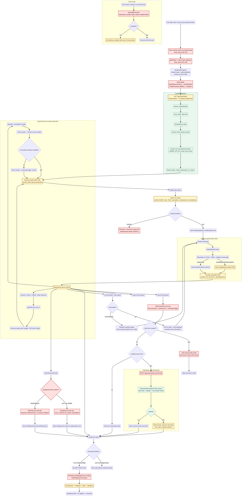
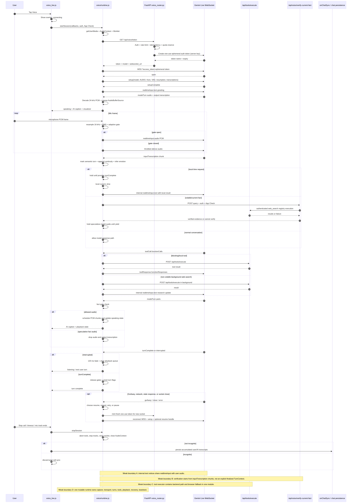

# MindPal Voice: Current End-to-End Pipeline and Weak-Area Analysis

**Date:** 2026-08-18
**Repository:** `M1rw/MindPal`
**Audited commit:** `133ffc8`
**Author:** Manus AI

## Purpose and scope

This report traces the current Voice pipeline from the user-facing browser action to microphone capture, backend authentication and token issuance, Gemini Live transport, provider VAD and transcription, tool/evidence branches, audio playback, interruption, reconnect, teardown, and post-call persistence. It also identifies where the pipeline becomes weak, ambiguous, duplicated, or difficult to verify.

The primary scope is the **active native-audio Live path**. The Camb/browser TTS subsystem is analyzed separately because it is not the main microphone-to-Live response path. The report reflects the current source code at the audited commit; historical Voice documents are treated as context only, because several of them describe older provider configurations.

> **Assumption:** “Voice pipeline” means the authenticated Live call path plus its tool, evidence, recovery, and persistence branches. It does not mean only the visual overlay or only backend TTS synthesis.

## Executive finding

The current pipeline is functional and has several strong controls, but it is not a clean pipeline in the architectural sense. It is a **large asynchronous runtime with many branches that all mutate the same session state**. The source contains a coherent intended design, yet the actual execution authority remains concentrated in `frontend/js/voice/runtime.js`.

The most important weaknesses are concentrated at four boundaries:

| Boundary | What currently happens | Why it is weak |
| --- | --- | --- |
| **UI → runtime** | `voice_live.js` passes callbacks, auth tokens, context, and UI handlers into a singleton runtime | UI lifecycle, persistence, and runtime lifecycle are coupled through callbacks and shared module state |
| **Audio/VAD → semantic turn** | Local RMS/noise gating and provider VAD both influence turn-related state | There is no explicit finalized turn object; chunks, timers, provider events, and internal notices share one runtime |
| **Runtime → tools/evidence** | The same runtime decides local time, blocking tools, background search, and current-fact verification | Trust and freshness decisions are distributed across frontend policy, tool executor, and backend routes |
| **Provider events → playback/recovery** | One handler processes setup, errors, transcripts, model audio, tool calls, turn completion, and reconnect signals | Playback generations, socket generations, turn epochs, and evidence flags can interact without one authoritative state machine |

## Current-state diagrams

The following diagrams were generated from the source-traced flow and visually verified after rendering.

### Control-flow view



This view is best for understanding the branches and weak areas across capture, evidence, tools, playback, and recovery.

### Chronological sequence view



This view is best for seeing which component calls which other component over time.

## Pipeline in one sentence

`voice_live.js` opens the overlay and obtains Firebase credentials, `voice/runtime.js` creates the microphone/audio graph and requests an ephemeral Live token from FastAPI, the browser opens a provider WebSocket and sends a setup message, microphone PCM is locally gated and forwarded to provider VAD, provider events are interpreted by the same runtime, current-fact questions branch to an authenticated backend verifier, model PCM is queued into Web Audio for playback, and stop/recovery paths clean up or reconnect before optional transcript persistence.

## Detailed pipeline: front to back and back to front

### 1. User action and UI initialization

The user-facing entry point is `startLiveVoice()` in `frontend/js/voice_live.js`. It prevents duplicate starts, clears local transcript accumulators, opens the overlay, sets the visual phase to `connecting`, and retrieves the Firebase ID token.[1]

The UI then calls `startSession()` in the compatibility facade `frontend/js/voice_session.js`. The facade does not implement session behavior; it forwards to a single controller created by `createVoiceSessionController()` in `frontend/js/voice/runtime.js`.[2]

| Input from UI | Passed into runtime |
| --- | --- |
| Conversation context | `contextProvider` |
| Transcript callback | `onTranscript` |
| UI state callback | `onAudioState` |
| Session-end callback | `onSessionEnd` |
| Turn-complete callback | `onTurnComplete` |
| Background-task callback | `onBackgroundTask` |
| Authentication | Firebase ID token and refresh callback |
| Abuse protection | App Check token and refresh callback |

**Weak area A — callback boundary:** the UI does not receive a typed session event stream. It receives several callbacks whose ordering and payload semantics are defined implicitly by runtime behavior. This makes it difficult to guarantee that a late callback cannot update a closed overlay or that a post-call sync cannot race with cleanup.

### 2. Microphone permission and browser audio graph

The runtime deliberately asks for microphone permission before requesting the provider token. This avoids consuming the short new-session window while the user is still responding to a browser permission dialog.[3]

`setupAudioCapture()` creates an `AudioContext` with interactive latency, requests a mono microphone stream with echo cancellation and noise suppression, and optionally requests `voiceIsolation` if the browser advertises it. A microphone track ending unexpectedly stops the whole session.[3]

The capture graph is:

```text
MediaStream
  -> MediaStreamSource
     -> Mic Analyser
     -> AudioWorklet PCM processor
        -> capture sink with zero gain
     -> ScriptProcessor fallback when AudioWorklet fails
```

The output graph is created in the same function:

```text
Provider PCM chunks
  -> AudioBufferSource nodes
     -> per-chunk GainNode
        -> DynamicsCompressor
           -> AI Analyser
              -> Output Gain
                 -> Speakers
```

**Weak area B — capture and playback co-location:** microphone capture and speaker playback are created and destroyed by the same runtime function. This is practical, but it means browser audio failures, playback cleanup, and provider transport all share one lifecycle owner. A device-track failure can therefore terminate a session rather than transition it into a recoverable audio-device state.

**Weak area C — fallback capture semantics:** ScriptProcessor is a compatibility fallback, but the runtime does not expose a normalized capture-quality or latency signal to the rest of the system. The model sees a pipeline that may have materially different frame timing depending on browser support, while policy and diagnostics treat both capture paths as equivalent.

### 3. Backend token request

After the audio graph is ready, the runtime calls `refreshVoiceCredentials()`, which calls `fetchVoiceTokenWithRetry()` against `GET /api/voice/token`.[4]

The browser request can include:

```text
Authorization: Bearer <Firebase ID token>
X-Firebase-AppCheck: <App Check token>
Cache-Control: no-store
credentials: omit
```

The backend route performs the following sequence:[5]

| Order | Backend action | Failure behavior |
| --- | --- | --- |
| 1 | Assert authenticated context | Reject unauthenticated callers |
| 2 | Consume voice-token rate limit | Return rate-limit error |
| 3 | Claim idempotency key | Prevent replay of a completed token request |
| 4 | Reserve voice-session quota | Refund on later failure |
| 5 | Read server-side Gemini API key | Return service-unavailable if absent |
| 6 | Compute token and new-session expiry | TTL comes from backend settings |
| 7 | Create one-use Gemini ephemeral token | Map provider failure to controlled HTTP error |
| 8 | Commit quota and complete idempotency claim | Return token metadata |
| 9 | Return token, model, WebSocket URL, and expiry | Browser uses token for one physical socket |

The server never returns the permanent Gemini API key. The returned credential is a one-use ephemeral token, and every physical browser WebSocket requires a newly minted token.[5]

**Weak area D — two clocks and two lifecycles:** the backend returns `expires_at` and `new_session_expires_at`, while the frontend has a separate 30-minute product call clock and recovery counters. The recovery policy currently ignores `credentialExpiresAt` in its decision logic, even though the runtime passes it into the policy.[6] This is not necessarily a runtime failure today, because the runtime refreshes credentials for every reconnect, but it is a sign that token lifetime, provider session lifetime, and product call lifetime are not represented by one lifecycle model.

### 4. WebSocket creation and provider setup

The runtime builds the provider URL by appending the ephemeral token as an encoded `access_token` query parameter and creates a WebSocket.[4] On `open`, it sends the setup message.[7]

The setup includes:

| Setup element | Current behavior |
| --- | --- |
| Model | `models/<backend-returned-model>` |
| Output | Audio response modality |
| Voice | Fixed prebuilt voice `Kore` |
| VAD | Automatic activity detection enabled |
| VAD sensitivity | High start and end sensitivity |
| Prefix padding | 100 ms |
| Silence duration | 500 ms |
| Activity handling | `START_OF_ACTIVITY_INTERRUPTS` |
| Turn coverage | Activity only |
| Resumption | Existing handle when available |
| Context compression | Sliding window enabled |
| Transcriptions | Input and output transcription enabled |
| Tools | Only if the capability profile allows provider functions; current setup excludes `web_search` |
| Prompt | Adaptive voice prompt plus local time/profile context and optional continuity seed |

When `setupComplete` arrives, the runtime changes the phase to `listening` or `muted` and sends a one-sentence greeting as post-setup `realtimeInput.text`.[7]

**Weak area E — provider contract drift:** the backend source currently defaults to `gemini-2.5-flash-native-audio-preview-12-2025`, and the frontend capability policy is also built around that model.[8] Several repository documents still describe `gemini-3.1-flash-live-preview` and the older `v1alpha` constrained transport.[9] This documentation drift is operationally dangerous: a developer can read the old design, change the setup according to it, and accidentally reintroduce unsupported features or the wrong API version.

The model/config contract should be generated from one versioned provider profile rather than repeated in backend settings, frontend policy, and multiple historical documents.

### 5. Microphone frame path and local noise gate

Every AudioWorklet or ScriptProcessor frame reaches `handleCapturedAudioFrame()`.[3] The runtime:

1. Ignores frames if the session is inactive or the mic is muted.
2. Resamples browser audio to 16 kHz.
3. Calculates RMS energy.
4. Updates an adaptive noise-floor and speech-frame streak.
5. Applies `getVoiceCapturePolicy()` using confirmed speech and AI-speaking state.
6. Marks a short gate-open window for candidate speech.
7. Marks local listening/attending/interruption UI state for confirmed speech.
8. Forwards real PCM when the gate is open.
9. Sends throttled silence frames when the gate is closed.

The provider remains responsible for semantic turn recognition. The local gate is intended to suppress noise and provide visual responsiveness, not to finalize turns.[3]

**Weak area F — duplicate activity authorities:** there are two different notions of activity:

| Activity source | Used for |
| --- | --- |
| Local RMS/noise gate | Whether PCM or silence is forwarded; visible volume; advisory attending/interruption phase |
| Provider VAD and transcription | Semantic user participation; turn completion; evidence start |

This separation is conceptually correct, but the runtime still stores and combines local `speechSeenRecently`, `_inputTurnActive`, provider `_semanticUserTurnActive`, `lastUserSpeechAt`, and `awaitingModelResponseAt`. The pipeline has multiple clocks and flags rather than a single `TurnContext` that says who owns the turn.

### 6. Provider server-event fan-out

All WebSocket messages are funneled into `handleServerMessage()`.[7] The handler processes several event types in one function:

```text
server event
  ├─ sessionResumptionUpdate -> save resumption handle
  ├─ goAway -> schedule resumable reconnect
  ├─ setupComplete -> enter listening + greeting
  ├─ error -> close socket and recover
  ├─ inputTranscription -> semantic user turn + evidence start
  ├─ modelTurn.parts -> audio decode/playback and output transcription
  ├─ turnComplete/interrupted -> release gates, clear playback, reset turn flags
  └─ toolCall.functionCalls -> async tool execution
```

The runtime intentionally processes input transcription before model audio in the same server event so a volatile-fact gate can be established before speculative audio reaches playback.[7] This is a good local defense, but it also illustrates the architectural weakness: ordering guarantees and trust decisions are implemented inside a large event handler instead of being enforced by a typed event reducer.

**Weak area G — event mixing:** setup, transport recovery, transcripts, model audio, tools, evidence, and turn boundaries have different consistency requirements, but they are all handled in one event path. A malformed or late message is logged and ignored at the socket handler level; there is no structured event rejection reason exposed to diagnostics.

### 7. Normal conversation path

For ordinary conversation, input transcription updates the user transcript, continuity ledger, emotion hint, and activity clock. No current-fact verifier is started. The model’s `modelTurn.parts` are decoded as PCM and scheduled for playback, while output transcription is forwarded to the UI as AI captions.[7]

When the model audio chunks are queued, the runtime marks the session `speaking`. Every chunk creates a separate `AudioBufferSource`, schedules it against `nextPlaybackTime`, and attaches an `onended` callback. When the last active source ends, the session returns to `listening`.[7]

**Weak area H — playback generation is implicit:** the queue is represented by `activeAudioSources`, `nextPlaybackTime`, and `isAiSpeaking`. There is no explicit playback generation ID attached to each audio chunk. The 120 ms interruption flush clears current sources, but asynchronous `onended` callbacks from old sources can still execute later. The current filtering is likely sufficient for many cases, but a generation number would make stale playback impossible by construction.

### 8. Local-time branch

If the input transcription is classified as a local-time request, the runtime sets a local-time gate, waits for provider yield, executes `current_time` locally, and injects the result back as an internal `realtimeInput.text` message.[7]

This avoids web verification for device time and keeps the model from guessing. However, the result is injected as text into the same provider input channel used for other internal notices and post-setup instructions.

**Weak area I — internal text shares the provider input channel:** greetings, listening-presence cues, session warnings, inactivity notices, thoughtful-pause bridges, local-time results, background research results, verified evidence, and verification-failure instructions all use `sendTextToModel()`, which sends `realtimeInput.text`.[7] The runtime labels these messages as “not user speech” in their content, but the transport itself does not provide a separate trusted control channel. This increases the chance of accidental ordering collisions, duplicate model responses, or internal instructions being treated as conversational content.

### 9. Current-fact and evidence branch

For a transcript that requires verified current information, the runtime starts `verifyCurrentVoiceFact()` with the user’s query, auth token, App Check token, and an abort signal.[10]

The backend `/api/voice/verify-current-fact` route:

1. Requires authentication.
2. Applies the general tools rate limit.
3. Applies the hourly web-search rate limit.
4. Executes the backend registry’s `web_search` tool.
5. Requires a non-empty results list.
6. Returns verified evidence or `verification_unavailable`.[11]

The runtime holds the fact gate until provider turn completion. If verification is still pending, it sends a short bridge instruction. If evidence is ready, it injects verified evidence after the turn boundary. If verification failed, it injects a short instruction to say that the fact cannot be verified and not to answer from memory.[7]

This is one of the strongest parts of the current design: the active runtime explicitly excludes `web_search` from the provider setup and uses an authenticated backend verifier.[7] [11]

**Weak area J — evidence is query-scoped but not fully turn-scoped:** verification is keyed by the query string and a verification epoch, while the runtime’s conversation epoch is separately used for background-task cancellation. There is no single immutable turn identifier joining the transcript chunk, evidence request, provider response, and playback generation. A rapid topic change or barge-in can therefore rely on several independent safeguards rather than one authoritative stale-result rule.

### 10. Model tool-call branch

The provider can emit `toolCall.functionCalls`. The runtime divides them into:

| Branch | Current handling |
| --- | --- |
| Non-volatile `web_search` | Starts a background task, max two concurrent tasks, 12-second timeout, one-turn grace, then injects results as internal text |
| Blocking/local tools | Calls the backend tool executor with `allowClientFallback: false`, waits up to 15 seconds for the batch, then sends `toolResponse.functionResponses` |
| Current-fact `web_search` | Excluded from background treatment and handled by the explicit verifier path |

The backend `/api/tools/execute` endpoint requires authentication, rate-limits all tools, adds a separate hourly limit for web search, validates the tool payload, executes through the server registry, and sanitizes the returned envelope.[12]

The frontend `tools.js` module also contains a browser-side fallback, including a DuckDuckGo instant-answer request.[13] In the active runtime, both background and blocking calls pass `allowClientFallback: false`, so this fallback should not be used by the active Live runtime. Nevertheless, the executor API defaults to allowing fallback and the same module contains both trusted backend execution and weaker client-side search.

**Weak area K — trust boundary is encoded by an option, not by type:** “do not use browser fallback” is a runtime call option rather than a separate executor type. A future call site can omit the option and silently re-enable the client fallback. The repository therefore has a weaker architectural guarantee than its current call sites suggest.

### 11. Model audio, fact gate, and playback

When a `modelTurn` arrives, the runtime iterates through all parts. PCM audio is accepted only when the fact gate is clear or the output is the deliberately requested fact-check bridge. Output transcription follows the same gate rule.[7]

Audio is decoded from base64 PCM, converted into a `Float32Array`, placed in an `AudioBuffer` at 24 kHz, and scheduled through a per-chunk gain node, compressor, analyser, and output gain.[7]

**Weak area L — browser scheduling is not provider-aware enough:** provider event boundaries and browser audio source boundaries are different. The model may send multiple parts, while the browser schedules multiple sources. The runtime has no explicit acknowledgement that the provider’s response generation and the browser’s queued playback generation are the same object. This is the place where stale audio, late `onended`, or interruption races are most likely to surface.

### 12. Turn completion and interruption

On `interrupted`, the provider is treated as the authority. The runtime clears its listening transition timer, fades active audio over 120 ms, flushes the playback queue, and returns control to listening.[7]

On `turnComplete`, it releases local-time and fact gates, resets semantic and capture flags, potentially delivers verified evidence, and calls the UI `onTurnComplete` callback.[7]

This is the correct high-level ownership model: provider interruption should clear playback, not local RMS energy alone.[14]

**Weak area M — turn completion is an event, not a durable object:** `turnComplete` resets many flags, but no completed-turn record is emitted containing the final user transcript, tool/evidence outcomes, provider response ID, and playback state. The system therefore loses a clean boundary for debugging and for preventing late asynchronous results from attaching to the next turn.

### 13. Recovery and reconnect

The runtime reacts to `goAway`, socket errors, abnormal closes, browser offline/online events, and stale-response timeouts.[7]

Recovery decisions come from `planVoiceRecovery()`:[6]

| Condition | Action |
| --- | --- |
| Provider GoAway/resumption reason with handle and no prior resumption attempt | Resume once after about 350 ms |
| Resumption unavailable or already attempted | Clear handle and reseed continuity |
| Transient network failure | Retry with exponential delay, up to four transient attempts |
| Repeated failures | Pause recovery, then try again |
| Credential 429 | Honor server delay, with minimum and maximum bounds |

Every physical reconnect refreshes the one-use token before opening a new socket. A successful setup resets recovery counters and optionally sends the continuity ledger as a reseed.[7]

**Weak area N — recovery shares session state with active conversation state:** reconnect execution directly changes `_sessionResumptionHandle`, `_resumeRequested`, `_continuityReseedPending`, `_reconnectInFlight`, `_socketGeneration`, and UI phase values inside the same runtime that owns capture, tools, and playback. This makes races possible between a reconnect, an active evidence request, a user interruption, and an explicit stop.

**Weak area O — continuity reseed is lossy by design:** the ledger keeps only the last eight short entries, and the reseed text is a prompt-like instruction containing serialized user/model text.[15] This can preserve conversational continuity, but it is not a durable transcript or a provider-native history object. It can also create a mismatch between the browser transcript accumulators and what the resumed/reseeded model actually knows.

### 14. Session lifecycle, inactivity, and stop

The runtime runs a five-second lifecycle interval. It enforces a 30-minute hard call limit, warns at 28 minutes, warns after two minutes of genuine user inactivity, and ends after three minutes of inactivity. Busy work such as model speaking, queued audio, tool calls, background tasks, pending model response, and fact verification can prevent inactivity termination.[3]

On stop, `cleanupResources()` increments session and socket generations, clears timers, stops the lifecycle and network monitors, flushes audio, removes socket handlers, closes the WebSocket, aborts background tasks, aborts fact verification, stops microphone tracks, disconnects audio nodes, and closes the `AudioContext`.[3]

The UI then optionally persists the accumulated user and AI transcript through `onChatSyncCallback`, unless incognito is enabled.[1]

**Weak area P — post-call persistence is outside the session contract:** the runtime ends first and the UI separately decides whether to persist two aggregated strings. There is no session-close payload with a reason, provider status, reconnect count, incomplete-turn marker, or transcript confidence. If persistence fails, the runtime has already completed teardown and there is no explicit retry or durable local outbox visible in this path.

## What is and is not in the active Live pipeline

| Subsystem | In active native Live path? | Role |
| --- | --- | --- |
| `frontend/js/voice_live.js` | Yes | UI and persistence integration |
| `frontend/js/voice/runtime.js` | Yes | Main capture/transport/turn/tool/playback/recovery runtime |
| `backend/api/voice_router.py` | Yes | Token, diagnostics, current-fact verification |
| `backend/api/tools_router.py` | Yes for backend tool calls | Authenticated tool execution |
| `frontend/js/voice/tools.js` | Yes | Model-facing declarations and execution client |
| `backend/api/tts_router.py` | No for the main Live call | Separate authenticated text-to-speech endpoint |
| `backend/services/tts_service.py` | No for the main Live call | External TTS/browser fallback policy |
| `backend/providers/camb_provider.py` | No for the main Live call | Camb synthesis provider |

The separate TTS path has its own authentication, rate limit, idempotency, quota, safety-level policy, provider selection, and browser fallback behavior.[16] Because it is not connected to the Live microphone loop in the active runtime, it should be treated as a second voice architecture, not as an internal stage of the Live pipeline.

## Weak-area severity map

| ID | Weak area | Severity | Primary evidence | Failure it can produce |
| --- | --- | --- | --- | --- |
| A | Callback-driven UI/runtime boundary | Medium | `voice_live.js`, `voice_session.js` | Late UI updates, unclear close ordering |
| B | Capture and playback share lifecycle owner | High | `runtime.js:1424-1511` | Device/audio failures terminate more than necessary |
| C | Capture fallback lacks normalized quality signal | Medium | `runtime.js:1468-1492` | Browser-dependent latency and inconsistent diagnosis |
| D | Token/session/product clocks are separate | Medium | `voice_router.py`, `recovery_policy.js`, `session_policy.js` | Incorrect assumptions during long reconnects |
| E | Model/config documentation drift | High | `config.py`, provider policy, old docs | Wrong API version or unsupported feature reintroduction |
| F | Local and provider activity authorities overlap | High | `runtime.js:367-474`, `conversation_policy.js` | False listening, premature/late turn state |
| G | One server-event fan-out handler | High | `runtime.js:1061-1215` | Cross-feature event races and weak diagnostics |
| H | Playback queue has no explicit generation | High | `runtime.js:1002-1059` | Old audio can race interruption or reconnect |
| I | Internal text shares `realtimeInput` | High | `runtime.js:405-435`, `747-757`, `834-875`, `1217-1227`, `1734-1743` | Internal notices collide with user/model turns |
| J | Evidence is epoch/query scoped, not TurnContext scoped | High | `runtime.js:877-917`, `fact_verifier.js` | Verified result can be harder to prove stale-safe |
| K | Tool trust boundary is option-based | High | `tools.js:89-147`, runtime call sites | Future caller can accidentally enable browser fallback |
| L | Provider response and browser playback not joined | High | `runtime.js:1002-1059`, `1061-1215` | Stale chunks, late `onended`, interruption races |
| M | No durable completed-turn record | Medium | `turnComplete` branch in runtime | Poor debugging and stale-result prevention |
| N | Recovery mutates active session state | High | `runtime.js:619-663`, `1284-1421` | Reconnect races with tools, evidence, stop, playback |
| O | Continuity reseed is short and lossy | Medium | `runtime.js:185-201` | Model/browser transcript mismatch after resume |
| P | Persistence is UI-owned and aggregated | Medium | `voice_live.js:188-226` | Lost or incomplete call history after persistence failure |

## The three most likely real-world failure sequences

### Failure sequence 1: user interrupts while evidence is pending

1. User asks a current-fact question.
2. Provider emits an input-transcription chunk.
3. Runtime starts backend verification and marks the fact gate pending.
4. User changes topic or interrupts.
5. Runtime increments the conversation epoch and aborts some stale background work.
6. The verification completion is filtered by a separate verification epoch.
7. A later provider turn boundary releases flags and may inject evidence or failure instructions.

The current code has multiple safeguards, but the flow lacks one explicit rule saying “this evidence belongs to Turn 17 and may never speak after Turn 17 is superseded.” The fix is a turn ID carried through the request, result, and release decision.

### Failure sequence 2: provider reconnect while browser audio is queued

1. Model audio chunks are scheduled in multiple `AudioBufferSource` nodes.
2. A GoAway or stale-response path starts reconnect.
3. Socket generation changes and a new setup begins.
4. Existing browser sources may still be queued or fading.
5. Old `onended` callbacks continue to mutate `activeAudioSources` and `isAiSpeaking`.

The current flush logic is useful, but playback does not have an explicit generation fence. A `PlaybackManager` should reject chunks from the old generation and make old callbacks no-ops.

### Failure sequence 3: internal notice collides with natural conversation

1. A lifecycle timer, background task, local-time result, or evidence bridge calls `sendTextToModel()`.
2. That method sends `realtimeInput.text` into the same provider input lane as the conversation.
3. The user may be speaking, yielding, or being interrupted at the same time.
4. Provider VAD and the internal text now share a temporal channel, while the runtime tracks their meaning through text labels and flags.

The current prompt convention reduces confusion but does not create transport-level separation. Internal commands should be represented as orchestrator events and inserted only at legal provider turn boundaries.

## Recommended target pipeline

```text
UI
  -> VoiceSessionOrchestrator
      -> CaptureAdapter
      -> TransportSupervisor
          -> LiveProviderAdapter
      -> TurnManager
      -> EvidenceGate
      -> ToolGateway
      -> PlaybackManager
      -> SessionPersistence
```

The key rule should be:

> Every asynchronous artifact must carry `sessionGeneration`, `turnId`, `providerResponseId`, and `playbackGeneration`; an artifact may mutate UI, model input, or audio only if all relevant identities are still current.

## Refactoring order

| Phase | Change | Why first/next | Verification |
| --- | --- | --- | --- |
| 1 | Create `TurnContext` and normalized event types | Establish one identity for user turn, evidence, tools, response, and playback | Unit-test stale result rejection |
| 2 | Extract `PlaybackManager` with generation fencing | Remove old-audio races and make interruption deterministic | Fake AudioContext tests |
| 3 | Extract `TransportSupervisor` | Isolate token refresh, socket generation, GoAway, retry, and pause | Recovery trace tests |
| 4 | Extract `EvidenceGate` and typed `ToolGateway` | Make freshness and trust architectural, not option-based | “No speculative audio” and “no browser fallback” tests |
| 5 | Replace `handleServerMessage()` with event reducer | Make legal states and event ordering explicit | Full event-trace tests |
| 6 | Add session-close persistence contract | Persist structured end reason and incomplete turns | Stop/race/offline tests |
| 7 | Consolidate provider profile and documentation | Remove 2.5-vs-3.1 configuration drift | Startup capability-contract test |

## Verification status

The diagrams were rendered successfully and visually inspected. The current-source flow was verified against the browser entry files, runtime, backend voice routes, tool route, fact verifier, recovery policy, provider policy, and TTS route. The previous targeted voice test run passed its voice-focused cases, but the broader repository test/build environment still had dependency-related failures documented in the prior assessment; this report does not claim a full production browser run.

## Bottom line

The current Voice pipeline works as a collection of carefully patched behaviors, but its weak areas appear exactly where asynchronous branches cross one another: local capture versus provider VAD, evidence versus turn completion, provider response versus browser playback, recovery versus active conversation, and runtime teardown versus UI persistence.

The most valuable next implementation is **not another prompt change**. It is to introduce explicit session, turn, response, and playback identities, then split the monolithic runtime into adapters and managers. That would make the pipeline easier to visualize, easier to test, and much harder for stale audio, stale evidence, or reconnect state to leak into a newer conversation.

## References

[1]: ../../frontend/js/voice_live.js "Voice UI integration and post-call persistence"
[2]: ../../frontend/js/voice_session.js "Voice session facade"
[3]: ../../frontend/js/voice/runtime.js "Voice runtime: capture, lifecycle, and cleanup"
[4]: ../../frontend/js/voice/startup_helpers.mjs "Voice token fetch, retry, and WebSocket URL helpers"
[5]: ../../backend/api/voice_router.py "Voice token, diagnostics, and current-fact API routes"
[6]: ../../frontend/js/voice/recovery_policy.js "Voice recovery decision policy"
[7]: ../../frontend/js/voice/runtime.js "Voice runtime: setup, events, tools, playback, and recovery"
[8]: ../../backend/core/config.py "Backend Live model configuration"; ../../frontend/js/voice/provider_policy.js "Frontend provider capability profile"
[9]: ../../docs/voice_layered_redesign_audit.md "Historical Voice architecture documentation"; ../../docs/voice_end_to_end_audit_2026-08-18.md "Historical end-to-end Voice audit"
[10]: ../../frontend/js/voice/fact_verifier.js "Authenticated current-fact verification client"
[11]: ../../backend/api/voice_router.py "Backend verified-fact route"
[12]: ../../backend/api/tools_router.py "Authenticated backend tool execution route"
[13]: ../../frontend/js/voice/tools.js "Voice tool declarations, backend executor, and client fallback"
[14]: ../../docs/voice_layered_redesign_audit.md "Provider interruption and turn-ownership design decision"
[15]: ../../frontend/js/voice/runtime.js "Continuity ledger and reseed implementation"
[16]: ../../backend/api/tts_router.py "Separate TTS synthesis and policy routes"; ../../backend/services/tts_service.py "TTS provider policy and fallback service"
