# MindPal Response Intelligence Architecture

**Objective:** Convert a capable underlying language model into a consistently helpful, natural, dialect-aware, safe conversational system.  
**Status:** The runtime control plane is implemented; preference-data and model-training stages are designed for a staged rollout.

## Design premise

The supplied technical material makes the essential distinction correctly: a foundation model gains language, style, context, and social-pattern capacity during pretraining, while post-training and preference optimization determine how reliably that capacity is used in an assistant conversation. MindPal cannot turn an external provider into a new frontier foundation model merely by adding a larger system prompt. It can, however, build a **response-intelligence control plane** that selects, evaluates, repairs, measures, and eventually improves the policy that users experience.

> **MindPal should not promise “always perfect.”** A production system can instead guarantee that every response passes explicit routing, quality, safety, and observability gates; that poor candidates are repaired only under bounded conditions; and that user preference feedback is converted into an audited improvement loop.

| Layer | Role | What it solves |
|---|---|---|
| Foundation capability | The selected provider model’s language, reasoning, multilingual, and social-pattern ability | The raw capacity to understand context and generate natural language |
| Response intelligence | Trusted response brief, prompt compiler, deterministic quality gate, optional repair | Inconsistent tone, robotic phrasing, vague support, over-questioning, and endpoint divergence |
| Safety system | Crisis routing, output guard, safety-aware repair exclusion | Ensures quality optimization never overrules clinical or crisis protections |
| Preference-learning loop | Opt-in feedback, reviewer preference pairs, offline evaluation, controlled fine-tuning or DPO | Improves the policy based on demonstrated user preference rather than prompt intuition |

## Production architecture

```mermaid
flowchart LR
    A[User message and recent chat state] --> B[Safety classifier]
    B -->|Crisis or elevated risk| S[Dedicated safety path]
    B -->|Safety-cleared| C[Context and memory retrieval]
    C --> D[Response Intelligence]
    D --> E[Trusted response brief]
    E --> F[Prompt compiler and provider router]
    F --> G[Candidate response]
    G --> H[Visible-reply finalizer]
    H --> I[Deterministic quality evaluator]
    I -->|Pass| K[Output safety guard]
    I -->|Low quality + safe + feature enabled| J[One bounded JSON repair pass]
    J --> K
    K --> L[User-visible response]
    I --> M[Privacy-safe quality telemetry]
    L --> N[Opt-in user feedback]
    N --> O[Review and preference dataset]
    O --> P[Offline evaluation, SFT or DPO candidate]
    P --> Q[Canary rollout and rollback gate]
```

### 1. Perception: infer a response brief, not a personality diagnosis

The `ResponseIntelligenceService` creates a structured, bounded `ResponseBrief` from the current message, existing classifier tier, selected response mode, and user-supplied style controls. It does not assert hidden facts about the user. The brief is a steering hypothesis for a single reply.

| Brief field | Example values | Operational consequence |
|---|---|---|
| `intent` | `wellbeing_support`, `direct_question_or_request`, `immediate_safety_support` | Determines whether to lead with an answer, steady support, or the dedicated safety route |
| `emotional_state` | `distressed`, `neutral_or_unspecified`, `acute_distress` | Controls warmth and whether a concrete next step is helpful |
| `social_tone` | `light_or_playful`, `warm_and_steady`, `clear_and_conversational` | Prevents corporate responses to casual language and prevents playful replies in distress |
| `language_style` | `natural_egyptian_arabic`, `natural_arabic_matching_user_register`, language matching | Treats dialect and register as a contextual output choice |
| `response_depth` | `brief`, `supportive_and_specific` | Prevents greetings from receiving an unnecessary long clinical reply |
| `directness` | `gentle`, `balanced`, `direct` | Respects user preference and the shape of the question |
| `needs_concrete_step` | Boolean | Makes actionability a response requirement only when appropriate |

### 2. Generation: use a response contract plus a trusted brief

MindPal’s tiered prompt builder now receives the trusted response brief. The pre-existing CLEAR contract remains the user-facing policy:

| CLEAR element | Generation requirement |
|---|---|
| **Capture** | Reflect the actual request or explicit emotion without inventing motives, history, causes, or diagnosis. |
| **Lead** | Begin with a direct answer or specific acknowledgement, not empty reassurance. |
| **Explain** | Explain only a tentative pattern when it helps; use calibrated language. |
| **Act** | Offer one to three concrete next steps when the situation calls for one. |
| **Re-engage** | Ask at most one easy follow-up question, only when it improves the next turn. |

The brief is placed before the final language rule. Consequently, the model receives semantic steering while the user’s current language and dialect remain the final output constraint.

### 3. Evaluation: explicit and inspectable quality signals

After generation, MindPal finalizes known legacy output wrappers and applies a deterministic evaluator. The evaluator is deliberately narrow and interpretable. It flags empty output, leaked internal formatting, generic reassurance with no grounding in the user’s message, more than one question, question-first answers to a direct question, and missing concrete action in a substantive support reply.

This is not a claim that a regular expression can judge empathy. It is a **minimum quality floor**. The evaluator makes unambiguous failures observable, testable, and safe to route. The underlying model remains responsible for nuance; user feedback and a later semantic critic are responsible for quality beyond the floor.

### 4. Repair: one bounded pass, not an agent loop

If a candidate scores below the configured threshold, the conversation is safety-cleared, and `ENABLE_RESPONSE_QUALITY_REPAIR=true`, MindPal may call one constrained repair prompt. The repair prompt returns a JSON object containing only the revised reply. The revised reply is selected only if the deterministic score improves.

| Guardrail | Reason |
|---|---|
| Disabled by default | Allows canary rollout, latency measurement, and easy rollback |
| One pass only | Prevents cost escalation and self-reinforcing rewrite loops |
| Safe/supportive safety levels only | Crisis and elevated-risk content never receives a style rewrite |
| JSON-only schema | Keeps output parsing reliable and prevents evaluator commentary from leaking to users |
| Re-score before selection | A rewrite cannot replace a candidate unless it measurably improves the defined quality floor |
| Output guard runs after repair | Safety validation remains the last content gate |

## Implemented backend slice

| File | Implemented responsibility |
|---|---|
| `backend/services/response_intelligence_service.py` | Response brief, deterministic evaluator, one-pass repair policy, JSON parsing, and privacy-safe metadata |
| `backend/core/config.py` | Typed settings: `ENABLE_RESPONSE_INTELLIGENCE`, `ENABLE_RESPONSE_QUALITY_REPAIR`, quality threshold, and repair-token cap |
| `backend/api/dependencies.py` | Shared service-container registration |
| `backend/core/prompt_builder.py` | Trusted response-brief injection into ordinary tiers without weakening final language rules |
| `backend/api/chat_router.py` | Standard chat orchestration |
| `backend/api/chat_stream_router.py` | Streaming orchestration and privacy-safe evaluator trace metadata |
| `tests/test_response_intelligence_service.py` | Tone/dialect inference, generic-response detection, safe repair gating, and prompt-injection tests |

## Long-term preference optimization system

The runtime control plane produces a consistent policy surface. To become genuinely better over time, MindPal needs a separate, governance-first preference-learning pipeline.

### A. Collect only consented, privacy-minimized signals

Use the existing `allow_product_improvement` preference as the first gate. Store no raw message or reply in routine telemetry. Persist only bounded scalar events such as route, language class, message tier, quality score bucket, repair attempted, repair selected, safety level, provider family, and explicit user feedback. If the product later requests a quality review, it must obtain a clear separate consent for retaining a de-identified transcript sample.

### B. Build preference examples, not only thumbs-up counts

A “thumbs-up” is weak supervision. High-value examples have one context and two candidate replies, with a clear chosen/rejected label and an annotation rubric. The rubric should score factual grounding, emotional attunement, directness, actionability, language/dialect naturalness, non-escalation, safety, and absence of invented assumptions.

| Dataset field | Required property |
|---|---|
| Context | Minimized and redacted; use only consented data |
| Candidate A/B | Same context, independently generated or human-edited replies |
| Chosen label | Human rater decision with calibration checks |
| Rejection rationale | Controlled taxonomy such as generic, overly clinical, wrong dialect, unsafe, or ignored question |
| Safety label | Separately evaluated; unsafe candidates are never treated as ordinary preference examples |
| Split | User-level and time-aware train/validation/test separation to reduce memorization leakage |

### C. Establish an offline evaluation gate before training

Build a held-out multilingual and safety-stratified evaluation set. Measure preference win rate against the current policy, evaluator false positives and false negatives, language/register match, generic-answer rate, safety escape rate, hallucination rate, and latency/cost. Require a non-regression gate on safety and crisis routing before any candidate is deployed.

### D. Improve policy in stages

Start with high-quality human edits as **supervised fine-tuning** data. After a stable preference dataset exists, use **direct preference optimization** or a managed provider’s equivalent only when the model, hosting, and data-governance posture make it appropriate. The control plane must remain in place after fine-tuning: post-training improves average behavior; it does not remove the need for runtime safety, routing, and observability.

### E. Deploy through shadow, canary, and rollback

Run the candidate in shadow mode first, then a small canary cohort. Compare selected quality metrics against the baseline by language, user-safety tier, provider, and route. Define automated rollback for a safety regression, a meaningful increase in output-guard interventions, or a sustained fall in user-rated helpfulness.

## Operational metrics

| Metric | Definition | Desired movement |
|---|---|---|
| Quality-floor pass rate | Share of candidates above the deterministic threshold | Increase without safety regressions |
| Repair selection rate | Share of candidates where one repair beat the original score | Fall over time as generation improves |
| Generic-support rate | Replies flagged for ungrounded generic reassurance | Decrease |
| Internal-format leak rate | Responses containing hidden-analysis wrappers before finalization | Near zero |
| User-rated helpfulness | Explicit, consented first-turn rating | Increase by language and tier |
| Safety intervention rate | Crisis bypasses and output-guard rewrites | Monitor; never optimize away necessary safety action |
| p95 added latency | Quality-layer latency relative to normal generation | Remain within a declared product budget |

## Rollout defaults

The response brief and deterministic evaluation are enabled. Repair is disabled by default. The recommended production sequence is: enable tracing only, inspect aggregate score/issue distributions, enable repair for a small safety-cleared canary, compare user feedback and p95 latency, then expand only if the safety and quality gates pass.

## Validation completed

The new response-intelligence tests and the existing focused backend suite completed successfully with **44 passing tests**. The test suite validates the control plane and routing constraints; it does not substitute for real-user preference evaluation or clinical safety review.
