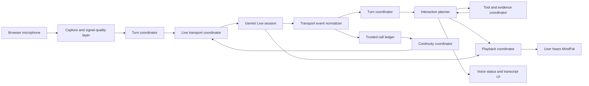

# MindPal Voice: gated architecture and delivery program

**Author:** Manus AI

**Date:** 2026-08-18

**Status:** Design gate — no new Voice behavior is implemented until this architecture is accepted and the active baseline is stabilized.

## 1. Objective

MindPal Voice must feel like a coherent live conversation, not a chain of unrelated browser timers, prompt injections, and WebSocket callbacks. The system must listen continuously, respond only when the user has yielded, permit interruption, verify changing public facts, use reliable tools, and preserve an active call through expected provider connection resets.

The system is built around one principle:

> **Every event has one owner, every state transition has one authority, and no phase can ship until its behavioral, automated, and production gates pass.**

## 2. Non-negotiable provider boundaries

The active provider model is `gemini-3.1-flash-live-preview`. It supports native audio, automatic/custom VAD, audio transcription, thinking, function calling, context compression, and session resumption. It does not support provider-native asynchronous functions, proactive audio, or affective dialogue. [1] [2]

The architecture must respect these boundaries. In particular, after setup, Gemini 3.1 requires text updates to be sent through **realtime input**. `clientContent` is only valid for initial history seeding when `initialHistoryInClientContent` is configured; it cannot be used as a post-yield “force a spoken bridge” mechanism. [1] This is the primary cause of the current silent-bridge regression and is prohibited in all new live-turn code.

| Capability | Use in MindPal | Explicit restriction |
| --- | --- | --- |
| 16 kHz PCM input / 24 kHz PCM output | Browser capture and queued playback | Send 20–40 ms chunks; no large client buffer. [2] |
| Automatic VAD | Default turn-end and barge-in signal | One coordinator owns interpretation; browser RMS never independently ends semantic turns. |
| Custom VAD | Future calibrated fallback only | Disabled until benchmarked against actual microphone sessions. |
| Input/output transcription | Captions, turn ledger, safe factual classification | Transcription is advisory and may arrive unordered relative to audio. |
| Function calls | Narrow server-side tools | Gemini 3.1 tools are sequential; the app must not claim provider-native non-blocking functions. |
| Context compression | Long logical conversations | Mandatory in production to prevent the audio context limit. [3] |
| Session resumption | Expected ten-minute connection rotation | Latest provider handle only; distinct from a network retry. [3] |
| Client text updates | Live internal instructions and system-safe context | `realtimeInput.text` only after initial setup. [1] |

## 3. Target architecture

The diagram is directional, not a shared-state free-for-all. Components communicate by named events with an event identifier, turn identifier, and session generation.

| Layer | Sole responsibility | It must not own |
| --- | --- | --- |
| **Capture and signal-quality** | Request supported microphone constraints, resample, measure audio quality, and forward PCM. | Deciding what a spoken turn means or ending a call. |
| **Turn coordinator** | Own `user-speaking`, `user-yielded`, `model-thinking`, `model-speaking`, `interrupted`, and `shared-idle`. | Token refresh, web verification, or DOM rendering. |
| **Live transport** | Open/setup/send/receive/close a generation-scoped WebSocket. | Prompts, audio playback, call policy, or retry budgets. |
| **Transport event normalizer** | Convert provider events into stable application events and retain latest session handle. | Business decisions. |
| **Interaction planner** | Select exactly one response path: direct response, tool path, verified-fact path, wait state, or safe escalation. | Microphone processing or WebSocket reconnection. |
| **Tool and evidence coordinator** | Execute narrow tools, preserve authenticated timezone, return typed evidence, and prohibit stale-fact fallback. | Speaking synthetic filler by itself. |
| **Playback coordinator** | Queue, fade, discard on interruption, and expose actual output activity. | Detect user turns. |
| **Continuity coordinator** | Handle GoAway/resumption/fresh reseed using a compact trusted ledger. | Silence-check policy or output audio. |
| **UI projection** | Render a read-only view of current state and transcript. | Create or change runtime state. |

## 4. Canonical state model

There is one `VoiceSessionState` object. Only the event reducer may transition it. UI components receive snapshots and never infer state from timers or raw audio volume.

| State | Entry event | Permitted next states | Call-end permitted? |
| --- | --- | --- | --- |
| `connecting` | User starts Voice | `setup-pending`, `failed` | Only explicit setup failure after a clear user-facing error. |
| `listening` | Setup complete or model turn complete | `user-speaking`, `shared-idle`, `resuming` | No. |
| `user-speaking` | Provider VAD activity / confirmed capture activity | `user-yielded`, `interrupted` | No. |
| `user-yielded` | Provider VAD end / completed grace | `response-planning`, `tool-working`, `listening` | No. |
| `response-planning` | Transcript or current turn is available | `model-thinking`, `tool-working`, `verified-wait` | No. |
| `verified-wait` | Changing fact needs evidence | `model-thinking`, `listening`, `tool-working` | No. |
| `tool-working` | Model requests a supported tool | `model-thinking`, `listening`, `resuming` | No. |
| `model-thinking` | Model starts response work | `model-speaking`, `listening`, `interrupted` | No. |
| `model-speaking` | First queued model PCM chunk | `interrupted`, `listening`, `resuming` | No. |
| `resuming` | GoAway/network transport closure | `setup-pending`, `continuity-reseeding`, `offline-recovering` | No. |
| `continuity-reseeding` | Resume unavailable or failed once | `setup-pending`, `offline-recovering` | No. |
| `offline-recovering` | Genuine network/token recovery issue | `setup-pending`, `degraded` | Only after explicit user choice or hard microphone loss. |
| `degraded` | Unrecoverable provider outage | `setup-pending`, `ended` | Only user ends or sees a clear retry/end choice. |
| `ended` | Explicit End action, track ended, or accepted unrecoverable error | none | Yes. |

## 5. Delivery phases and gates

### Phase A — Foundation: transport, state, capture, and observability

This phase replaces shared callback/timer ownership with a generation-safe event reducer. It separates GoAway resumption attempts from transient network recovery and removes any unconditional `Reconnect attempts exhausted → stopSession()` behavior. It also measures actual audio-frame cadence, capture constraints selected by the browser, setup duration, reconnect cause, and playback activity.

**Automated gate:** Unit tests simulate setup success/failure, GoAway, normal post-GoAway close, stale provider handle, token refresh, repeated network close, and user-ended call. No expected lifecycle path may call the permanent end transition.

**Provider gate:** A short authenticated Voice session must reach setup-complete, while a controlled reconnect test must display `resuming` and retain microphone tracks.

**Production gate:** Deployment Ready, bundle signature present, one manual startup check; rollback remains available.

### Phase B — Conversation: VAD, interruption, silence, transcription, and response timing

This phase gives provider VAD priority for semantic turn boundaries. The capture layer may filter obvious environmental noise but cannot declare a user turn complete. Playback fades only after a real interrupt event and immediately clears queued model audio on provider `interrupted`, as documented. [2]

**Automated gate:** Recorded fixture tests for clean speech, silence, keyboard transient, sustained fan noise, and user barge-in. Tests assert no call check-in during model playback, tool work, verification, or resumption.

**Provider gate:** A manual two-minute talk/interrupt session validates that a user can finish a thought, interrupt a reply, and never receive “Still with me?” while MindPal is active.

**Production gate:** The status view is derived only from reducer state and matches transcript/playback telemetry.

### Phase C — Intelligence: local time, current facts, tools, and waiting language

This phase has typed routes before model choice:

| User intent | Route | Evidence requirement |
| --- | --- | --- |
| Local time/date | Local timezone-aware `current_time` tool | Direct trusted device/backend time; never web verification. |
| Arithmetic | Strict calculator | Exact server-calculated result. |
| Changing public fact | Verified authenticated web-evidence tool | No speech of the fact without successful evidence. |
| Stable explanation/advice | Model response | No fact tool required unless it makes a current claim. |
| General research | Background research lane | May continue listening; no claim before source arrives. |

The “wait a minute” behavior is not implemented as an unsupported post-setup `clientContent` turn. Phase C will conduct a provider probe using only the documented `realtimeInput.text` channel. It advances only if a short spoken bridge is reliable in actual audio output. If the model cannot reliably produce it, the product must use a truthful visual/caption wait indicator rather than fake a capability or introduce a second synthetic voice.

**Automated gate:** English and Egyptian Arabic local-time tests; mayor/weather/price/election tests; a no-evidence test; calculator and timezone tests; evidence cannot leak through model audio before the gate resolves.

**Provider gate:** Live time query returns correct local time. Live mayor query waits for evidence and either speaks a verified answer or explicitly says it cannot verify.

### Phase D — Continuity: long calls and degraded recovery

This phase implements a reason-scoped policy:

| Condition | Required behavior |
| --- | --- |
| `GoAway` with valid handle | Use latest handle, reconnect before `timeLeft`, preserve session generation and microphone. |
| Resume setup fails once | Retire the handle and make one fresh continuity-seeded session with a new token. |
| Fresh setup/token temporarily fails | Enter `offline-recovering`; exponential pause, no permanent call-end from a fixed counter. |
| Provider unavailable after bounded recovery cycles | Enter `degraded` with a clear retry/end choice; retain transcript locally. |
| User presses End or microphone track ends | End immediately and cleanly. |

**Automated gate:** Distinct counters for resumption, transient recoveries, and recovery cycles. A GoAway cannot consume the transient budget; a failed handle causes fresh reseed, not four repeated attempts.

**Provider gate:** One controlled resumption lifecycle reaches a second `setupComplete` with the same mic stream. A sustained 10–12 minute manual session validates real GoAway behavior.

### Phase E — End-to-end release

The release gate combines the prior successful scenarios into one staging run, reviews instrumentation, performs a production startup call, a current-time call, a verified-fact call, a manual interruption, and a long-call continuity session. Any failure rolls back to the last passing phase rather than being patched live.

## 6. Test evidence requirements

Each phase must provide all four evidence types before the plan advances.

| Evidence | Minimum required artifact |
| --- | --- |
| **Provider fact** | Official source link and date, stored in `docs/`. |
| **Deterministic test** | Unit/regression test for the phase’s state transitions and unsafe paths. |
| **Build evidence** | Frontend build and immutable asset verification; backend tests where touched. |
| **Real interaction evidence** | Short real Voice session for Phases A–C; a long provider lifecycle session for Phase D. |

A phase can be marked **passed** only when all four are present. A browser connector timeout is not a pass; it is recorded as an incomplete validation and blocks the next phase.

## 7. Risk register

| Risk | Mitigation | Gate owner |
| --- | --- | --- |
| Unsupported provider message type | Capability matrix blocks code path before implementation. | Foundation |
| Shared retry counter ends normal sessions | Reason-scoped counter and reducer-only end transition. | Foundation / Continuity |
| Transcription races audio | Treat transcript as advisory; gate audio only with a turn and event identifier. | Conversation |
| Background noise creates false barge-in | Native constraints plus measured capture quality; provider VAD remains semantic authority. | Conversation |
| Stale current fact | Typed pre-model route and backend evidence result. | Intelligence |
| Generic support/medical disclaimer | HRO contract test cases with ordinary distress and safety edge cases. | Conversation / Intelligence |
| Overlong prompt overrides behavior | Small ordered policy modules, one owner per rule, scenario regression set. | All phases |
| Preview provider change | Capability regression probe on every release plus documented rollback configuration. | Foundation / Release |

## 8. Immediate design decision

The current baseline remains frozen. The next permitted implementation is **Phase A only**. It may not add a new prompt rule, tool, UI effect, factual route, or provider feature. Its first task is to replace the shared reconnect cap and unsupported live `clientContent` mechanism with a valid stateful transport foundation, then prove that foundation through the four evidence gates.

## References

[1] [Gemini 3.1 Flash Live Preview model documentation](https://ai.google.dev/gemini-api/docs/models/gemini-3.1-flash-live-preview)

[2] [Gemini Live API capabilities guide](https://ai.google.dev/gemini-api/docs/live-api/capabilities)

[3] [Session management with Live API](https://ai.google.dev/gemini-api/docs/live-api/session-management)

[4] [Live API best practices](https://ai.google.dev/gemini-api/docs/live-api/best-practices)
