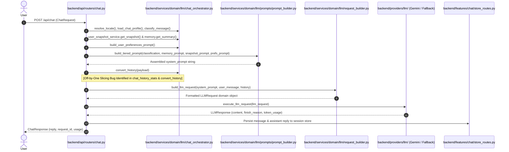

# LLM Pipeline & Request Execution Trace

## End-to-End LLM Request Sequence



---

## Component Slicing & Injection Mechanics

### 1. System Prompt & Context Assembly
- **File**: `backend/services/domain/llm/prompts/prompt_builder.py` (`build_tiered_prompt` at line 484)
- **Assembly Stages**:
  - **Core Identity & Locale Rules**: Derived from `identity.json` and `locale_rules.json`.
  - **Persona / Preferences**: `build_user_preferences_prompt` (`chat_orchestrator.py:126`) translates style/warmth/emoji preferences.
  - **Memory Graph Summary**: Injected into system prompt via `memory_prompt` (`prompt_builder.py:554, 579, 642, 721`).
  - **User Snapshot Context**: Active situational snapshot generated by `UserSnapshotService` (`user_snapshot_service.py:143`).
  - **RAG & Tool Output**: Untrusted tool evidence appended under `UNTRUSTED_TOOL_DATA_BEGIN`.

### 2. Conversation History Slicing & The Off-by-One Bug

#### History Contract Specification
- **`payload.history`**: Contains conversation turns BEFORE the current message only. Must not contain the active user message.
- **`payload.message`**: Contains the active current user message ONLY.

#### History Conversion Logic
- **File**: `backend/services/domain/llm/chat_orchestrator.py` (`convert_history` at line 377)
```python
MAX_HISTORY_FOR_LLM: Final[int] = 30

def convert_history(payload: ChatRequest) -> list[LLMMessage]:
    history: list[LLMMessage] = []
    for message in payload.history[-MAX_HISTORY_FOR_LLM:]:
        ...
```

#### Identified Off-by-One Slicing Bug & Remediation
1. **History Inconsistency in Stats vs. LLM Payload**:
   In `chat_history_stats` (`chat_orchestrator.py:81`), history completeness check:
   ```python
   history_includes_current = _history_includes_current_user_message(payload, history)
   total_messages = len(history) if history_includes_current else len(history) + 1
   ```
   However, when `payload.history` contains the current user message at the end AND total history length exceeds `30` (`MAX_HISTORY_FOR_LLM`), `convert_history` slices `payload.history[-30:]` and appends `payload.message` separately as `user_message` in `build_llm_request` (`request_builder.py:43`).

2. **Duplicate Message Injection**:
   If the frontend client includes the current prompt inside `payload.history`, slicing the last 30 items retains the user message at index `-1`. `build_llm_request` then passes `user_message` as the trailing message, resulting in the user's latest prompt being sent to Gemini **twice in succession** (`USER: <msg>`, `USER: <msg>`), triggering degraded LLM outputs or invalid prompt sequences.

3. **Remediation Contract Enforced**:
   - `convert_history(payload)` validates and drops trailing duplicate user messages matching `payload.message` both before and after slicing the last 30 history turns.
   - `build_llm_request` enforces a defensive check dropping trailing duplicate user messages from history and logging a `history_contract_violation` telemetry event.
