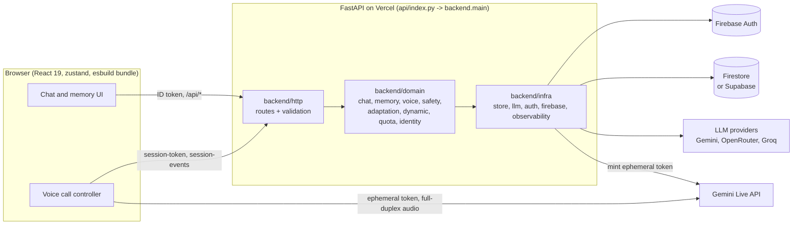
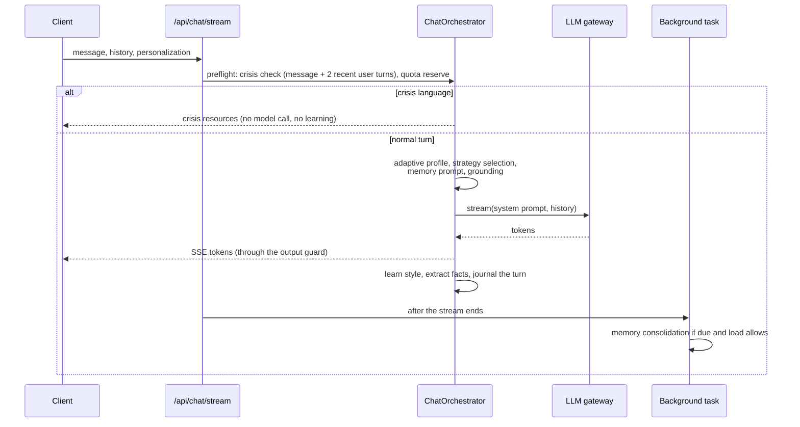

# Architecture

MindPal is a wellness companion: text chat and live voice, with memory that
adapts to each person. One FastAPI service on Vercel serves the API and the
built React app. Identity is Firebase Auth; application data lives in Supabase
Postgres (Firestore is a supported alternative).

## System

Provider API keys never reach the browser. Live voice audio goes directly from
the browser to Gemini Live using a short-lived, single-use token minted by the
backend after quota and consent checks.

## Backend layers

| Layer | Path | Rule |
|---|---|---|
| HTTP | `backend/http/` | Request/response only. Never imports `backend.infra`; route modules stay under 150 lines (`scripts/ci/check_architecture.py`). |
| Domain | `backend/domain/` | Product behavior. One package per capability. |
| Infrastructure | `backend/infra/` | Storage providers, LLM gateway, Firebase, auth, metrics and the platform pulse. |
| Config | `backend/configs/` | `Settings` (environment, cached) plus schema-validated JSON in `configs/json/`. Nothing else reads `os.environ`. |
| Core | `backend/core/` | Errors, API contract loading, request ID context. |

Every route has an `operationId` in `contracts/openapi.yaml`. A test fails if
the served routes and the contract differ.

## A chat turn

Quota is reserved before the model call and refunded if the turn fails. Guests
are rate-limited per network; accounts have credit windows (5 hours and weekly).

## Where to read next

- [memory.md](memory.md): facts, AI summary, self-learning, privacy
- [voice.md](voice.md): live call lifecycle, quotas, safety lease
- [safety.md](safety.md): crisis handling in chat and voice
- [operations.md](operations.md): deploy, configuration, storage, load levels
- [development.md](development.md): local setup, tests, CI
