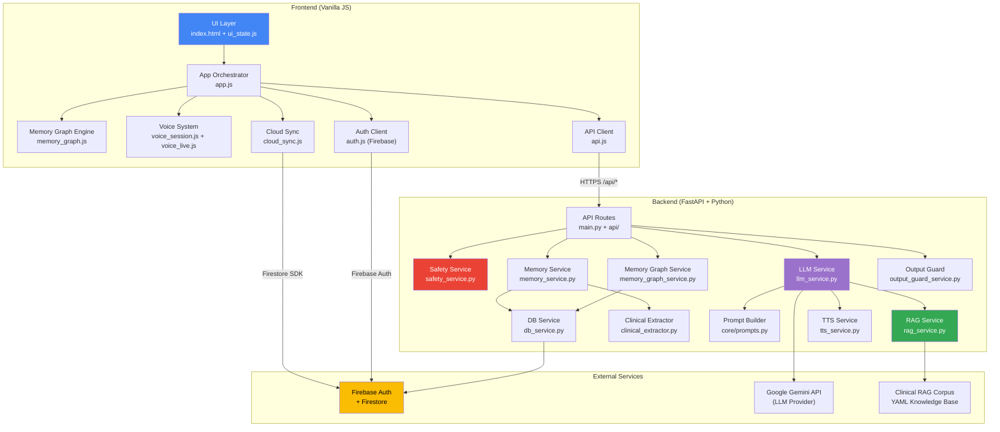
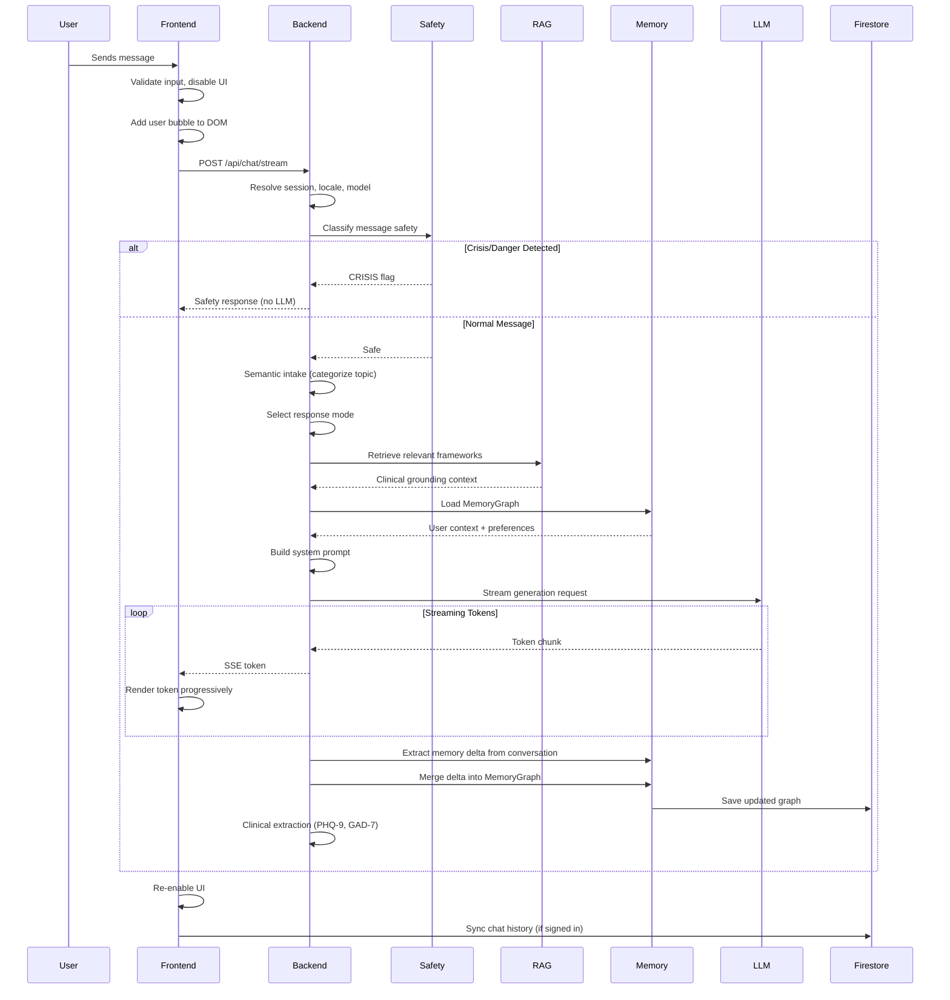
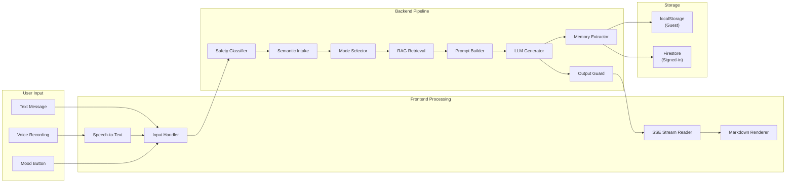
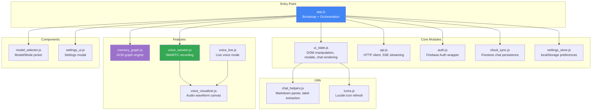
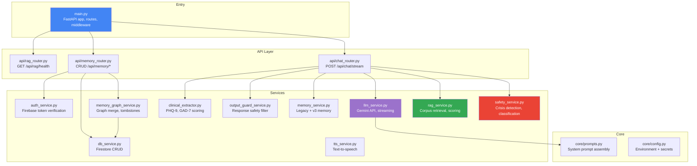

# MindPal System Architecture — Deep Dive

## High-Level Architecture

```mermaid
graph TB
    subgraph "Frontend (Vanilla JS)"
        UI["UI Layer<br/>index.html + ui_state.js"]
        APP["App Orchestrator<br/>app.js"]
        MG["Memory Graph Engine<br/>memory_graph.js"]
        VOICE["Voice System<br/>voice_session.js + voice_live.js"]
        AUTH["Auth Client<br/>auth.js (Firebase)"]
        SYNC["Cloud Sync<br/>cloud_sync.js"]
        API_CLIENT["API Client<br/>api.js"]
    end

    subgraph "Backend (FastAPI + Python)"
        ROUTES["API Routes<br/>main.py + api/"]
        SAFETY["Safety Service<br/>safety_service.py"]
        RAG["RAG Service<br/>rag_service.py"]
        LLM["LLM Service<br/>llm_service.py"]
        MEM_SVC["Memory Service<br/>memory_service.py"]
        MG_SVC["Memory Graph Service<br/>memory_graph_service.py"]
        CLINICAL["Clinical Extractor<br/>clinical_extractor.py"]
        GUARD["Output Guard<br/>output_guard_service.py"]
        PROMPTS["Prompt Builder<br/>core/prompts.py"]
        DB["DB Service<br/>db_service.py"]
        TTS["TTS Service<br/>tts_service.py"]
    end

    subgraph "External Services"
        FIREBASE["Firebase Auth<br/>+ Firestore"]
        GEMINI["Google Gemini API<br/>(LLM Provider)"]
        CORPUS["Clinical RAG Corpus<br/>YAML Knowledge Base"]
    end

    UI --> APP
    APP --> API_CLIENT
    APP --> MG
    APP --> VOICE
    APP --> AUTH
    APP --> SYNC

    API_CLIENT -->|"HTTPS /api/*"| ROUTES
    SYNC -->|"Firestore SDK"| FIREBASE
    AUTH -->|"Firebase Auth"| FIREBASE

    ROUTES --> SAFETY
    ROUTES --> LLM
    ROUTES --> MEM_SVC
    ROUTES --> MG_SVC
    ROUTES --> GUARD

    LLM --> PROMPTS
    LLM --> GEMINI
    LLM --> RAG
    RAG --> CORPUS

    MEM_SVC --> DB
    MG_SVC --> DB
    MEM_SVC --> CLINICAL
    DB --> FIREBASE

    LLM --> TTS

    style UI fill:#4285f4,color:white
    style SAFETY fill:#ea4335,color:white
    style RAG fill:#34a853,color:white
    style LLM fill:#9b72cb,color:white
    style FIREBASE fill:#fbbc04,color:black
```

## Request Lifecycle — Complete Chat Flow

```mermaid
sequenceDiagram
    participant User
    participant Frontend
    participant Backend
    participant Safety
    participant RAG
    participant Memory
    participant LLM
    participant Firestore

    User->>Frontend: Sends message
    Frontend->>Frontend: Validate input, disable UI
    Frontend->>Frontend: Add user bubble to DOM
    Frontend->>Backend: POST /api/chat/stream

    Backend->>Backend: Resolve session, locale, model
    Backend->>Safety: Classify message safety
    
    alt Crisis/Danger Detected
        Safety-->>Backend: CRISIS flag
        Backend-->>Frontend: Safety response (no LLM)
    else Normal Message
        Safety-->>Backend: Safe
        Backend->>Backend: Semantic intake (categorize topic)
        Backend->>Backend: Select response mode
        Backend->>RAG: Retrieve relevant frameworks
        RAG-->>Backend: Clinical grounding context
        Backend->>Memory: Load MemoryGraph
        Memory-->>Backend: User context + preferences
        Backend->>Backend: Build system prompt
        Backend->>LLM: Stream generation request
        
        loop Streaming Tokens
            LLM-->>Backend: Token chunk
            Backend-->>Frontend: SSE token
            Frontend->>Frontend: Render token progressively
        end
        
        Backend->>Memory: Extract memory delta from conversation
        Backend->>Memory: Merge delta into MemoryGraph
        Memory->>Firestore: Save updated graph
        Backend->>Backend: Clinical extraction (PHQ-9, GAD-7)
    end

    Frontend->>Frontend: Re-enable UI
    Frontend->>Firestore: Sync chat history (if signed in)
```

## Data Flow Diagram

```mermaid
flowchart LR
    subgraph "User Input"
        TEXT["Text Message"]
        VOICE_IN["Voice Recording"]
        MOOD["Mood Button"]
    end

    subgraph "Frontend Processing"
        INPUT["Input Handler"]
        STT["Speech-to-Text"]
        STREAM["SSE Stream Reader"]
        RENDER["Markdown Renderer"]
    end

    subgraph "Backend Pipeline"
        CLASSIFY["Safety Classifier"]
        INTAKE["Semantic Intake"]
        MODE_SELECT["Mode Selector"]
        RETRIEVE["RAG Retrieval"]
        PROMPT_BUILD["Prompt Builder"]
        GENERATE["LLM Generator"]
        EXTRACT["Memory Extractor"]
        GUARD_OUT["Output Guard"]
    end

    subgraph "Storage"
        LS["localStorage<br/>(Guest)"]
        FS["Firestore<br/>(Signed-in)"]
    end

    TEXT --> INPUT
    VOICE_IN --> STT --> INPUT
    MOOD --> INPUT

    INPUT --> CLASSIFY
    CLASSIFY --> INTAKE
    INTAKE --> MODE_SELECT
    MODE_SELECT --> RETRIEVE
    RETRIEVE --> PROMPT_BUILD
    PROMPT_BUILD --> GENERATE
    GENERATE --> GUARD_OUT
    GUARD_OUT --> STREAM
    STREAM --> RENDER

    GENERATE --> EXTRACT
    EXTRACT --> LS
    EXTRACT --> FS
```

---

## Frontend Module Map

```mermaid
graph TD
    subgraph "Entry Point"
        APP["app.js<br/>Bootstrap + Orchestration"]
    end

    subgraph "Core Modules"
        UI["ui_state.js<br/>DOM manipulation, modals, chat rendering"]
        API["api.js<br/>HTTP client, SSE streaming"]
        AUTH["auth.js<br/>Firebase Auth wrapper"]
        SYNC["cloud_sync.js<br/>Firestore chat persistence"]
        STORE["settings_store.js<br/>localStorage preferences"]
    end

    subgraph "Features"
        MG["memory_graph.js<br/>ACM graph engine"]
        VOICE["voice_session.js<br/>WebRTC recording"]
        VOICE_LIVE["voice_live.js<br/>Live voice mode"]
        VOICE_VIZ["voice_visualizer.js<br/>Audio waveform canvas"]
    end

    subgraph "Components"
        MODEL_SEL["model_selector.js<br/>Model/Mode picker"]
        SETTINGS["settings_ui.js<br/>Settings modal"]
    end

    subgraph "Utils"
        HELPERS["chat_helpers.js<br/>Markdown parser, label extraction"]
        ICONS["icons.js<br/>Lucide icon refresh"]
    end

    APP --> UI
    APP --> API
    APP --> AUTH
    APP --> SYNC
    APP --> STORE
    APP --> MG
    APP --> VOICE
    APP --> MODEL_SEL
    APP --> SETTINGS

    VOICE --> VOICE_VIZ
    VOICE_LIVE --> VOICE_VIZ
    UI --> HELPERS
    UI --> ICONS

    style APP fill:#4285f4,color:white
    style MG fill:#9b72cb,color:white
    style VOICE fill:#34a853,color:white
```

---

## Backend Module Map

```mermaid
graph TD
    subgraph "Entry"
        MAIN["main.py<br/>FastAPI app, routes, middleware"]
    end

    subgraph "API Layer"
        CHAT_API["api/chat_router.py<br/>POST /api/chat/stream"]
        MEM_API["api/memory_router.py<br/>CRUD /api/memory/*"]
        RAG_API["api/rag_router.py<br/>GET /api/rag/health"]
    end

    subgraph "Core"
        PROMPTS["core/prompts.py<br/>System prompt assembly"]
        CONFIG["core/config.py<br/>Environment + secrets"]
    end

    subgraph "Services"
        SAFETY_SVC["safety_service.py<br/>Crisis detection, classification"]
        RAG_SVC["rag_service.py<br/>Corpus retrieval, scoring"]
        LLM_SVC["llm_service.py<br/>Gemini API, streaming"]
        MEM_SVC2["memory_service.py<br/>Legacy + v3 memory"]
        MG_SVC2["memory_graph_service.py<br/>Graph merge, tombstones"]
        CLINICAL_SVC["clinical_extractor.py<br/>PHQ-9, GAD-7 scoring"]
        DB_SVC["db_service.py<br/>Firestore CRUD"]
        GUARD_SVC["output_guard_service.py<br/>Response safety filter"]
        AUTH_SVC["auth_service.py<br/>Firebase token verification"]
        TTS_SVC["tts_service.py<br/>Text-to-speech"]
    end

    MAIN --> CHAT_API
    MAIN --> MEM_API
    MAIN --> RAG_API

    CHAT_API --> SAFETY_SVC
    CHAT_API --> RAG_SVC
    CHAT_API --> LLM_SVC
    CHAT_API --> MEM_SVC2
    CHAT_API --> GUARD_SVC
    CHAT_API --> CLINICAL_SVC

    LLM_SVC --> PROMPTS

    MEM_API --> MG_SVC2
    MEM_API --> DB_SVC
    MEM_API --> AUTH_SVC

    MG_SVC2 --> DB_SVC

    style MAIN fill:#4285f4,color:white
    style SAFETY_SVC fill:#ea4335,color:white
    style RAG_SVC fill:#34a853,color:white
    style LLM_SVC fill:#9b72cb,color:white
```
