# MindPal Frontend-to-Backend Workflow Map

**Author:** Manus AI  
**Mapped on:** 2026-08-13  
**Scope:** Browser application bootstrap, authenticated cloud hydration, text chat streaming, memory and chat synchronization, backend orchestration, and post-generation persistence.

## System flow

MindPal is a browser-first wellness application with a static JavaScript frontend and a FastAPI backend. The frontend retains local state for immediate continuity, while authenticated users additionally hydrate and synchronize profile, memory, and chat state through protected API routes. Text chat is sent to `/api/chat/stream`, which provides a buffered Server-Sent Events response: the backend validates the complete provider response through its output guard before emitting chunks to the browser.

```mermaid
flowchart LR
    A[Browser bootstrap] --> B[Initialize Firebase auth]
    B --> C{Authenticated?}
    C -- No --> D[Local-only chat, memory, and state]
    C -- Yes --> E[Fetch user and profile]
    E --> F[Hydrate Memory v3]
    F --> G[Merge cloud and local memory]
    G --> H[Hydrate and merge current cloud chat]
    H --> I[Ready for chat]

    I --> J[User submits text]
    J --> K[Optimistically render user message]
    K --> L[Persist local chat and local memory extraction]
    L --> M[Queue cloud chat and memory sync]
    M --> N[POST /api/chat/stream]

    N --> O[Auth, App Check, request validation]
    O --> P[Rate limit, concurrency, quota, idempotency]
    P --> Q[Deterministic input safety]
    Q --> R{Immediate safety bypass?}
    R -- Yes --> S[Deterministic response]
    R -- No --> T[Profile, memory, RAG, tools, prompt assembly]
    T --> U[LLM provider chain]
    U --> V[Post-generation output guard]
    S --> W[SSE response]
    V --> W

    W --> X[Render chunks and status]
    X --> Y[Receive response metadata]
    Y --> Z[Persist assistant message and backend memory delta]
    Z --> AA[Queue cloud synchronization]
```

## Detailed workflow

| Stage | Frontend behavior | Backend behavior | Failure containment currently present |
|---|---|---|---|
| Bootstrap | `bootstrap.js` sets viewport state and removes a global loader after a 12-second failsafe. | No request required. | Loader cannot remain indefinitely if frontend boot stalls. |
| Authentication | `initFrontendAuth` waits for Firebase state. Authenticated users request `/api/user/me` and `/api/user/profile`. | Session dependency validates the Firebase token and constructs a user-scoped request context. | Failed profile verification disables cloud synchronization and retains local state. |
| Memory hydration | Local memory graph is loaded first. Cloud Memory v3 is fetched, merged, then synchronously reconciled with a versioned save. | `/api/memory/v3` enforces authentication and version-aware persistence. | On failure, frontend retains local memory and re-renders the inspector. |
| Chat hydration | Current cloud chat is fetched, normalized, merged with local messages, then optionally written back. | `/api/chats/current` provides a user-scoped durable message list. | Failures are logged without discarding local history. |
| Chat submit | UI disables input, renders the user message, stores it locally, performs local graph extraction, then opens a streaming request. | `/api/chat/stream` validates request, reserves quota, claims idempotency, applies safety, loads memory/RAG, calls the provider, then applies the output guard. | Client timeout is 120 seconds. The backend uses quotas, rate limits, local concurrency limits, and error-to-HTTP conversion. |
| Stream display | `sendChatMessageStream` parses `data:` SSE frames and forwards text, status, and metadata callbacks. | Backend emits text chunks, `text_finished`, and response metadata. | Non-SSE responses, empty body, malformed HTTP errors, cancellation, and timeout are converted to structured client errors. |
| Response persistence | Final visible text is added to local state and queued for cloud synchronization. Backend memory delta/snapshot metadata updates local memory. | Backend completes idempotency and quota before returning the stream. | Failed cloud sync retains a retry queue and local copy. |
| Generation stop/new chat | A per-request `AbortController` is retained as `activeStreamController`; a new chat aborts the active request. | The server handles cancellation through request disconnect and normal cleanup. | The UI returns to an enabled input state in `finally`. |

## Protocol contracts verified

| Contract | Frontend implementation | Backend implementation | Assessment |
|---|---|---|---|
| Text stream | Sends a `POST` request and parses JSON values from SSE `data:` frames. | Buffers response, then emits text chunks, a `text_finished` status frame, and a metadata frame. | Compatible. The safe buffered stream prevents unsafe partial provider output from reaching the browser. |
| Authentication | Adds bearer token and Firebase App Check token when a user token is available. | Authentication and App Check dependencies enforce production policy. | Compatible, subject to Firebase configuration health. |
| User context | Client sends optional presentation/settings metadata, not identity authority. | User-scoped identity comes from the authenticated request context. | Correct trust boundary. |
| Chat history | Frontend bounds items and total text before sending. | Backend bounds the request model and LLM prompt model. | Layered payload control. |
| Memory conflict handling | Frontend merges graphs and uses expected version saves. | Memory V3 supports version-aware writes and merge paths. | Compatible; requires resilience tests for offline/concurrent edits. |
| Cloud chat persistence | Frontend batches queued messages every 250ms and retries failures. | Backend upserts the authenticated user’s current chat. | Functional, but queue lifecycle needs explicit stress coverage. |

## Reliability seams selected for reproduction

The next test phase targets the following areas because they can make an AI application appear to fall down, glitch, or silently lose continuity even when the basic happy path works.

| Priority | Seam | Why it matters | Planned validation |
|---|---|---|---|
| High | Stream terminal semantics | A disconnect or terminal response without usable text/metadata can leave a blank reply, duplicate fallback, or stale UI state. | Fragmented SSE, malformed event, HTTP error, timeout, cancellation, and no-terminal-marker tests. |
| High | Cloud chat retry queue | Queue growth, duplicate messages, rejected token refresh, and repeated offline retries can consume memory or produce duplicate history. | Bounded queue, deduplication, token failure, recovery, and concurrent flush tests. |
| High | Auth hydration races | Changing identity while profile/memory/chat hydration is in flight can mix one user’s state with another’s. | Mocked sign-in/sign-out race tests and user-identity generation guards. |
| High | Local persistence faults | Browser storage quota or corrupted state can cause UI resets, lost data, or exceptions during message handling. | Storage-throwing and malformed-state tests. |
| Medium | Request identity | Missing client request identifiers make retry/idempotency behavior harder to correlate across browser and backend. | Verify client request IDs survive request, stream metadata, and persisted chat paths. |
| Medium | Optional App Check | An App Check token acquisition failure can currently prevent an otherwise valid authenticated request from reaching the backend. | Required-versus-optional token-failure tests and compatibility-safe fallback behavior. |
| Medium | Long output rendering | Large streams and rich HTML formatting can block the UI or leave stale animation callbacks after errors. | Bounded large-response and cancellation rendering tests. |
| Medium | Voice lifecycle | Voice setup, WebSocket state, background retries, and transcript sync are separate state machines. | Controlled token, socket-close, reconnect, and transcript-persistence tests. |

## Guardrails for test execution

End-to-end tests will run against the local FastAPI application, mocked browser APIs, in-memory persistence, and mocked providers. They will not issue high-volume traffic to Vercel, Firebase, or external LLM providers. This isolates application defects from third-party cost, quota, and network noise while still exercising MindPal’s real route, validation, stream, and state-management code.

## Live-interface observation

A read-only review of the deployed interface showed the page loading with persisted chat content while multiple visible `Summarizing…` placeholders remained in the viewport. This may be transient skeleton state during hydration, but it is a useful reproduction target because stale loading placeholders can make the product appear frozen even when chat controls are usable. The next implementation pass will inspect placeholder creation/removal and add regression coverage for successful, failed, and cancelled hydration paths.

## Reproduced defects and repairs

| Finding | Failure mode | Repair | Regression coverage |
|---|---|---|---|
| Completed stream retry was not replayable | A client retry using the same idempotency key received `409 stream_already_completed`, even though the prior safe reply had already been generated. A transport failure could therefore look like a failed or blank conversation turn. | Completed stream records now persist both the sanitized safe reply and response metadata. The stream route recreates the same SSE response for a matching completed request rather than calling the provider again. | `tests/test_chat_stream_replay.py` verifies reply chunks, `text_finished`, metadata, and legacy non-replayable record handling. |
| Browser did not assign a stable stream request identity | Each request relied on a server-generated ID unless a caller manually supplied one. The browser could not safely retry a pre-output transient failure with backend idempotency. | The stream client generates and sends `metadata.client_request_id`; the same value survives exactly one automatic pre-output retry. | `tests/test_chat_stream_resilience.mjs` verifies payload identity, no optimistic user-history duplicate, retry eligibility, and a mocked fail-then-SSE recovery. |
| Retrying after visible output could duplicate text | A network interruption after chunks arrived cannot be blindly retried because replay would append an entire safe response after the visible partial response. | Retry policy is deliberately limited to the first transient failure before any text is emitted. User cancellation and non-transient HTTP errors are never retried automatically. | Stream retry eligibility test asserts rejection after any emitted text, after the first retry, for server errors, and for aborts. |
| Cloud chat sync had a token-await race | Two timers could both pass the idle check, await token acquisition, and submit the same queued batch. Token failures could also escape before the existing `try/finally` began. | The cloud sync single-flight lock is now claimed before token acquisition and is released in the existing `finally` path. | Application build and full suite validation; the change preserves the queue’s retry semantics while preventing duplicate concurrent flushes. |
| Voice call cards could retain `Summarizing…` permanently | A persisted call with no summary and no transcripts rendered the pending label but had no possible summary request to complete it. This was observed in the live interface review. | Added a pure summary-state resolver. Calls with transcript data show a pending label; calls without a usable summary or transcript display `Voice call` immediately. | `tests/test_voice_summary_state.mjs` covers missing transcript, active summarization, and persisted short summary states. |

## Final validation

The final full verification run passed with **88 Python tests**, **17 JavaScript tests**, and **24 focused backend resilience tests**. The production verifier additionally completed Python compilation, Ruff, Bandit, frontend delivery auditing, production OpenAPI smoke testing, prebuilt asset verification, and Python and Node production dependency audits with no known vulnerabilities. The browser-facing build regenerated `frontend/dist/app.bundle.js` and `frontend/prebuilt-assets.manifest.json` from the updated source set.
