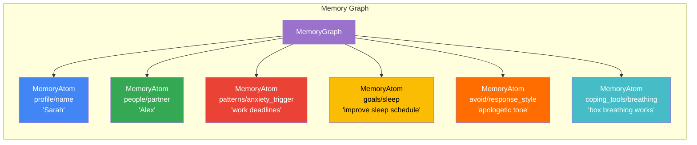
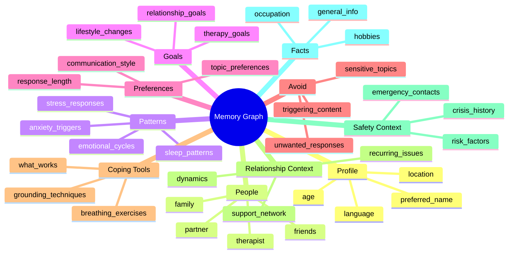
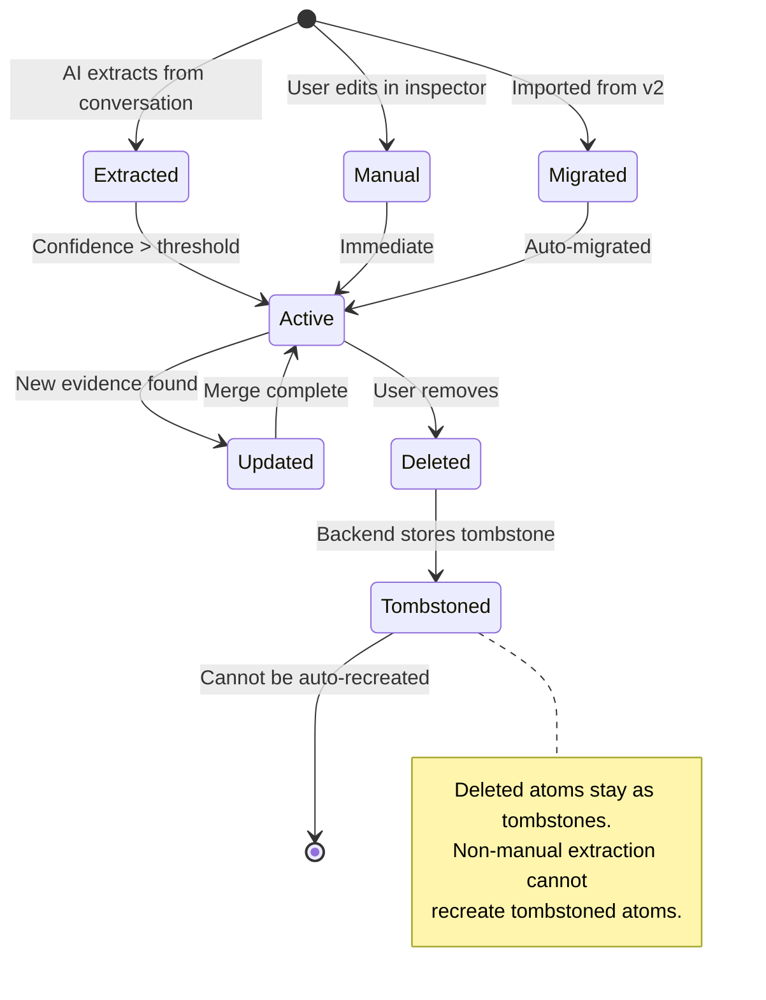
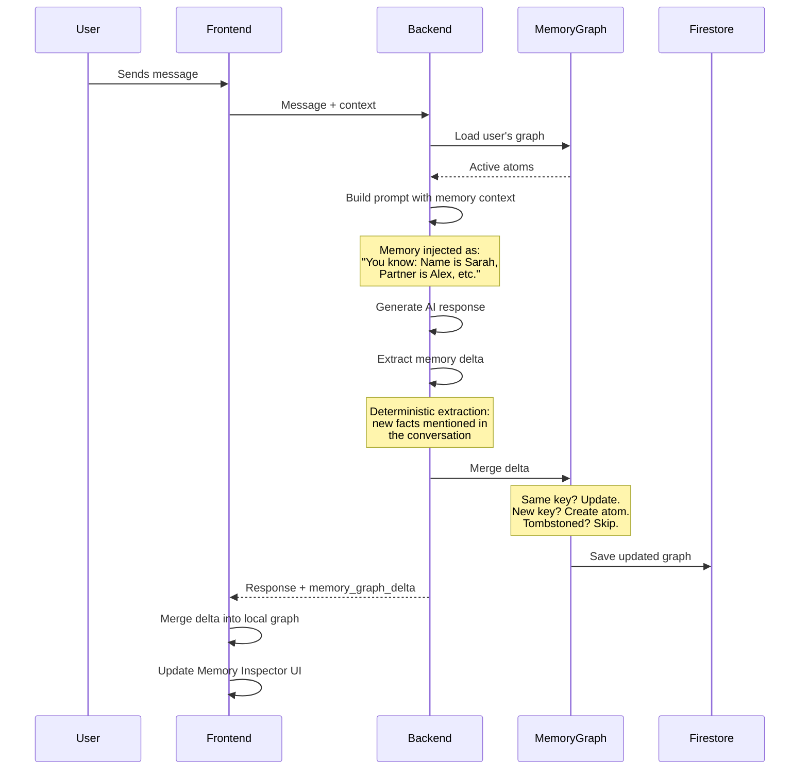
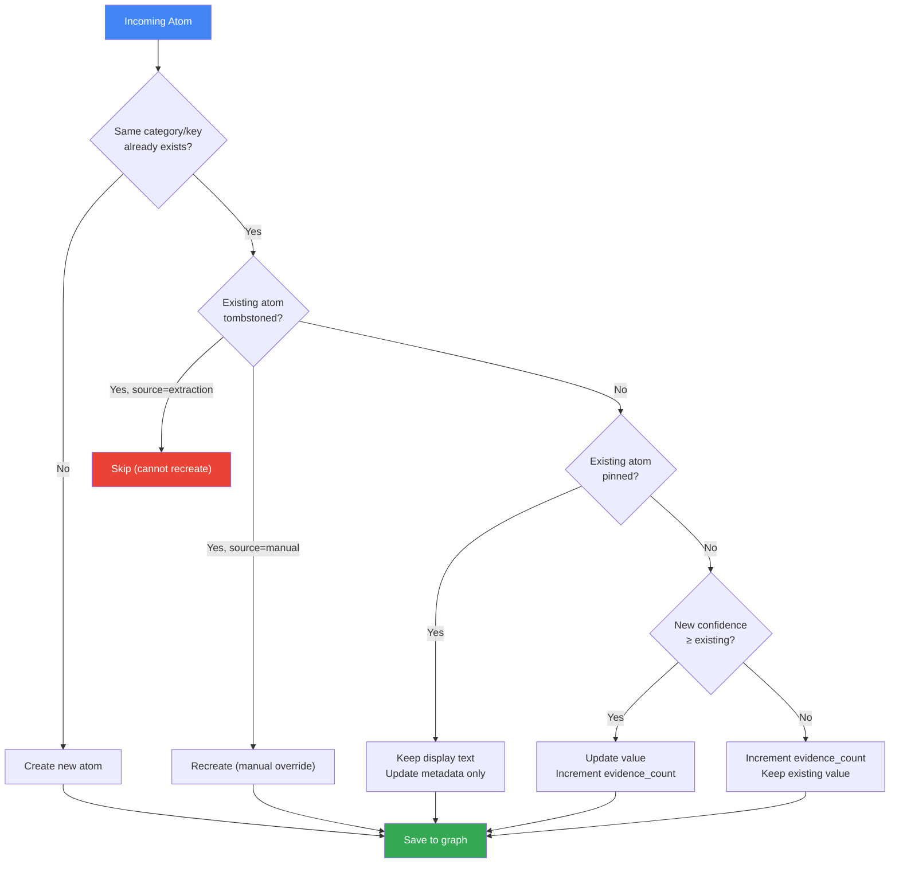
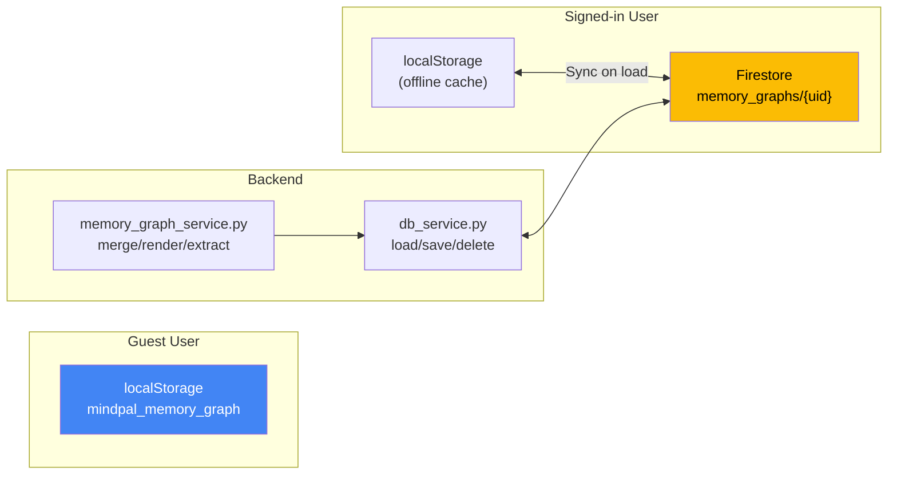

# Memory System — Adaptive Cortical Memory (ACM)

## Overview

MindPal's memory system (V3) uses an **Adaptive Cortical Memory (ACM)** graph architecture that persists user facts, preferences, relationships, and behavioral patterns across sessions.



## MemoryAtom Schema

Each memory fact is stored as a `MemoryAtom`:

```
MemoryAtom {
  id              string    Unique identifier (UUID)
  category        string    One of the 10 categories
  key             string    Human-readable key within category
  value           string    The actual memory content
  normalized_value string   Lowercased, trimmed for dedup
  display_value   string    User-facing display text
  confidence      float     0.0–1.0 (how certain we are)
  sensitivity     string    "low" | "medium" | "high"
  source          string    "extraction" | "manual" | "migration"
  status          string    "active" | "deleted" (tombstone)
  pinned          boolean   User pinned (protected from auto-update)
  created_at      ISO date  When first created
  updated_at      ISO date  Last modification
  last_seen_at    ISO date  Last time evidence appeared
  evidence_count  int       How many times confirmed
  aliases         string[]  Alternative names/references
  metadata        object    Extra structured data
}
```

## Memory Categories



## Memory Lifecycle



## Memory in the Chat Flow



## Merge Rules (Deterministic)



### Key Merge Principles
1. **Partial deltas never replace the graph** — only merge into it
2. **Empty fields don't delete** — missing fields are ignored
3. **Aliases merge** — new aliases are added to existing sets
4. **People merge by alias/relationship** when safe to do so
5. **Timestamps move forward** — `updated_at` and `last_seen_at` never go backward

## Storage Architecture



## Memory Inspector (Frontend)

The Memory Inspector is accessible from the Settings panel. It displays all active memory atoms grouped by category as interactive cards with chips:

```
┌─────────────────────────────────────────┐
│  Memory Inspector                       │
├─────────────────────────────────────────┤
│                                         │
│  👤 Profile                             │
│  ┌──────────┐ ┌───────────────┐         │
│  │ Sarah  ✕ │ │ 25 years old ✕│         │
│  └──────────┘ └───────────────┘         │
│                                         │
│  👥 People                              │
│  ┌─────────────────┐ ┌──────────┐       │
│  │ Alex (partner) ✕│ │ Mom    ✕ │       │
│  └─────────────────┘ └──────────┘       │
│                                         │
│  🚫 Avoid                               │
│  ┌──────────────────────┐               │
│  │ apologetic responses ✕│              │
│  └──────────────────────┘               │
│                                         │
│  🎯 Goals                               │
│  ┌─────────────────────┐                │
│  │ improve sleep      ✕ │               │
│  └─────────────────────┘                │
└─────────────────────────────────────────┘
```

### Chip Deletion Flow
1. User clicks ✕ on a chip
2. Atom marked as `status=deleted` locally
3. If signed in → `DELETE /api/memory/v3/items/{atom_id}`
4. Backend stores tombstone
5. Auto-extraction cannot recreate tombstoned atoms

## API Endpoints

| Method | Path | Description |
|--------|------|-------------|
| `GET` | `/api/memory/v3` | Load full memory graph |
| `PUT` | `/api/memory/v3` | Replace entire graph |
| `PATCH` | `/api/memory/v3` | Merge partial delta |
| `DELETE` | `/api/memory/v3/items/{id}` | Delete single atom (tombstone) |
| `POST` | `/api/memory/v3/merge` | Merge external graph |
| `POST` | `/api/memory/v3/migrate` | Migrate from v2 to v3 |

## Prompt Integration

Memory is injected into the system prompt as a structured block:

```
You know the following about this user (verified facts — may be outdated):
⚠️ This memory may be outdated. Verify key facts if the conversation contradicts stored information.

Profile:
  - Name: Sarah
  - Age: 25

People:
  - Partner: Alex (together 3 years)
  - Mom: close relationship, supportive

Patterns:
  - Anxiety spikes before work deadlines
  - Sleep worsens during stress periods

Goals:
  - Improve sleep schedule
  - Better work-life boundaries

Avoid:
  - Apologetic tone in responses
  - Over-validation without substance
```

The memory block sits between `PRODUCT_BOUNDARY_PROMPT` and `THOUGHT CHAIN GUIDELINES` in the prompt stack.
