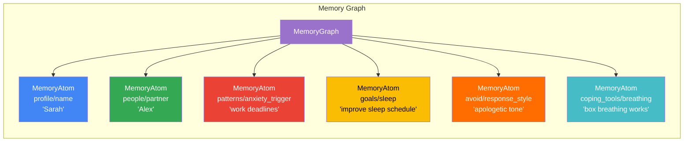
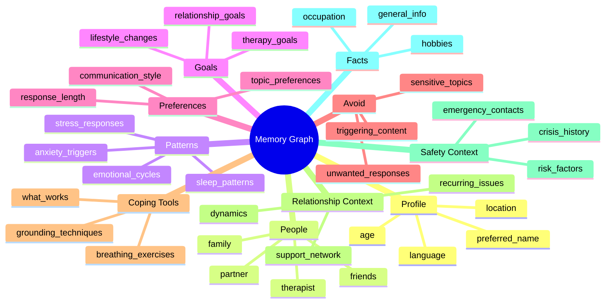
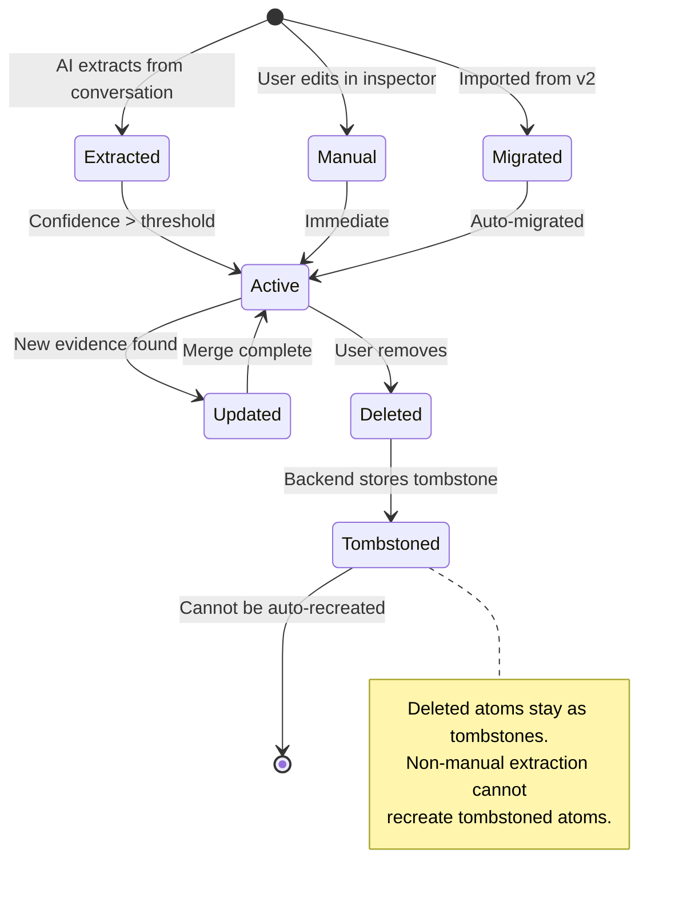
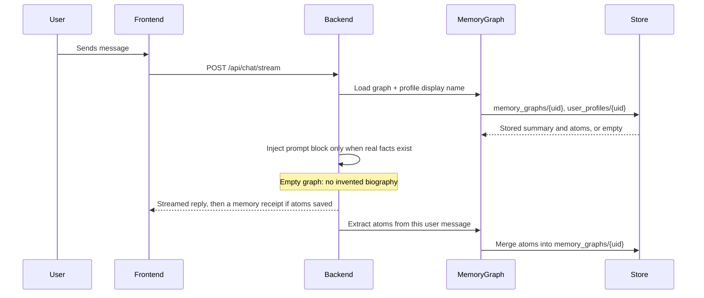
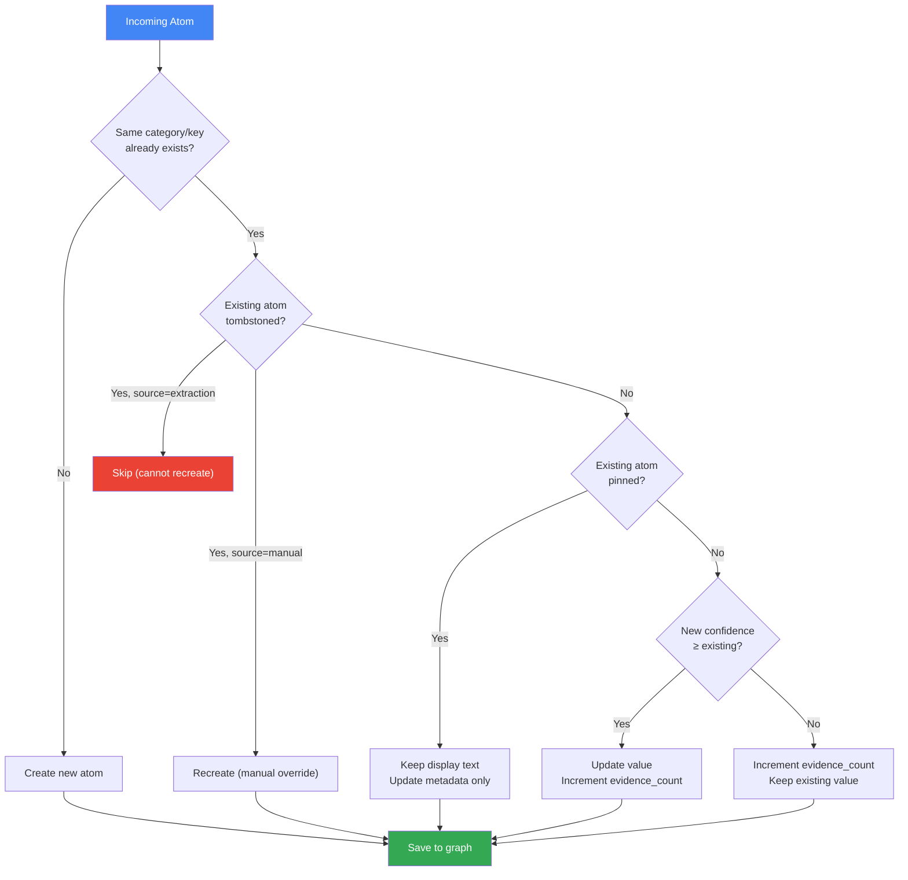
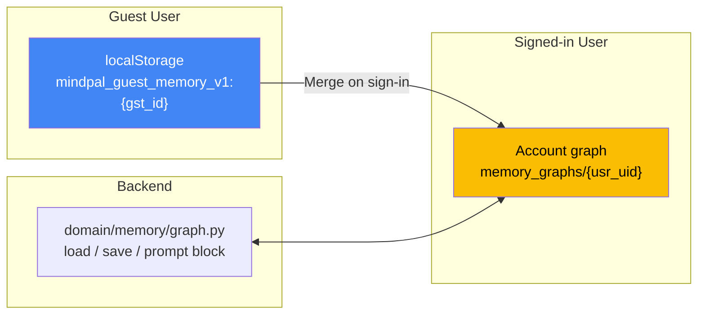

# Memory System — Adaptive Cortical Memory (ACM)

## Overview

MindPal's memory system (V3) uses an **Adaptive Cortical Memory (ACM)** graph architecture that persists user facts, preferences, relationships, and behavioral patterns across sessions.


```mermaid
graph TB
    subgraph "Memory Graph"
        direction TB
        GRAPH["MemoryGraph"]
        GRAPH --> A1["MemoryAtom<br/>profile/name<br/>'Sarah'"]
        GRAPH --> A2["MemoryAtom<br/>people/partner<br/>'Alex'"]
        GRAPH --> A3["MemoryAtom<br/>patterns/anxiety_trigger<br/>'work deadlines'"]
        GRAPH --> A4["MemoryAtom<br/>goals/sleep<br/>'improve sleep schedule'"]
        GRAPH --> A5["MemoryAtom<br/>avoid/response_style<br/>'apologetic tone'"]
        GRAPH --> A6["MemoryAtom<br/>coping_tools/breathing<br/>'box breathing works'"]
    end

    style GRAPH fill:#9b72cb,color:white
    style A1 fill:#4285f4,color:white
    style A2 fill:#34a853,color:white
    style A3 fill:#ea4335,color:white
    style A4 fill:#fbbc04,color:black
    style A5 fill:#ff6d01,color:white
    style A6 fill:#46bdc6,color:white
```

## MemoryAtom Schema

Each memory fact is stored as a `MemoryAtom`:

```
MemoryAtom {
  id              string    Unique identifier (UUID)
  category        string    One of the 10 categories
  key             string    Human-readable key within category
  value           string    The actual memory content
  normalized_value string   Lowercased, trimmed for dedup
  display_value   string    User-facing display text
  confidence      float     0.0–1.0 (how certain we are)
  sensitivity     string    "low" | "medium" | "high"
  source          string    "extraction" | "manual" | "migration"
  status          string    "active" | "deleted" (tombstone)
  pinned          boolean   User pinned (protected from auto-update)
  created_at      ISO date  When first created
  updated_at      ISO date  Last modification
  last_seen_at    ISO date  Last time evidence appeared
  evidence_count  int       How many times confirmed
  aliases         string[]  Alternative names/references
  metadata        object    Extra structured data
}
```

## Memory Categories


```mermaid
mindmap
  root((Memory Graph))
    Profile
      preferred_name
      age
      location
      language
    People
      partner
      family
      friends
      therapist
    Patterns
      anxiety_triggers
      emotional_cycles
      sleep_patterns
      stress_responses
    Goals
      therapy_goals
      lifestyle_changes
      relationship_goals
    Preferences
      communication_style
      response_length
      topic_preferences
    Avoid
      unwanted_responses
      sensitive_topics
      triggering_content
    Coping Tools
      breathing_exercises
      grounding_techniques
      what_works
    Relationship Context
      dynamics
      recurring_issues
      support_network
    Safety Context
      crisis_history
      emergency_contacts
      risk_factors
    Facts
      occupation
      hobbies
      general_info
```

## Memory Lifecycle


```mermaid
stateDiagram-v2
    [*] --> Extracted: AI extracts from conversation
    [*] --> Manual: User edits in inspector
    [*] --> Migrated: Imported from v2

    Extracted --> Active: Confidence > threshold
    Manual --> Active: Immediate
    Migrated --> Active: Auto-migrated

    Active --> Updated: New evidence found
    Updated --> Active: Merge complete
    Active --> Deleted: User removes
    Deleted --> Tombstoned: Backend stores tombstone
    Tombstoned --> [*]: Cannot be auto-recreated

    note right of Tombstoned
        Deleted atoms stay as tombstones.
        Non-manual extraction cannot
        recreate tombstoned atoms.
    end note
```

## Memory in the Chat Flow

Chat turns **read** stored memory before generation and **write** a small structured delta after a successful reply.


```mermaid
sequenceDiagram
    participant User
    participant Frontend
    participant Backend
    participant MemoryGraph
    participant Store

    User->>Frontend: Sends message
    Frontend->>Backend: POST /api/chat/stream
    Backend->>MemoryGraph: Load graph + profile display name
    MemoryGraph->>Store: memory_graphs/{uid}, user_profiles/{uid}
    Store-->>MemoryGraph: Stored summary and atoms, or empty
    Backend->>Backend: Inject prompt block only when real facts exist
    Note over Backend: Empty graph: no invented biography
    Backend-->>Frontend: Streamed reply, then a memory receipt if atoms saved
    Backend->>MemoryGraph: Extract atoms from this user message
    MemoryGraph->>Store: Merge atoms into memory_graphs/{uid}
```

Automatic writes use `extract_atoms_from_turn` plus `MemoryGraphService.merge_atoms`. They store high-confidence durable facts (preferred name, named people, goals, communication preferences) from the **current user message only**. They do not dump the transcript, assistant text, or RAG corpus into the graph.

Skipped writes:

- Empty or small-talk turns (`ok`, `thanks`, `hello`)
- Crisis / safety-override turns (no crisis text stored as biography)
- Shared guest key `usr_anon_default` (never a write target; no global graph)
- Failed or empty model output

Guests do not get a server graph. Auth is Bearer-only (no cookie or signed guest token), so a client-supplied device id would be an unauthenticated graph key. Guest atoms stay on-device, keyed by a crypto-random `gst_` id in localStorage. The same extract rules still run; the stream may emit a receipt so the client can store those atoms locally. Signing in merges leftover device atoms into the account graph and stops writing the guest key.

Inspector routes (`/api/memory/*`) replace, merge, and delete atoms for signed-in users only. Unauthenticated PUT/DELETE is rejected and must not write `usr_anon_default`. Chat write is a partial merge; it never rewrites the whole graph or the summary from the turn. Chat logs record `memory_atoms_written` only — not reflective text.

After a successful reply, the stream may emit one `memory` event listing saved atoms (`id`, `type`, short `text`) and `count`. Empty writes omit the event. Crisis and small-talk turns stay silent. The chat receipt can open the inspector or undo (account: `DELETE /api/memory/graph/items/{id}`; guest: the on-device graph). Saved-fact edits persist with `PATCH /api/memory/graph/items/{id}` (account) or the on-device graph (guest).

## Merge Rules (Deterministic)


```mermaid
flowchart TD
    START["Incoming Atom"] --> CHECK{"Same category/key<br/>already exists?"}
    
    CHECK -->|"No"| NEW["Create new atom"]
    CHECK -->|"Yes"| TOMB{"Existing atom<br/>tombstoned?"}
    
    TOMB -->|"Yes, source=extraction"| SKIP["Skip (cannot recreate)"]
    TOMB -->|"Yes, source=manual"| OVERRIDE["Recreate (manual override)"]
    TOMB -->|"No"| PINNED{"Existing atom<br/>pinned?"}
    
    PINNED -->|"Yes"| KEEP_TEXT["Keep display text<br/>Update metadata only"]
    PINNED -->|"No"| CONF{"New confidence<br/>≥ existing?"}
    
    CONF -->|"Yes"| UPDATE["Update value<br/>Increment evidence_count"]
    CONF -->|"No"| EVIDENCE["Increment evidence_count<br/>Keep existing value"]
    
    NEW --> SAVE["Save to graph"]
    OVERRIDE --> SAVE
    KEEP_TEXT --> SAVE
    UPDATE --> SAVE
    EVIDENCE --> SAVE

    style START fill:#4285f4,color:white
    style SKIP fill:#ea4335,color:white
    style SAVE fill:#34a853,color:white
```

### Key Merge Principles
1. **Partial deltas never replace the graph** — only merge into it
2. **Empty fields don't delete** — missing fields are ignored
3. **Aliases merge** — new aliases are added to existing sets
4. **People merge by alias/relationship** when safe to do so
5. **Timestamps move forward** — `updated_at` and `last_seen_at` never go backward

## Storage Architecture


```mermaid
flowchart LR
    subgraph "Guest User"
        LS["localStorage<br/>mindpal_guest_memory_v1:{gst_id}"]
    end

    subgraph "Signed-in User"
        FS["Account graph<br/>memory_graphs/{usr_uid}"]
    end

    subgraph "Backend"
        MG_SVC["domain/memory/graph.py<br/>load / save / prompt block"]
    end

    LS -->|"Merge on sign-in"| FS
    MG_SVC <--> FS

    style FS fill:#fbbc04,color:black
    style LS fill:#4285f4,color:white
```

## Memory Inspector (Frontend)

The Memory Inspector is accessible from Settings (stacked above it) or Review on a save receipt. It lists saved facts in a compact table: type, text, edit, and delete.

### Fact edit / delete
1. Pencil opens an in-row field. Empty Save stays disabled. Escape restores the previous text.
2. Save persists the atom text: signed in → `PATCH /api/memory/graph/items/{atom_id}`; signed out → the on-device graph.
3. Trash removes the fact immediately (no confirm): signed in → `DELETE /api/memory/graph/items/{atom_id}`; signed out → remove from the on-device graph.

## API Endpoints

| Method | Path | Description |
|--------|------|-------------|
| `GET` | `/api/memory/graph` | Load the account graph. Guests get an empty graph. |
| `PUT` | `/api/memory/graph` | Replace atoms for a signed-in account. |
| `PATCH` | `/api/memory/graph/items/{atom_id}` | Update one atom’s stored text. Rejects empty text. |
| `DELETE` | `/api/memory/graph/items/{atom_id}` | Remove one atom. |
| `GET` | `/api/memory/summary` | Load the stored summary. |
| `POST` | `/api/memory/summary/refresh` | Replace the stored summary. |

`GET /api/user/wellness-timeline` (signed-in) **reads** this graph plus synced user turns and derives a coarse mood/theme/event reflection. It does not write a separate clinical profile. `DELETE /api/user/data` removes those sources.

## Prompt Integration

`ChatOrchestrator` loads the graph (and a non-placeholder profile name, if one exists) and appends a bounded block only when stored facts exist. Placeholder copy such as “User is building a therapeutic reflective space” is treated as empty.

```
Known user memory. Use only when relevant. Do not invent additional personal facts.
Stored details may be outdated if the conversation contradicts them.

Prefers evening walks. Anxious before exams.
Profile:
- Preferred name: Sarah
People:
- Partner is Alex
Goals:
- Improve sleep schedule
```

No stored summary or atoms: the block is omitted. Chat logs record `memory_atoms` count and `memory_summary=yes|no` only — not the memory text.
