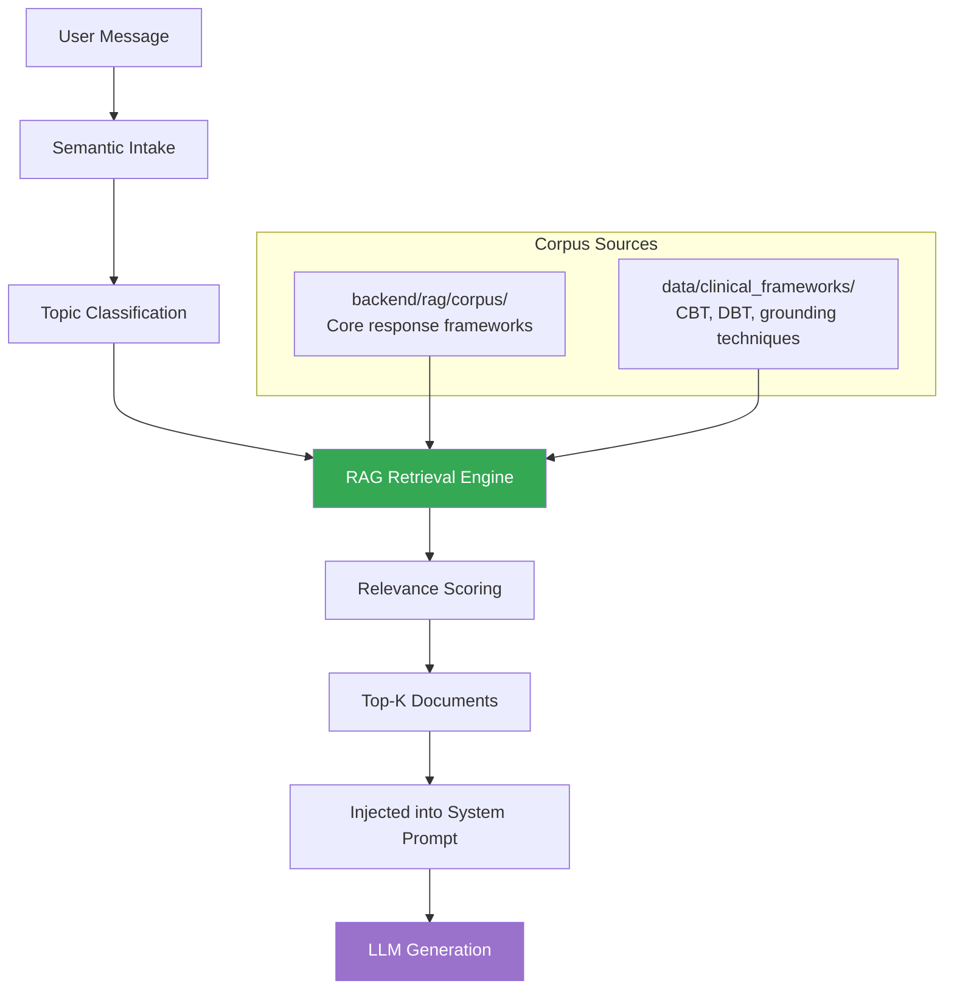
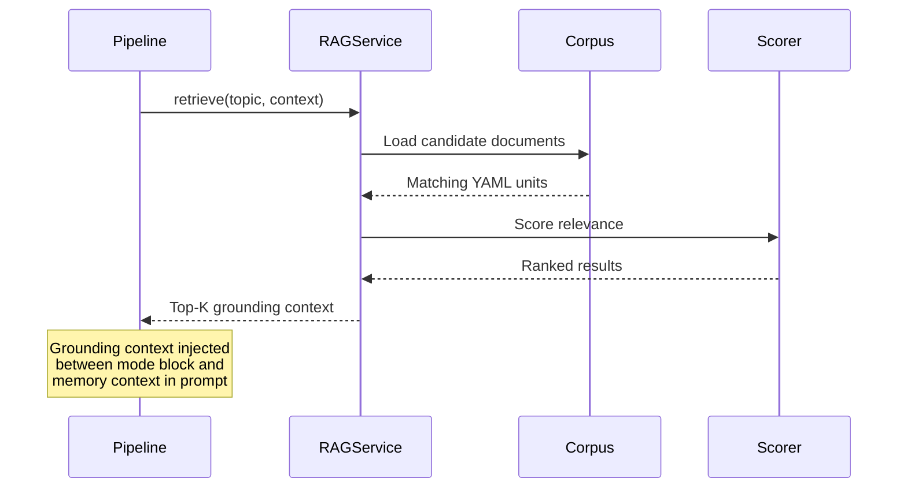

# RAG — Clinical Framework Grounding

## Overview

MindPal uses Retrieval-Augmented Generation (RAG) to ground AI responses in evidence-based clinical frameworks. This ensures responses follow established therapeutic techniques rather than relying solely on LLM "vibes."

## RAG Architecture

## Corpus Structure

### Core Corpus (`backend/rag/corpus/`)
Response framework templates for common scenarios:
- Panic attacks → Grounding sequences (5-4-3-2-1)
- Anxiety → Box breathing, cognitive restructuring
- Anger → De-escalation, emotion naming
- Study stress → Pomodoro, prioritization
- Relationship distress → Pattern naming, safety questions

### Clinical Frameworks (`data/clinical_frameworks/`)
Evidence-based therapeutic technique YAML files:
- **CBT** (Cognitive Behavioral Therapy) — thought records, cognitive distortions
- **DBT** (Dialectical Behavior Therapy) — distress tolerance, emotion regulation
- **Grounding** — sensory awareness, breathing exercises
- **Behavioral Activation** — activity scheduling, pleasure/mastery tracking

## Retrieval Flow

## What RAG Is NOT

| RAG Is | RAG Is NOT |
|--------|-----------|
| Technique guidance | User-specific memory |
| Curated clinical content | LLM-generated advice |
| Evidence-based frameworks | Diagnosis or treatment |
| Deterministic retrieval | Hallucinated techniques |

## Health Endpoint

`GET /api/rag/health` — Verifies corpus is loaded and retrieval is functional.
