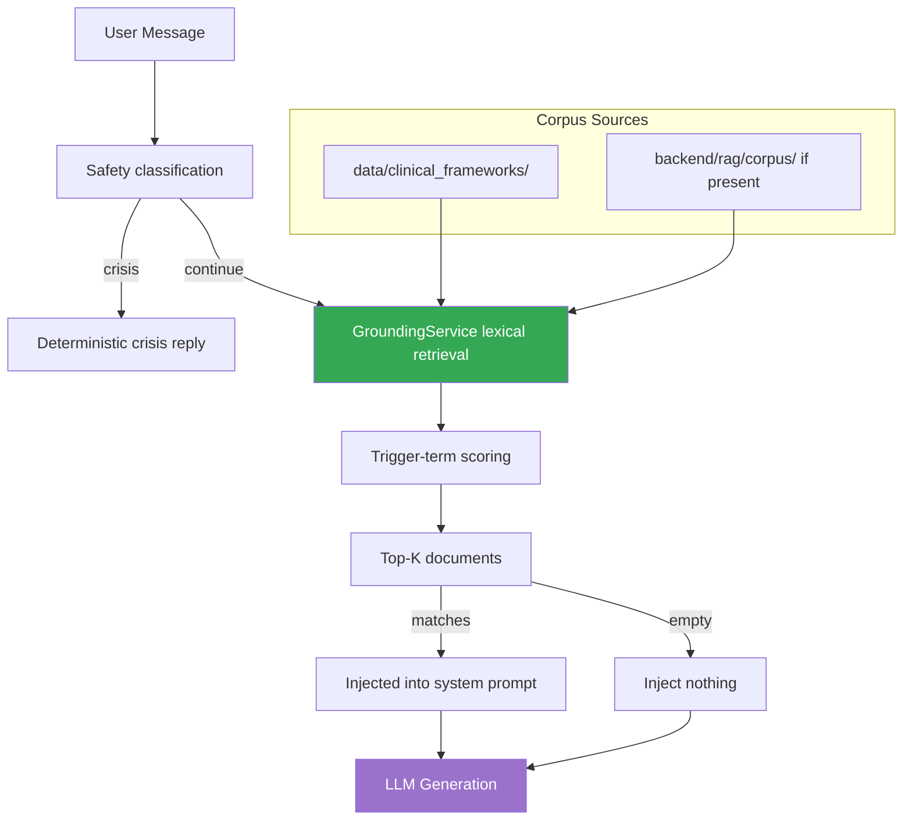
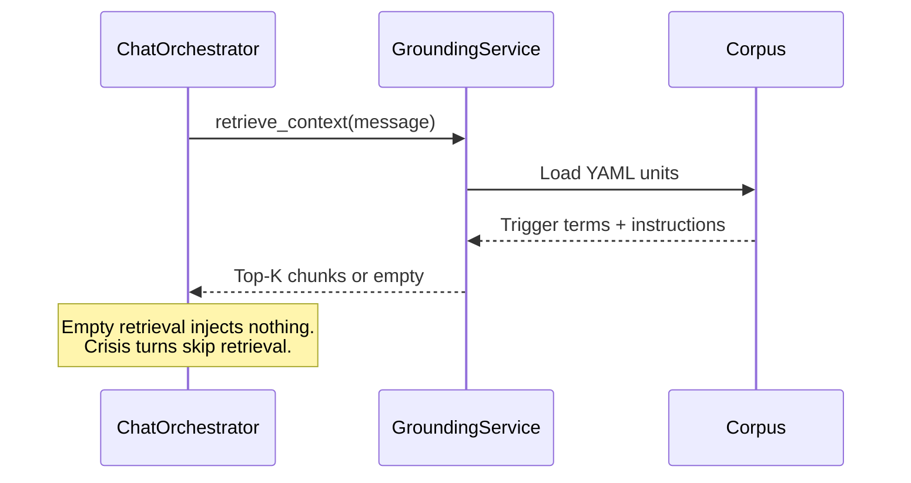

# RAG — Clinical Framework Grounding

## Overview

MindPal uses Retrieval-Augmented Generation (RAG) to ground AI responses in curated wellness frameworks. Retrieved units are technique guidance for the current chat turn, not diagnosis, treatment, or user memory.

## RAG Architecture

```mermaid
flowchart TD
    MSG["User Message"] --> SAFETY["Safety classification"]
    SAFETY -->|crisis| CRISIS["Deterministic crisis reply"]
    SAFETY -->|continue| RETRIEVE["GroundingService lexical retrieval"]

    subgraph "Corpus Sources"
        CLINICAL["data/clinical_frameworks/"]
        CORE["backend/rag/corpus/ if present"]
    end

    CLINICAL --> RETRIEVE
    CORE --> RETRIEVE

    RETRIEVE --> SCORE["Trigger-term scoring"]
    SCORE --> TOP_K["Top-K documents"]
    TOP_K -->|matches| PROMPT["Injected into system prompt"]
    TOP_K -->|empty| SKIP["Inject nothing"]
    PROMPT --> LLM["LLM Generation"]
    SKIP --> LLM

    style RETRIEVE fill:#34a853,color:white
    style LLM fill:#9b72cb,color:white
```

## Corpus Structure

### Clinical frameworks (`data/clinical_frameworks/`)
Curated YAML units used on every non-crisis chat turn:
- Panic / acute anxiety — 5-4-3-2-1 sensory grounding
- Anger — DBT STOP delay
- Overthinking — cognitive reframe
- Study stress — one testable block
- Relationship distress — boundary naming and safety checks

### Optional core corpus (`backend/rag/corpus/`)
Loaded when the directory exists. It is not required for chat grounding.

## Retrieval Flow

```mermaid
sequenceDiagram
    participant Pipeline as ChatOrchestrator
    participant Grounding as GroundingService
    participant Corpus

    Pipeline->>Grounding: retrieve_context(message)
    Grounding->>Corpus: Load YAML units
    Corpus-->>Grounding: Trigger terms + instructions
    Grounding-->>Pipeline: Top-K chunks or empty
    Note over Pipeline: Empty retrieval injects nothing.<br/>Crisis turns skip retrieval.
```

`ChatOrchestrator` (`backend/domain/chat/orchestrator.py`) calls `GroundingService.retrieve_context` while assembling the system instruction for `/api/chat/stream`. Matches are labeled as technique guidance, not diagnosis. If nothing scores above the relevance floor, the prompt is unchanged.

## What RAG Is NOT

| RAG Is | RAG Is NOT |
|--------|-----------|
| Technique guidance | User-specific memory |
| Curated clinical content | LLM-generated advice |
| Evidence-based frameworks | Diagnosis or treatment |
| Deterministic retrieval | Hallucinated techniques |
