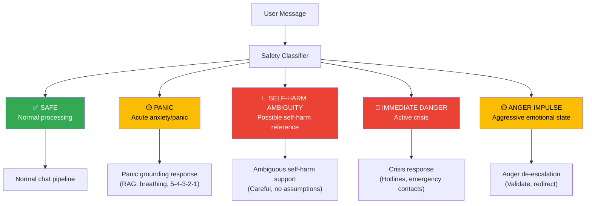
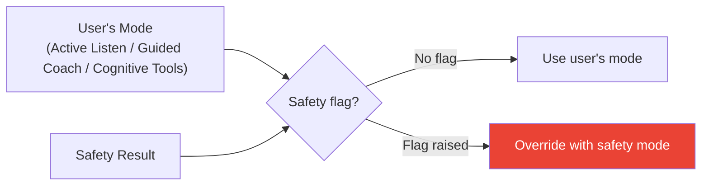
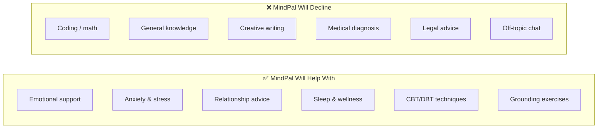

# Safety System — Crisis Detection & Response Routing

## Overview

MindPal's safety system is the first gate every message passes through. It classifies risk level and can override the user's chosen mode with a safety-specific response.

## Safety Classification Pipeline

## Safety Override Rules

Safety classification **always overrides** the user's selected mode:

## Response Modes (Backend)

| Mode | Trigger | Behavior |
|------|---------|----------|
| `normal_support` | No safety flag | Use user's selected mode |
| `panic_grounding` | Panic/acute anxiety detected | 5-4-3-2-1 grounding, box breathing |
| `ambiguous_self_harm_support` | Possible self-harm language | Careful inquiry, no assumptions |
| `personal_safety` | Active danger | Crisis resources, hotlines |
| `anger_deescalation` | Aggressive emotional state | Validate anger, redirect energy |
| `study_stress` | Academic overwhelm | Structured study strategies |
| `relationship_distress` | Partner/relationship issues | Name pattern, one safety question |
| `emotion_labeling` | Vague emotional state | Help identify and name emotions |

## Product Boundaries

MindPal stays focused on emotional support. The `PRODUCT_BOUNDARY_PROMPT` enforces:

When off-topic requests are detected, MindPal responds:
> "I'm designed to support your emotional well-being. I'm not the best fit for [topic], but I'm here if you'd like to talk about how you're feeling."

## Safety Disclaimers

Injected into every response context:
- Never diagnose or prescribe
- Never claim to replace professional care
- Always recommend professional help for serious concerns
- Clinical frameworks are guidance, not treatment
- AI may make mistakes — always consult a licensed professional

## Clinical Extraction

After each conversation, the `clinical_extractor.py` service extracts:
- **PHQ-9 signals** (depression screening indicators)
- **GAD-7 signals** (anxiety screening indicators)
- **Observed patterns** (sleep, appetite, energy, concentration)

These are displayed in the Mental Health tab of the Settings panel as clinical insights, NOT as diagnoses.
