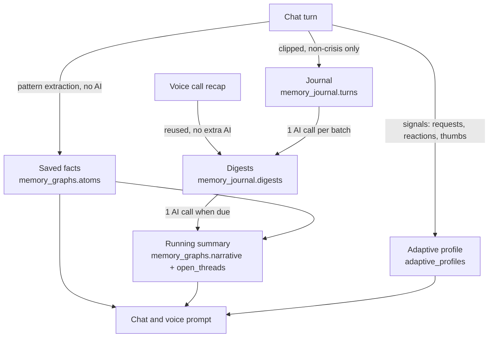

# Memory and Learning

What MindPal remembers about a person, how it learns what helps them, and how
the person stays in control. Signed-in accounts only; guests keep memory on
their own device and are never profiled.

## Layers

| Layer | Written by | Cost |
|---|---|---|
| Facts | Pattern extraction each turn (`domain/memory/extract.py`), plus facts the digest call finds in any language | none extra |
| Digests | Compaction of ~6+ turns, or after 30 idle minutes; stored with a vector for search by meaning | 1 AI call per batch |
| Summary | Merge of previous summary, top facts and recent digests | 1 AI call when due |
| Adaptive profile | Signals the person gives (`domain/adaptation/profile.py`) | none |

## Facts and salience

Each fact tracks `mentions`, `first_seen` and `last_seen`. Salience =
confidence x reinforcement (log of mentions) x recency (45-day half-life);
identity facts are pinned. When memory is full (16 facts) the least salient
fact is evicted, and the prompt lists facts in salience order.

## AI summary (consolidation)

`domain/memory/consolidation.py` runs the pipeline in the diagram. AI calls are
rationed by:

- **thresholds**: turns before a digest, digests or new facts before a summary
- **a per-person cooldown and daily budget**
- **platform load**: thresholds rise and inline work stops as MindPal gets busy
  (see [operations.md](operations.md#load-levels))

A person's first consolidation also writes their first summary. Open threads
are written as follow-up questions in the person's language; after a gap of
12+ hours the greeting asks one ("How did the Friday exam go?"). A question is
never asked twice, never touches crisis topics, and is skipped under load. Work runs
inline after a reply when load allows, otherwise from the scheduler
(`/api/internal/memory-consolidation`). There is never an AI call on the reply
path itself.

## Search by meaning

The wellness guidance library and conversation digests carry embeddings
(`infra/llm/embeddings.py`, 256 dimensions). Retrieval ranks by keywords plus
meaning, so "I froze in the meeting" reaches the anxiety techniques, and voice
recall finds an earlier conversation from a paraphrase. Library vectors are
built once with `scripts/ops/build_grounding_embeddings.py` and ignored when
their technique text changes. Semantic search is off at `strained` and
`critical` load and whenever no key is configured; keywords alone still work.

## Self-learning

The adaptive profile learns from explicit requests ("too long", "just listen",
"be direct", in English and Arabic), reactions to the previous reply, and
thumbs up/down. Reactions and thumbs reward the strategy that produced the
reply (a Beta-Bernoulli estimate per strategy). Everything decays each turn.

It steers strategy selection (`domain/chat/strategy.py`, which scores distress,
cognitive distortion and advice-seeking in both languages), fills
personalization settings the person left at defaults, and adds a style note to
chat and live-voice prompts. Explicit settings always win, and safety rules
always take priority.

## Control and privacy

| Person can | How |
|---|---|
| See facts, the AI summary, open threads | Memory screen; `GET /api/memory/graph`, `/summary`, `/journal` |
| Edit or delete a fact | Memory screen. Deleting also drops the AI summary and every digest mentioning the fact, then queues a rebuild |
| Forget the AI summary | Memory screen "Forget summary"; `DELETE /api/memory/narrative` |
| See and reset learned style | Settings, Personalization; `GET`/`DELETE /api/user/adaptation` |
| Export or delete everything | `GET /api/user/export`, `DELETE /api/user/data` |

Crisis turns are never journaled or learned from. Prompts forbid invention,
diagnosis and self-harm method details, and AI output containing crisis
language is rejected. A summary the person writes themselves is kept separately
and never overwritten.
