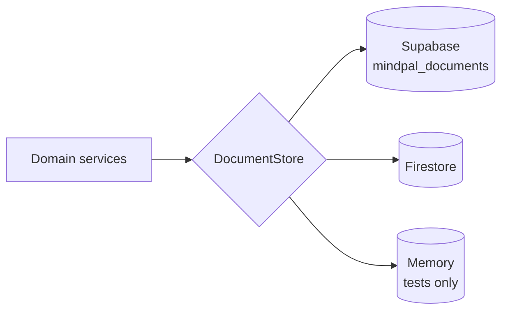

# Operations

## Deploy

Vercel builds with `vercel.json`:

```
python scripts/build/apply_brand.py && npm ci && npm run build:vercel && python scripts/build/verify_frontend_build.py
```

`api/index.py` exposes `backend.main:app`; FastAPI serves the built frontend.
`/api/health/ready` returns 503 while storage is degraded.

## Configuration

Environment is read only through `backend/configs/settings.py` (`get_settings()`,
cached). Product values live in schema-validated JSON under
`backend/configs/json/` and are checked at boot and in CI
(`scripts/ci/validate_runtime_configs.py`). `.env.example` documents every
variable. The ones operators must set:

| Variable | Purpose |
|---|---|
| `FIREBASE_CREDENTIALS_JSON` (or `_BASE64` / `_PATH`) | Firebase Admin (sign-in verification) |
| `MINDPAL_STORAGE_PROVIDER` | `supabase` (production), `firestore`, or `memory` (local only) |
| `SUPABASE_URL`, `SUPABASE_SERVICE_ROLE_KEY` | Production data store (server-side secrets) |
| `GEMINI_API_KEY` | Chat, classifiers, live voice tokens |
| `OPENROUTER_API_KEY`, `GROQ_API_KEY` | Optional fallback providers |
| `CRON_SECRET` | Scheduler credential (Vercel Cron sends it as a bearer token) |
| `MINDPAL_VOICE_SUPPORT_DIAGNOSTICS_SECRET` | Support-only diagnostics and platform pulse |
| `MINDPAL_ALLOWED_HOSTS`, `MINDPAL_CORS_ORIGINS` | Host and origin allowlists |
| `MINDPAL_ADAPTIVE_LEARNING` | `0` turns per-person learning off |
| `MINDPAL_PRESSURE_OVERRIDE` | Pin the load level during an incident |

## Storage



- The provider is chosen by `MINDPAL_STORAGE_PROVIDER`; production uses
  Supabase. If unset: Supabase when configured, then Firestore when Firebase
  Admin credentials exist, then memory (logged as an error in production).
- The Firebase project `mindpal-official-0` has no Firestore database, so
  selecting Firestore needs one created first (see
  [decision 0001](decisions/0001-supabase-document-store.md)).
- A durable provider is never silently swapped for memory. After failures a
  half-open circuit breaker stops calls and then recovers on its own. While
  degraded, reads can come from a bounded cache; writes fail closed, so limits
  are never enforced from per-instance state.
- Per-user export, delete and retention use field queries with real document
  IDs and paging.
- Supabase needs migrations `0004` and `0005` in `supabase/migrations/`.
- Move data between providers (keeps IDs, verifies counts):
  `python scripts/ops/migrate_store.py --from firestore --to supabase --dry-run`

## Scheduled jobs

| Path | Schedule | Does |
|---|---|---|
| `/api/internal/voice-retention` | daily 03:00 | purges expired voice data |
| `/api/internal/memory-consolidation` | daily 03:30 | queued AI memory work, pulse cleanup |

Both require `CRON_SECRET`. Vercel Hobby only allows daily jobs; on Pro, run
memory consolidation every 15 minutes (`*/15 * * * *`).

## Load levels

Every instance reports active people, requests, LLM calls, errors, rate limits,
latency and tokens once per minute (`platform_pulse`). Pressure is the busiest
signal relative to the capacity in `configs/json/dynamic.json`.

| Level | Memory AI | Voice face reactions | Chat history sent | Guest quota |
|---|---|---|---|---|
| calm | eager, inline | normal | full | full |
| busy | higher thresholds | 1.6x slower | full | full |
| strained | scheduler only | 3x slower | 80% | 60% |
| critical | overdue jobs only | off | 60% | 40% |

Never load-dependent: crisis detection and resources, the voice safety
classifier and lease, and signed-in users' quotas.

Current state: `GET /api/internal/platform-pulse` with header
`X-Voice-Support-Secret`. To pin a level, set `MINDPAL_PRESSURE_OVERRIDE`.

## Operational scripts

| Script | Use |
|---|---|
| `scripts/ops/migrate_store.py` | Copy data between storage providers |
| `scripts/ops/push_env_to_vercel.py` | Push `.env.vercel` values to Vercel |
| `scripts/ops/firebase_smoke.py` | Verify Firebase Admin credentials |
| `scripts/ops/verify_gemini_config.py` | Verify the live-voice Gemini config against the API |
| `scripts/ops/check_openrouter_key.py` | Report what an OpenRouter key can do |
| `scripts/eval/validate_voice_classifier.py` | Score the voice crisis classifier on labelled phrases |
| `scripts/eval/rank_openrouter_free.py` | Rank free models for the classifier |
