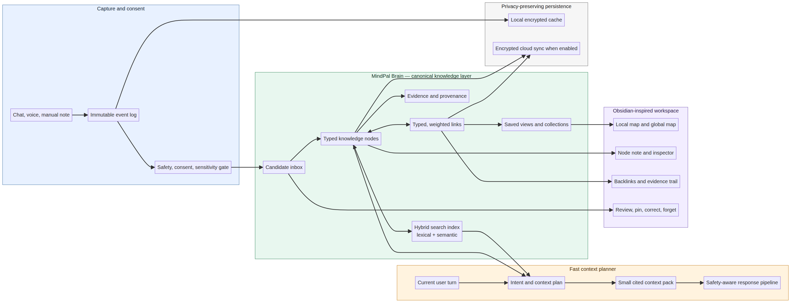
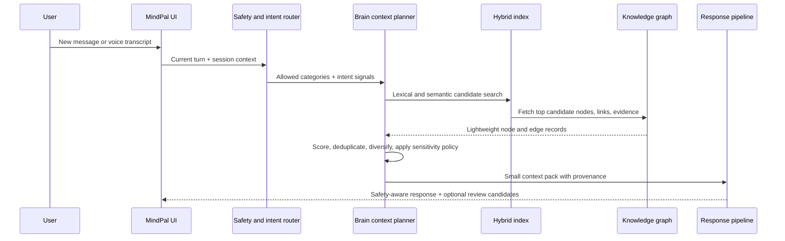

# MindPal Brain: An Obsidian-Inspired, Safety-Aware Knowledge Workspace

**Author:** Manus AI  
**Status:** Product and technical design  
**Scope:** A new first-class **Brain** workspace that extends MindPal’s existing Adaptive Cortical Memory v3 without replacing its safety system, chat history, or current cloud-sync behavior.



## Executive summary

MindPal is a **wellness-oriented conversational companion**. Its experience is centered on text and voice conversations, selectable support styles, durable personal memory, curated grounding, safety-aware routing, and optional cloud synchronization. The existing memory model already has a strong foundation: it stores atomic, categorized facts with confidence, sensitivity, source, timestamps, pinning, aliases, evidence counts, and tombstones. It also explicitly separates raw chat history from durable memory.[1] [2]

The main product gap is not the absence of memory. It is the absence of a **clear, inspectable, navigable knowledge space**. Today, the user reaches memory mainly through a Settings inspector. That is appropriate for controls, but it does not help someone understand how their goals, patterns, people, coping tools, reflections, and past sessions relate. The proposed **MindPal Brain** converts the existing atom store into a small personal knowledge graph with source evidence, typed links, local maps, backlinks, focused review, and a fast context planner.

> **Design thesis:** The Brain should make MindPal’s remembered context understandable and correctable by the user, while selecting only a small, relevant, and safety-permitted context pack for each response.

The design borrows the useful navigation patterns of Obsidian rather than reproducing a note-taking application. Obsidian’s graph represents items as nodes and relationships as links, supports filtering and grouping, and offers a focused local graph around an active item.[3] Its links and backlinks make the surrounding context visible.[4] MindPal should apply those patterns to consented, evidence-backed personal context—not to unbounded raw conversation or clinical diagnoses.

| Design decision | Why it matters | Relationship to current MindPal |
|---|---|---|
| Add a dedicated Brain workspace | Memory becomes discoverable rather than hidden in Settings | Retains the existing Memory Inspector as the place for data controls |
| Preserve chat history as an event stream | Avoids conflating a moment of conversation with durable truth | Reinforces the current explicit separation of history and memory [2] |
| Add typed, evidence-backed links | Explains why two pieces of knowledge are connected | Extends current categorized atoms without weakening merge/tombstone rules [1] |
| Use local and global graph views | Keeps exploration helpful rather than visually overwhelming | Adapts Obsidian’s global and local graph patterns [3] |
| Retrieve a small context pack | Reduces token use, response latency, and irrelevant recall | Replaces broad prompt injection with ranked context selection |
| Make review, correction, and forgetting first-class | Keeps users in control of sensitive personal context | Builds on the existing pin, edit, and tombstone behaviors [1] |

## What MindPal currently does

MindPal’s present experience can be modeled as a chat-first loop. The user sends a text or voice turn, chooses a preferred conversational style, and receives a safety-aware response. The backend uses current conversation context, memory, product instructions, and relevant grounding to create the response. Afterwards, it may extract candidate durable memory, merge it into the existing graph, persist/synchronize it, and refresh the frontend inspector.[1] [2]

| Stage | Present behavior | Strength | Design opportunity |
|---|---|---|---|
| Conversation | Text and immersive voice interactions are the primary entry points | Low-friction user expression | Add a lightweight “Save to Brain” action for intentional capture |
| Safety and routing | Safety routing can override the selected response preference | Appropriate for a wellness product | Gate all candidate memory and graph linking through the same policy layer |
| Raw history | Local in guest mode; cloud-backed when signed in | Preserves conversational continuity | Treat as immutable evidence, not as the graph itself [2] |
| Durable memory | Categorized atoms have confidence, sensitivity, provenance, aliases, pinning, and tombstones | Strong, user-controlled foundation | Promote atoms to graph nodes with explicit evidence and typed edges [1] |
| Memory controls | Review, edit, pin, clear, and delete are available through Settings | Important control surface | Keep as controls; add a more discoverable Brain workspace for exploration |
| Prompt context | Durable memory is rendered into the prompt | Provides continuity | Rank, diversify, and bound the context pack per turn |

## Brain experience

The Brain is a **third primary place** in MindPal, alongside Chat and Settings. It should open as a calm, low-density workspace rather than a technical visualization. The default experience is a useful **Today** view, not a dense graph.

### Primary navigation

| Area | Purpose | Default content |
|---|---|---|
| **Today** | Turn reflection into a useful next step | Current goal, recent pattern, one saved coping tool, and pending review items |
| **Map** | Explore relationships | A filterable global graph with safe, high-level clusters |
| **Focus** | Understand one item in context | The selected node, direct evidence, linked items, and local map depth 1–2 |
| **Review** | Decide what MindPal should retain | Candidate memories, stale memories, conflicts, and low-confidence links |
| **Search** | Find a past idea or fact quickly | Hybrid lexical and semantic search with category, date, and sensitivity filters |

The user reaches **Brain** from the main navigation. The workspace uses three panes on desktop and one progressively disclosed pane on mobile:

| Pane | Contents | Interaction |
|---|---|---|
| Left rail | Today, Map, Focus, Review, saved views, filters | Switch view, filter categories, select a saved collection |
| Center canvas | Local graph, timeline, or list depending on selected view | Zoom, pan, select, search, expand only one relationship depth at a time |
| Right inspector | Node details, properties, evidence, backlinks, controls | Pin, correct, merge, unlink, hide, delete, or set an expiry |

The global Map intentionally begins with at most a few meaningful clusters: **People**, **Goals**, **Patterns**, **Tools**, and **Recent reflections**. Users can increase depth or turn on lower-confidence material. This follows the practical distinction in Obsidian between a broad graph and a local graph centered on the active item.[3]

## Knowledge model

### Canonical layers

The Brain should use four connected but distinct layers. The separation is essential for correctness, privacy, and performance.

```text
Conversation and voice events  →  Evidence records  →  Knowledge nodes and edges  →  Response context pack
```

| Layer | Definition | Editable? | Used directly in a response? |
|---|---|---:|---:|
| Event | An immutable conversation, voice transcript segment, or explicit user action | No; user may delete the source under data controls | No |
| Evidence | A minimal source reference that supports a memory candidate or link | Not rewritten; may be detached or hidden | Only as a short cited excerpt when necessary |
| Node | A durable, human-readable personal item | Yes | Yes, if relevant, consented, and allowed by policy |
| Edge | A typed relationship between two nodes | Yes | Yes, only through the nodes it connects |
| View | A saved query or collection such as “Work stress patterns” | Yes | No; it organizes content |

### Node types

Existing MindPal atoms remain the migration source of truth. The Brain adds a stable `node_type`, user-facing title, optional summary, and richer link semantics.

| Node type | Examples | Default sensitivity | Capture rule |
|---|---|---:|---|
| `person` | partner, family member, trusted friend | Medium | Create only when the person is relevant to the user’s ongoing context |
| `goal` | improve sleep consistency, prepare for an exam | Medium | Prefer explicit intention or repeated evidence |
| `pattern` | stress rises before deadlines | Medium | Require repeated evidence or user confirmation |
| `coping_tool` | breathing exercise, a helpful routine | Low–Medium | Record what the user says helps; do not imply treatment efficacy |
| `preference` | concise replies, avoid a topic | Medium | User instruction or a high-confidence recurring preference |
| `context` | university schedule, hobby, workplace change | Low–Medium | Capture only durable, useful context |
| `reflection` | a user-authored insight or deliberate note | User-selected | Always explicit; never silently generated as a fact |
| `session_summary` | a concise, user-reviewable summary of a conversation | Medium | Generated only with clear review/retention controls |
| `boundary` | “Do not bring up this topic unless I do” | High | Explicit user control; always honored |
| `safety_context` | restricted safety-related context | High | Restricted, need-to-know use only; not placed in the default visual map |

MindPal must not represent inferred clinical labels, diagnoses, or high-impact psychological conclusions as ordinary graph nodes. A wellness companion can show a user’s own reflection or stated preference; it should not visually present speculative judgments as settled identity.

### Edge types and link confidence

Graph links should be explicit and typed. A generic line is not enough for a user to understand why items appear related.

| Edge type | Direction | Example | User-visible label |
|---|---|---|---|
| `supports` | Evidence → node | A repeated statement supports a goal | “Supported by” |
| `relates_to` | Symmetric | A person and a recurring issue are related | “Related to” |
| `affects` | Directed | Deadline pressure affects sleep | “May affect” |
| `helps_with` | Directed | A grounding exercise helps with overwhelm | “Helpful for” |
| `blocks` | Directed | Late-night screen use blocks a sleep goal | “Gets in the way of” |
| `part_of` | Directed | An exam plan is part of a study goal | “Part of” |
| `contradicts` | Symmetric | Two current preferences conflict | “Needs review” |
| `supersedes` | Directed | A new address replaces an old address | “Updates” |

Every edge carries `confidence`, `source`, `evidence_ids`, `created_at`, `last_confirmed_at`, and `status`. The UI should use subtle styling rather than alarming certainty labels: solid for confirmed, dotted for tentative, and amber only for conflicts needing review.

### Properties and provenance

Obsidian’s useful lesson is that small, typed properties make a knowledge item both human-readable and filterable.[5] MindPal should use a constrained schema rather than open-ended metadata.

```json
{
  "id": "node_goal_sleep_consistency",
  "node_type": "goal",
  "title": "Improve sleep consistency",
  "summary": "Wants a steadier sleep routine during stressful weeks.",
  "status": "active",
  "confidence": 0.84,
  "sensitivity": "medium",
  "source": "extraction",
  "pinned": true,
  "created_at": "2026-08-13T12:00:00Z",
  "updated_at": "2026-08-13T12:00:00Z",
  "last_confirmed_at": "2026-08-13T12:00:00Z",
  "expires_at": null,
  "evidence_count": 3,
  "evidence_ids": ["ev_01", "ev_04"],
  "properties": {
    "time_horizon": "ongoing",
    "review_state": "confirmed"
  }
}
```

A node inspector always explains **what MindPal knows**, **why it knows it**, **how certain it is**, **when it was last confirmed**, and **what control the user has**. This is the central difference between a trustworthy Brain and an opaque “AI memory.”

## Fast context planner

The current system should evolve from broad memory rendering toward a bounded, query-aware context planner. The planner runs after safety routing but before the response prompt is finalized.

### Retrieval workflow



### Candidate selection and ranking

The planner should retrieve a maximum of **24 inexpensive candidates**, score them in memory, and supply **at most 6 durable nodes**, **2 evidence excerpts**, and **2 current-session snippets** to the response pipeline. The exact numbers should be tested, but the guiding rule is stable: context must be small, diverse, and explainable.

```text
score(node) =
  0.36 × semantic relevance
+ 0.24 × lexical/entity match
+ 0.14 × recency decay
+ 0.12 × user pin / explicit instruction
+ 0.08 × evidence confidence
+ 0.06 × graph proximity to current-session entities
− staleness penalty
− sensitivity-policy penalty
− redundancy penalty
```

The planner then applies three deterministic passes. First, it removes inaccessible and tombstoned items. Second, it limits each type to avoid a response filled with the same topic. Third, it resolves conflicts by selecting the most recently confirmed, highest-confidence, or explicitly pinned node and creating a Review item instead of silently choosing between incompatible personal facts.

| Performance mechanism | Implementation | Expected effect |
|---|---|---|
| Graph-versioned cache | Cache context plans by user, graph version, session, normalized intent, and policy tier | Avoids re-ranking unchanged knowledge on repeated follow-up turns |
| Incremental deltas | Update affected nodes, edges, and index entries after a memory merge | Avoids rebuilding the full graph after each message |
| Hybrid retrieval | Run a small local lexical/entity search before semantic expansion | Fast exact matching for names, goals, and recently mentioned phrases |
| Two-stage rerank | Retrieve cheaply, then score only the top candidates | Keeps response-critical latency bounded |
| Context budget | Pack a fixed maximum amount of durable context | Controls model tokens and reduces irrelevant recall |
| Background extraction | Return the response first; enqueue non-urgent memory extraction and link generation | Keeps conversational latency separate from graph maintenance |
| On-demand visualization | Render a local graph first; defer global layout and hidden clusters | Prevents the Brain UI from blocking chat or mobile interaction |

### Context-pack contract

```json
{
  "graph_version": 42,
  "intent": "goal_planning",
  "policy_tier": "standard",
  "nodes": [
    {
      "id": "node_goal_sleep_consistency",
      "type": "goal",
      "text": "Improve sleep consistency during stressful weeks.",
      "confidence": 0.84,
      "last_confirmed_at": "2026-08-13T12:00:00Z",
      "why_selected": "Directly related to the user’s question about their evening routine."
    }
  ],
  "evidence": [
    {
      "node_id": "node_goal_sleep_consistency",
      "event_id": "evt_839",
      "excerpt": "I want to get back to sleeping at the same time.",
      "captured_at": "2026-08-10T19:32:00Z"
    }
  ],
  "conflicts": [],
  "review_candidates": []
}
```

`why_selected` is a backend/debug field and can be surfaced as an optional “Why did MindPal remember this?” explanation. It must not reveal hidden system prompts, hidden chain-of-thought, or safety-classification internals.

## User workflows

### 1. Capture without surprise

MindPal should only create a durable item through one of three routes: an explicit user action, a high-confidence candidate queued for review, or an approved low-risk extraction policy. A small non-blocking receipt appears after a response: **“Saved: Exam preparation goal · Review”**. The user can open it, undo it, or choose **“Ask me before saving anything.”**

### 2. Review and correct

The Review view groups items into: **New**, **Changed**, **Conflicting**, **Stale**, and **Expiring**. Each card presents the proposed node, a short supporting excerpt, a confidence cue, and five short actions: **Confirm**, **Edit**, **Pin**, **Not true**, and **Forget**. “Not true” creates a tombstone or correction, so the same extracted claim cannot reappear automatically. This preserves the existing tombstone principle.[1]

### 3. Explore through a local map

Selecting a node opens Focus. The center canvas shows the active item plus immediate links; the right inspector lists properties and backlinks. Backlinks are particularly valuable because they explain where a person, pattern, or goal is referenced from.[4] The user can expand one more step, but the product should never start with an unfiltered “spiderweb.”

### 4. Turn insight into action

A goal or pattern can surface one small, user-controlled suggestion: create a reflection, mark a coping tool as tried, or schedule a review. These are product actions, not treatment instructions. The user decides whether an outcome becomes a durable Brain item.

### 5. Forget and repair

Every node exposes **Remove from Brain**, **Remove evidence**, **Hide from replies**, and **Set expiry**. Sensitive or safety-restricted items have a clearer confirmation step and are excluded from the default Map. When the user deletes source history under data controls, linked evidence must be detached or the associated node must enter Review; the Brain must not retain an unjustified claim after its source is gone.

## Privacy, safety, and trust requirements

A Brain in a wellness product must be more conservative than a generic personal knowledge graph.

| Requirement | Product rule |
|---|---|
| Consent | Default to transparent candidate creation. Let users choose auto-save policy separately for low, medium, and high sensitivity. |
| Data minimization | Store an atomic claim plus minimal evidence pointer, not a full duplicate transcript. |
| High-sensitivity protection | Hide high-sensitivity and safety-context nodes from the global graph by default; gate them by need-to-know policy. |
| No diagnosis graph | Do not create nodes for unverified clinical labels or inferred pathology. |
| User control | Support pin, edit, correction, unlink, expiry, hide-from-replies, export, and deletion. |
| Conflict handling | Never silently overwrite a pinned or recently confirmed claim; surface it for review. |
| Evidence traceability | Every inferred node and edge must point to evidence, source type, and last confirmation time. |
| Safety precedence | Safety routing controls what retrieval, display, and memory extraction are permitted for the current turn. |
| Cloud mode | Use the current guest/local and signed-in/synced distinction; avoid adding a second source of truth. |

## Integration with Memory v3

The right architecture is an **additive migration**, not a replacement. Existing memory atoms map one-to-one to initial Brain nodes. No automatic edge inference should occur during migration beyond deterministic, safe relationships such as a node belonging to its category collection. This provides a usable Brain immediately while avoiding false relationship claims.

| Existing Memory v3 field | Brain usage |
|---|---|
| `category`, `key`, `value`, `display_value` | Node type, title, and summary |
| `confidence`, `evidence_count`, `last_seen_at` | Ranking and review prioritization |
| `sensitivity` | Visibility, retrieval, and consent policy |
| `source`, `metadata`, `aliases` | Provenance, search, entity matching, and correction support |
| `pinned` | Strong rank boost and protection from automatic overwrite |
| `status=deleted` | Tombstone; excluded from maps, search, prompt packs, and automatic recreation |
| partial graph merge | Incremental node/edge/index update mechanism |

### Minimal persistence additions

The initial implementation can persist Brain material alongside the current graph document to maintain a single synchronization model.

```json
{
  "schema_version": 4,
  "graph_version": 1,
  "nodes": [],
  "edges": [],
  "evidence": [],
  "collections": [],
  "review_queue": []
}
```

For scale, the eventual cloud shape should separate `nodes`, `edges`, `evidence`, and `review_queue` into independently patchable records. The client should sync compact deltas (`upsert_node`, `upsert_edge`, `tombstone_node`, `detach_evidence`) rather than re-uploading the entire Brain. A version vector or monotonically increasing `graph_version` is sufficient for the first single-user, multi-device sync model; it is simpler than solving a general-purpose collaborative graph CRDT.

## Delivery plan

| Phase | Deliverable | Non-negotiable acceptance test |
|---|---|---|
| 0. Instrumentation | Graph-size, retrieval-latency, extraction-latency, correction-rate events | No personal content in operational telemetry |
| 1. Read-only Brain | Today, Map, Focus, search, node inspector; existing atoms visible as nodes | Existing memory behavior and Settings controls remain unchanged |
| 2. Evidence and review | Candidate queue, provenance, correction, expiry, tombstones | A rejected fact cannot reappear through automatic extraction |
| 3. Typed links and local maps | Deterministic links, bounded local expansion, backlinks | A link always has a type, confidence, and source |
| 4. Fast context planner | Hybrid retrieval, ranking, cache, context pack | Context remains bounded and only policy-permitted material is used |
| 5. Optional insights | User-triggered summaries, weekly review, saved collections | No diagnosis, hidden inference, or automatic high-sensitivity saving |

## Quality and performance gates

| Area | Gate |
|---|---|
| Correctness | Every displayed node/edge has a stable ID, provenance, sensitivity, status, and last-confirmed date. |
| Safety | Unit tests prove safety policy blocks forbidden nodes from UI, retrieval, extraction, and response context. |
| Privacy | Deleting a source event detaches or invalidates dependent evidence; deletion propagates across synced devices. |
| Memory controls | Pinning protects text; tombstoning prevents automatic recreation; conflicts enter Review. |
| Response quality | Evaluation prompts show fewer irrelevant personal recalls and no increase in stale or contradictory context. |
| Speed | Measure p50/p95 context-planning latency separately from model response latency; graph updates are delta-based. |
| Mobile UX | Focus works at a single-pane width; map rendering is optional and never blocks text or voice interaction. |
| Accessibility | The graph has a list equivalent, keyboard navigation, readable contrast, and text descriptions for relationships. |

## Recommended first implementation slice

The highest-value, lowest-risk first slice is **Read-only Brain + Review queue**, powered by current Memory v3 atoms. It makes stored knowledge visible, offers a filtered local map, and adds provenance/review without changing the live response pipeline. Once correction behavior and user trust are validated, introduce typed edges and the fast context planner.

This sequencing makes MindPal more advanced in a meaningful way: the user can see and shape a coherent personal model, while the system becomes faster because it retrieves a small, versioned, relevant set of knowledge instead of treating all durable memory as equally useful.

## References

[1]: ../backend/memory-v3.md "MindPal Adaptive Cortical Memory v3"
[2]: ../backend/chat-sync-and-history.md "MindPal Chat Sync and History"
[3]: https://obsidian.md/help/plugins/graph "Obsidian Help: Graph view"
[4]: https://help.obsidian.md/plugins/backlinks "Obsidian Help: Backlinks"
[5]: https://help.obsidian.md/properties "Obsidian Help: Properties"
