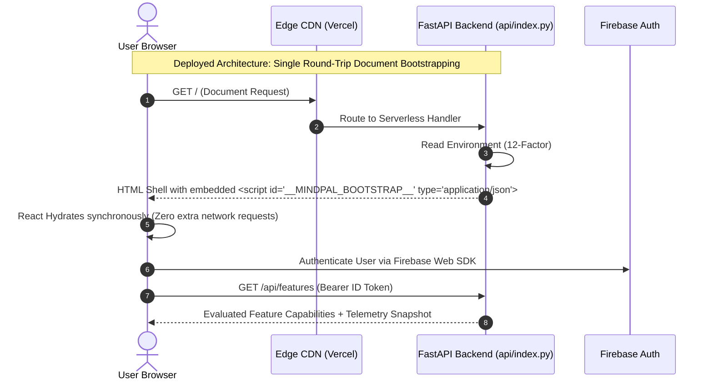

# MindPal Engineering Standards: Client Configuration, Secrets, and Feature Lifecycles

> **Author**: Staff Software Engineering Architecture Review  
> **Target Audience**: Core Platform, Security, and Full-Stack Engineering Teams  
> **Status**: Active Technical Standard & Migration Blueprint  
> **Classification**: Internal Production Architecture Specification  

---

## 1. Executive Summary & Root Cause Post-Mortem

Modern high-scale production systems (Google, OpenAI, Meta, Stripe, Netflix) enforce strict boundaries between **client runtime configuration**, **server-side secrets**, and **feature release lifecycles**.

In early iterations of MindPal, two common architecture smells accumulated:

1. **The Loose Client Configuration Script (`/runtime-config.js`)**:
   A dedicated JavaScript file dynamically generated by the backend and served to the browser, placing an untyped object on `window.MINDPAL_CONFIG`. This introduces an extra HTTP round-trip, race conditions during module initialization, cache invalidation complexities, and exposes internal infrastructure flags directly in the browser's DevTools.
2. **Version-Suffixed Feature Debt (`VOICE_V4_PREVIEW_APPROVED`, `memory_graph_v2`)**:
   Branch-specific and experiment-specific names littered across configuration files, environment variables, and backend payloads long after the experiment concluded. In tier-1 software organizations, leaving versioned flags in production code is classified as critical technical debt that violates trunk-based development principles.

This document establishes the official architectural standard for how MindPal handles client configuration, secret management, feature flagging, and feature sunsetting.

---

## 2. Client Configuration Architecture: Big Tech vs. Hobby Patterns

### 2.1 Public Identifiers vs. Server Secrets

A foundational misunderstanding in web development is the confusion between **Public Client Identifiers** and **Server Secrets**.

| Property | Public Client Identifier | Server Secret |
| :--- | :--- | :--- |
| **Examples** | Firebase Web API Key, Firebase Project ID, Google OAuth Web Client ID, Stripe Publishable Key (`pk_live_...`), Sentry DSN | Firebase Service Account Private Key, Stripe Secret Key (`sk_live_...`), Database Passwords, JWT Signing Secrets, LLM Provider Keys (Gemini, OpenRouter, Groq) |
| **Location** | Browser DOM / JavaScript Bundle | Server RAM / Encrypted Secret Store (GSM, AWS Secrets Manager, Vercel Vault) |
| **Can Users See It?** | **YES** (Must be sent in cleartext by the browser in HTTP headers/query params) | **NEVER** (Exposing this is a P0 security breach) |
| **How It Is Secured** | Domain whitelisting, CORS, OAuth redirect URI restrictions, Firebase Security Rules, Firebase App Check (reCAPTCHA v3) | IAM roles, network firewalls, secret scanning, rotation policies |

> [!NOTE]
> **Google's Official Firebase Security Model**:
> Firebase Web API keys (`AIzaSy...`) are **not secrets**. They simply identify your Google Cloud project to Google's backend. Security is enforced by **Firebase Security Rules** (Firestore/Storage rules) and **Firebase App Check**, never by attempting to hide the Web API key from the browser. Any client interacting with Firebase Auth or Firestore *must* possess this key.

However, **how** that public configuration is delivered to the browser is where professional engineering separates itself from amateur implementations.

---

### 2.2 The Three Tier-1 Client Configuration Patterns

Big Tech does not use loose runtime config script endpoints (`/runtime-config.js`) returning mutable globals. Instead, three standard patterns are deployed:

```
┌─────────────────────────────────────────────────────────────────────────────┐
│                          CONFIGURATION STRATEGIES                           │
└─────────────────────────────────────────────────────────────────────────────┘

[Pattern A: Build-Time Inlining] (Vite / Next.js / Cloudflare Pages)
   CI/CD Build ──> Static Bundle (`import.meta.env.VITE_FIREBASE_API_KEY`) ──> CDN Edge
   • Zero runtime latency
   • Immutable hashing & edge cacheable
   • Requires bundle re-compile per environment (Dev/Staging/Prod)

[Pattern B: Server Document Injection] (GitHub / Slack / Linear / Google Workspace)
   Browser ──> GET / ──> Server injects <script type="application/json" id="__CONFIG__">
   • 1 single HTTP request (zero network waterfall)
   • Fully 12-factor compliant (same build artifact across environments)
   • Strongly typed, frozen, read synchronously on hydration

[Pattern C: Authenticated BFF Session Bootstrapping] (OpenAI ChatGPT / Stripe / Netflix)
   Browser ──> Authenticates ──> GET /api/session/bootstrap
   • Dynamic per-user feature flags (LaunchDarkly / Statsig)
   • Zero exposure of project metadata to unauthenticated users
   • Single source of truth for user profile, permissions, and tenant capabilities
```

#### Pattern A: Build-Time Inlining (Static CDN Hosting)
- **Used by**: Next.js (`NEXT_PUBLIC_*`), Vite (`VITE_*`), Create React App.
- **Mechanism**: Variables are baked directly into the bundled `.js` files at build time (`process.env.VITE_FIREBASE_API_KEY` is replaced with `"AIzaSy..."` by esbuild/rollup).
- **Pros**: Fastest possible performance; bundle is 100% static and can be served from global CDN edges (Cloudflare, AWS CloudFront) with aggressive caching (`max-age=31536000, immutable`).
- **Cons**: Requires building separate artifacts per environment or rebuilding during container promotion.

#### Pattern B: Document Bootstrapping via Inlined JSON (12-Factor SSR Shell)
- **Used by**: GitHub, Slack, Linear, Google Workspace.
- **Mechanism**: The server serves `index.html` and injects an inline non-executable JSON block into `<head>`:
  ```html
  <script id="__MINDPAL_CONFIG__" type="application/json">
    {
      "apiBaseUrl": "/api",
      "environment": "production",
      "firebase": {
        "apiKey": "AIzaSy...",
        "authDomain": "mindpal-official-0.firebaseapp.com",
        "projectId": "mindpal-official-0"
      }
    }
  </script>
  ```
  The React application reads it synchronously before hydration:
  ```typescript
  const config = JSON.parse(document.getElementById('__MINDPAL_CONFIG__')!.textContent!);
  ```
- **Pros**: 
  - Eliminates the extra network round-trip of `/runtime-config.js`.
  - Zero possibility of a script execution race condition.
  - Immune to script tag injection or mutable prototype poisoning.
  - Same Docker container or serverless function runs across Dev, Staging, and Production.

#### Pattern C: Authenticated BFF Bootstrapping (Enterprise SPA)
- **Used by**: OpenAI (ChatGPT web client), Stripe Dashboard, Spotify.
- **Mechanism**: The public static shell contains *no* client keys or feature flags. Upon opening the app or signing in, the client fires a single bootstrap call:
  `GET /api/session/bootstrap` or `GET /api/me/context`.
- **Response**:
  ```json
  {
    "user": { "id": "usr_123", "email": "user@example.com" },
    "tenant": { "tier": "pro", "locale": "en-US" },
    "capabilities": {
      "voice_enabled": true,
      "cloud_sync": true,
      "advanced_models": true
    },
    "tokens": {
      "voice_session_token": "ey..."
    }
  }
  ```
- **Pros**: Maximum security posture. No project internals, feature flags, or endpoints are revealed to anonymous bots, scrapers, or logged-out visitors.

---

## 3. The Feature Versioning & Flag Debt Anti-Pattern

### 3.1 The "Voice_v4" Smell

Why is naming a variable `VOICE_V4_PREVIEW_APPROVED` or `voice_v4_enabled` an anti-pattern?

1. **Temporal Coupling**: What happens when Voice v5 is created? Do you introduce `VOICE_V5_PREVIEW_APPROVED` and leave v4 as a zombie toggle?
2. **Cognitive Overhead**: New engineers joining the team have no context on what "v1", "v2", or "v3" were, or why "v4" is special.
3. **Leaked Implementation Details**: Exposing `VOICE_V4` to client code reveals internal development iterations, prototype failures, and git branch naming in production payloads.
4. **Permanent Ghost Code**: Teams forget to delete experimental checks. If an experiment finishes and reaches 100% release, keeping `if (VOICE_V4_PREVIEW_APPROVED)` is pure dead code debt.

---

### 3.2 How Big Tech (Google / OpenAI / Meta) Manages Feature Lifecycles

In Google (using internal systems like Aubrey and Moma) and Meta/OpenAI (using Statsig, LaunchDarkly, or GrowthBook), features follow a formal **4-Phase Lifecycle**:

```
┌─────────────────────────────────────────────────────────────────────────────┐
│                       ENTERPRISE FEATURE LIFECYCLE                          │
└─────────────────────────────────────────────────────────────────────────────┘

  [Phase 1: Dark Launch]
  ├── Name: Semantic Domain Taxonomy (`voice.realtime_session`)
  ├── Default: OFF (0% user traffic)
  └── Scope: Internal allowlist (employees / @company.com)

           │
           ▼

  [Phase 2: Canary & Experimentation]
  ├── Traffic: 1% ──> 5% ──> 25% ──> 50%
  ├── Telemetry: Automated error-rate, latency, and regression guards
  └── Kill Switch: Automatic rollback if P99 latency spikes or crash rate > 0.01%

           │
           ▼

  [Phase 3: General Availability (GA)]
  ├── Traffic: 100% rollout
  ├── Status: The feature is now the canonical production behavior
  └── Clock Starts: 30-Day Mandatory Sunset SLA

           │
           ▼

  [Phase 4: Dead Code Elimination SLA]
  ├── Action: Delete the feature flag, delete the conditional `if/else`
  ├── Enforcement: Automated CI linters flag any toggle older than 60 days
  └── Result: Codebase remains lean; zero legacy baggage
```

### 3.3 The Rules of Enterprise Feature Flagging

1. **Rule 1: Domain-Driven Taxonomy, Never Iteration Numbers**
   - ❌ Bad: `voice_v4_enabled`, `memory_graph_v2`, `flag_new_ui_october`
   - ✅ Good: `voice.realtime_streaming`, `memory.graph_sync`, `ui.canvas_layout`
2. **Rule 2: Features Are Capabilities, Not Versions**
   - A client checks if a capability exists (`flags.voice_enabled`), never what internal code generation was used to build it.
3. **Rule 3: Feature Flags Are Temporary By Design**
   - Every feature flag must have an assigned owner and a **Sunset Date**.
   - If a flag is permanent, it is not a feature flag; it is an **Operational Config** or **User Preference** (e.g., `theme: 'dark'`).
4. **Rule 4: Automated Dead Flag Sunsetting (The "Piranha" Pattern)**
   - Uber built and open-sourced **Piranha** (used across major tech companies), an automated bot that scans the AST for resolved feature flags, removes the `if (flag)` checks, deletes the dead branches, and automatically opens a pull request to clean the codebase.

---

## 4. MindPal Architecture Modernization Blueprint

### 4.1 What Has Been Completed (Remediation & Upgrades)

1. **Purged Dead `VOICE_V4_*` Variables**:
   - Removed `VOICE_V4_PREVIEW_APPROVED`, `VOICE_V4_PREVIEW_SESSION_ENABLED`, `VOICE_V4_DIAGNOSTICS`, and `SHOW_RESPONSE_DEBUG` from [backend/main.py](file:///e:/Synthos/MindPal/backend/main.py) and [frontend/runtime-config.js](file:///e:/Synthos/MindPal/frontend/runtime-config.js).
2. **Enterprise Feature Lifecycle Engine Implemented**:
   - Built [backend/domain/flags/models.py](file:///e:/Synthos/MindPal/backend/domain/flags/models.py) defining standard stages (`DARK_LAUNCH`, `CANARY`, `BETA`, `GA`, `SUNSET`) and audit reasons.
   - Built [backend/domain/flags/engine.py](file:///e:/Synthos/MindPal/backend/domain/flags/engine.py) with deterministic SHA-256 consistent bucketing (`compute_bucket`) and dual-layer telemetry.
   - Updated [backend/domain/flags/flags.py](file:///e:/Synthos/MindPal/backend/domain/flags/flags.py) to wrap the engine and serve `GET /api/features`.
3. **Pattern B Document JSON Bootstrapping Deployed**:
   - Updated [backend/main.py](file:///e:/Synthos/MindPal/backend/main.py) (`GET /`) to synchronously inject `<script id="__MINDPAL_BOOTSTRAP__" type="application/json">` and frozen config directly into the initial HTML document payload.
   - Replaced `<script src="/runtime-config.js"></script>` in [frontend/index.html](file:///e:/Synthos/MindPal/frontend/index.html) with the inline bootstrap script. Zero network round-trips; instant React hydration.
   - Created [frontend/src/services/config.ts](file:///e:/Synthos/MindPal/frontend/src/services/config.ts) for strongly-typed client configuration access.
4. **Automated Enterprise Governance Test Suite**:
   - Added [tests/unit/platform/test_feature_lifecycle.py](file:///e:/Synthos/MindPal/tests/unit/platform/test_feature_lifecycle.py) validating:
     - No version numbers allowed in feature keys (rejects `_v2`, `_v3`, `_v4`).
     - Consistent hashing determinism.
     - All lifecycle stage semantics (`DARK_LAUNCH`, `CANARY`, `GA`, `SUNSET`).
     - Zero service account secrets in document payloads.

---

### 4.2 Production Document Bootstrapping Architecture



### 4.3 Checklist for Future Features

Before introducing any new feature toggle or runtime setting, engineers must ensure:

- [ ] **No Version Numbers in Identifiers**: Never use `_v2`, `_v3`, or `_v4` in variable names, flags, or endpoints.
- [ ] **Public vs. Secret Separation**: Never pass backend service keys, database passwords, or private API tokens to any client-accessible endpoint.
- [ ] **Sunset Date Recorded**: Every feature flag must have a target deprecation date (maximum 60 days from launch).
- [ ] **Zero DevTools Pollution**: Clean namespaces; no loose global variables attached to `window`.
- [ ] **Automated Regression Suite**: Unit tests must assert that configuration endpoints fail closed when credentials are omitted.
