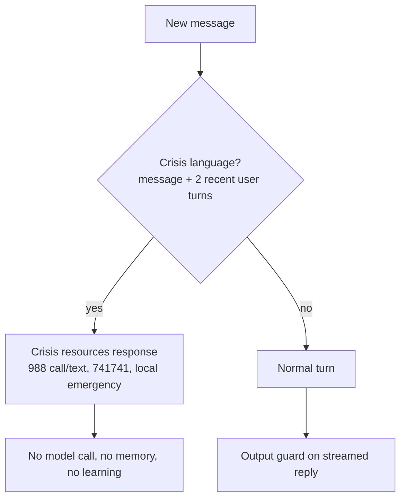
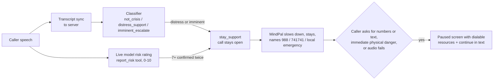

# Safety

MindPal is a wellness companion, not a crisis line, clinician or emergency
service. Safety behavior is never adjusted by platform load or learned style.

## Text chat

- Detection: normalized English and Arabic patterns with benign-idiom
  exclusions (`domain/safety/modes/chat/classify.py`, `configs/json/safety.json`).
  Recent history is re-screened so a disclosure can't be hidden one turn back.
- The output guard drops any streamed token that would complete companion-breaking
  boilerplate such as "as an AI language model"
  (`domain/safety/shared/output_guard.py`, patterns in `configs/json/safety.json`).
- Crisis turns are excluded from memory extraction, the conversation journal,
  AI summaries and the adaptive profile.

## Live voice

- The classifier reads meaning, not keywords, and tolerates imperfect model
  output. An unparseable or unavailable verdict is **unverified**, never "safe",
  and the safety lease then blocks renewal.
- The Live model's rating is a second signal, because it hears tone and pauses
  that transcripts lose. It is not treated as proof of safety.
- MindPal's own words (including offering 988) never count as caller risk.

## Guarantees and limits

- Crisis detection, resources, the voice classifier and its lease are exempt
  from load shedding.
- Nothing ends a call on the caller because of risk.
- Detection is not clinical screening and does not catch every crisis. The UI
  says so where resources are shown.

Tests: `tests/backend/voice/test_voice_crisis_classifier.py`,
`test_voice_safety_*`, `tests/frontend/test_voice_crisis_enforcement.mjs`,
`test_voice_distress_safety_contracts.mjs`.
