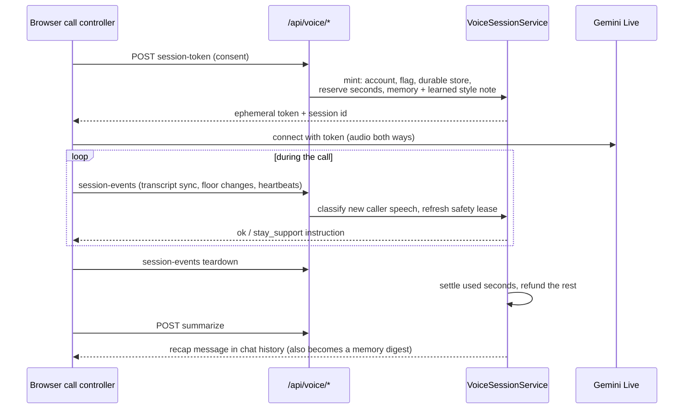
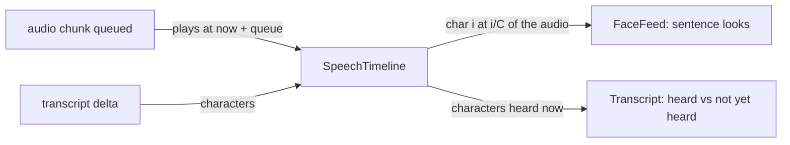

# Live Voice

Full-duplex calls with Gemini Live. The browser streams audio directly to
Gemini; the backend owns entitlement, quota, safety verification and privacy.
Live voice requires a signed-in account (dictation works for everyone).

## Call lifecycle

A call starts knowing the person: their AI summary, open threads and most
salient facts are sealed into the Live instruction at mint (server-set only; a
client-supplied value is dropped). Recall tools still work mid-call.

## Quota

Accounts reserve up to the daily cap (30 minutes) when a call starts; teardown
settles on server-observed time and refunds the rest. A crashed tab is reclaimed
on the next mint rather than billed to the wall clock. Limits live in
`configs/json/voice_runtime.json`.

Settlement happens exactly once:

- Teardown flips the session to `torn_down` in a store transaction that also
  records the refund owed. Of two concurrent teardowns, only one settles.
- The refund is keyed by session id on the usage document and only applies to
  the day the hold was charged (`charged_day`). A replay or a retry after a
  crash can't refund twice, and a refund after midnight can't reduce the new
  day's count.
- `torn_down` is final. Later events get `action: "ended"` and change nothing.
  All session writes go through `backend/domain/voice/runtime/records.py`, which never reopens a
  settled session, never lifts a crisis freeze, and never recreates a deleted
  one.
- If the session can't be saved after the token is minted, the hold is
  refunded at once.
- Deleting account data keeps the usage counters, so it isn't a quota refill.

## Session states

`minted -> warm -> listening <-> speaking`, with `stay_support` layered on when
distress is verified, and `torn_down` at the end. Renewing the token requires a
fresh **safety lease**: a verified classifier verdict (or no caller speech yet)
within the stale window. A client that stops sending transcripts is treated as
unverified, not safe.

## Safety in calls

See [safety.md](safety.md#live-voice). In short: distress and even imminent risk
keep the call open with support-mode instructions; MindPal names immediate help
out loud. Two independent signals feed it: the server classifier on the
transcript, and the Live model's own risk rating.

## Keeping the face and caption on the voice

Gemini Live streams MindPal's audio and its transcript separately, and either can
arrive first. `voice/call/speechTimeline.ts` joins them:

- Each audio chunk is placed on the wall clock where it will play. A gap where
  the queue ran dry stays a gap.
- Character *i* of *C* known characters sits at *i/C* of the known audio. The
  mapping corrects itself as either side catches up and is exact when the
  reply ends.
- The face classifies MindPal's sentences for tone with up to three checks in
  flight. It places each look when its sentence is due, using the timeline as
  it stands then. A look whose sentence has already been heard is dropped, not
  shown late. When playback ends, anything still pending is discarded.
- The caption shows words already heard at full strength and the rest faintly.
  That is the "speaking" indicator. It keeps tracking a reply after it moves
  into history, because generation finishes seconds before the audio does.
- An 80 ms speech clock (`SPEECH_TICK_MS`) drives both, so muting the mic,
  which stops mic frames, does not slow them down.

## Components

| Area | Backend | Frontend |
|---|---|---|
| Session, quota, lease | `domain/voice/services/session.py`, `domain/voice/runtime/usage.py` | `voice/call/callController.ts`, `callMachine.ts` |
| Token and live prompt | `domain/voice/services/token.py`, `providers/gemini/` | `voice/control/geminiLive.ts` |
| Safety | `domain/safety/modes/voice/classify.py` | `voice/safety/` |
| Face and reactions | `domain/voice/services/reaction.py` (load-aware) | `voice/face/`, `voice/call/faceFeed.ts`, `voice/call/speechTimeline.ts` |
| Recall during calls | `domain/voice/services/recall.py` | tool calls in `voice/call/` |
| Privacy, retention, analytics | `domain/voice/privacy.py`, `telemetry.py`, `analytics.py` | `voice/diagnostics/` (redacted traces) |

Retention runs daily from the scheduler (`/api/internal/voice-retention`).
Support can read redacted traces with the support credential only.
