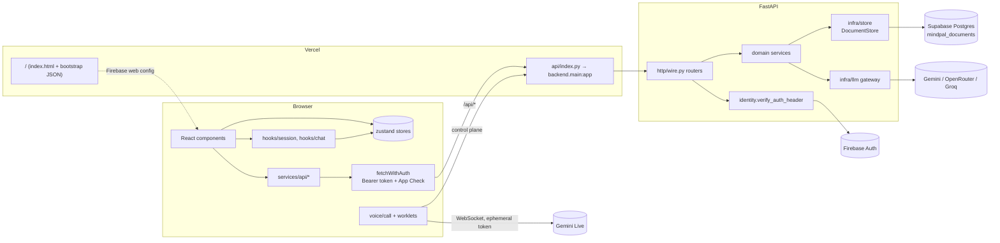
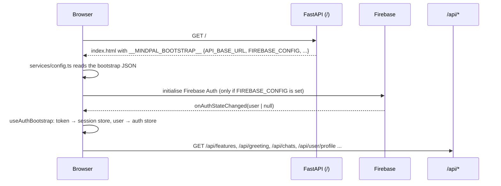
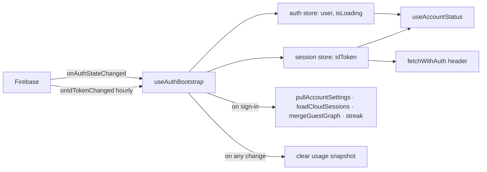
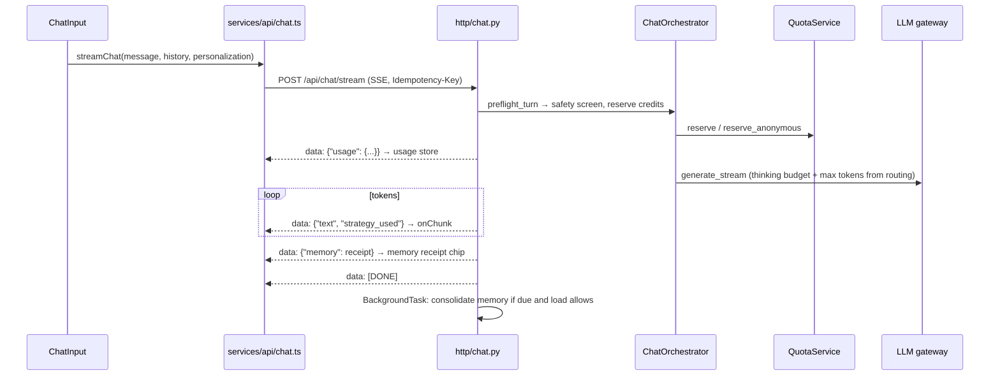
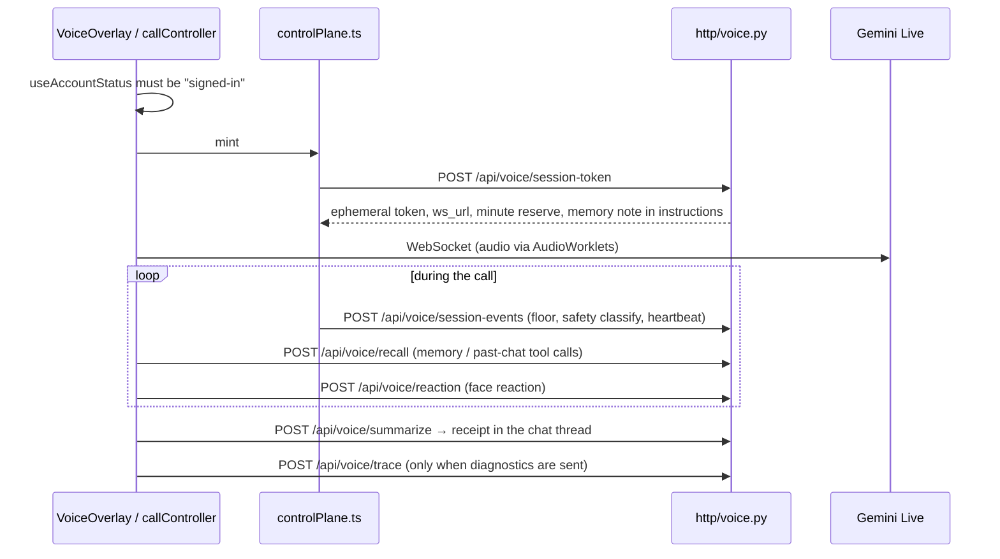

# Frontend ↔ Backend Wiring

How every screen in the app reaches the backend, and what happens when a link breaks.
For the layers inside the backend, see [architecture.md](architecture.md). The API
contract is `contracts/openapi.yaml`.

## The whole path

Three rules hold everywhere:

1. **Every call goes through `fetchWithAuth`** (`frontend/src/services/api/http.ts`). It
   attaches `Authorization: Bearer <Firebase ID token>` and `X-Firebase-AppCheck`, retries
   once with a refreshed token after a 401, and turns error bodies into `ApiError`.
2. **Every route first calls `verify_auth_header`** (or `account_guard`, which requires an account).
   That gives a `UserSession` with `user_id_hash`, and nothing else identifies the caller.
   A guest gets no account storage. Their chat credits are counted per network (`anon_rate_limits`).
3. **Routes are thin.** `backend/http/*` validates the request and calls one domain service. Storage
   is reached only through the `DocumentStore` protocol (`get_store()`).

## Page boot

The Firebase web config is **injected by the backend** into the page. If the backend cannot
start, the page gets `{}`, sign-in never initialises, and everyone looks like a guest. So a bad
storage setting no longer crashes the process (see "When a link breaks" below).

## Who is signed in

There is one answer: `useAccountStatus()` in `frontend/src/hooks/session/useAccountStatus.ts`.

| Status | Meaning | What the UI does |
|---|---|---|
| `loading` | Firebase has not reported yet | Shows nothing account-specific (no guest-gate flash) |
| `unavailable` | No Firebase config on this deployment | No sign-in button; explains that sign-in is down |
| `signed-in` | Firebase has a user | Account features on; token comes from the session store |
| `guest` | Firebase reported no user | Guest copy and a sign-in button |

Components use `useIsSignedIn()` for "is this an account?". Data hooks such as
`useWellnessTimeline` and `useChangelogBootstrap` still check the session store's token,
because they need a token in hand to make the request.

## Feature map

| Feature | UI (frontend/src) | Client call | Route → module | Domain | Stored in |
|---|---|---|---|---|---|
| Chat reply | `components/chat/input/ChatInput.tsx`, `components/chat/canvas/ChatCanvas.tsx` | `ApiClient.streamChat` | `POST /api/chat/stream` → `http/chat.py` | `chat.orchestrator` (safety → strategy → grounding → LLM → output guard) | `idempotency_records`, `user_quotas` / `anon_rate_limits`, `memory_journal` |
| Reply rating | `ChatCanvas.tsx` thumbs | `ApiClient.rateReply` | `POST /api/chat/feedback` → `http/identity.py` | `adaptation.profile` | `adaptive_profiles` |
| Chat history | `store/history.ts`, `components/chat/history/ChatHistoryModal.tsx` | `listChatSessions`, `saveChatSession`, `deleteChatSession` | `GET/POST /api/chats`, `DELETE /api/chats/{id}` → `http/sessions.py` | `identity` | `chat_sessions` |
| Greeting | `hooks/chat/useGreeting.ts` | `ApiClient.getGreeting` | `GET /api/greeting` → `http/sessions.py` | `greeting.engine` (follow-up questions) | `greeting_cache`, `user_presence` |
| Usage | `components/settings/tabs/UsageSettingsTab.tsx` | `ApiClient.refreshUsage`, `voiceApi.getVoiceUsage` | `GET /api/usage` → `http/usage.py`; `GET /api/voice/usage` → `http/voice_ops.py` | `quota.QuotaService.snapshot*`; `voice.services.session` | `user_quotas`, `anon_rate_limits`, `voice_minute_reservations` |
| Memory | `components/memory/MemoryInspector.tsx` | `getMemoryGraph`, `patchMemoryGraphItem`, `deleteMemoryGraphItem`, `getMemorySummary`, `refreshMemorySummary`, `forgetMemoryNarrative` | `/api/memory/*` → `http/memory.py` | `memory.graph`, `memory.editing`, `memory.consolidation` | `memory_graphs`, `memory_journal`, `memory_jobs` |
| Guest memory merge | `useAuthBootstrap` on sign-in | `mergeGuestGraphIntoAccount` | `PUT /api/memory/graph` | `memory.graph` | `memory_graphs` |
| Settings | `settings/tabs/*`, `store/settings.ts` | `services/sync/settingsSync.ts` → `getUserProfile`, `patchUserProfile` | `GET/PATCH /api/user/profile` → `http/identity.py` | `identity` | `user_profiles.settings` |
| Learned style | `components/settings/tabs/PersonalizationSettingsTab.tsx` | `getAdaptation`, `resetAdaptation` | `GET/DELETE /api/user/adaptation` | `adaptation.profile` | `adaptive_profiles` |
| Streak and insights | `store/streak.ts` | `getUserInsights` | `GET /api/user/insights` | `identity` | `session_telemetry` |
| Wellness timeline | `hooks/session/useWellnessTimeline.ts` | `getWellnessTimeline` | `GET /api/user/wellness-timeline` | `identity` | `session_telemetry` |
| Export / delete data | `components/settings/SettingsModal.tsx` | `exportUserData`, `deleteUserData` | `GET /api/user/export`, `DELETE /api/user/data` | `identity` (graph, voice, profile, chats) | all of the user's rows |
| Feature flags | `hooks/session/useAppBootstrap.ts` | `getFeatureFlags` | `GET /api/features` → `http/flags.py` | `flags` | config + Supabase control plane |
| Changelog | `components/changelog/ChangelogModal.tsx` | `getChangelog`, `dismissChangelog` | `GET/POST /api/release/changelog` → `http/release.py` | `release.changelog` | `changelog_dismissals` |
| Live voice | `components/voice/VoiceOverlay.tsx`, `voice/call/*` | `voice/control/controlPlane.ts`, `voiceApi.*` | see below | `voice.services.*` | `voice_*` collections |

## A chat turn

Crisis turns never reserve credits. The first event is the crisis response with
`is_crisis: true`, and the stream ends there.

## A live voice call

Guests never reach the mint. The overlay shows the sign-in gate. If sign-in is
unavailable, it says so, and after a guest signs in the call starts without a retry.

## When a link breaks

| What fails | What the user sees | Why |
|---|---|---|
| Storage setting missing (e.g. `SUPABASE_URL`) | The page and sign-in load. Data features answer 503 "storage is not configured". `/api/health/ready` names the missing setting | `UnavailableStore` stands in, and `create_app` logs it instead of crashing |
| Supabase unreachable | Reads served from cache while degraded. Writes and limits fail closed with 503 | Circuit breaker in the store providers |
| Backend down completely | Page shell has no Firebase config, so the voice screen says sign-in is unavailable instead of offering a dead button | `useAccountStatus() === 'unavailable'` |
| ID token expired mid-session | One silent retry with a refreshed token | `fetchWithAuth` + `onIdTokenChange` |
| Usage fetch fails | "Usage is unavailable right now". Limits are still enforced server-side | `UsageSettingsTab` |
| Settings push fails | Settings stay on the device. The next change or sign-in retries the diff | `settingsSync.ts` |

## Server-only routes

These are called by schedulers, operators, or not by the web app at all. They are listed
here on purpose so nobody deletes them for looking unused.

| Route | Caller |
|---|---|
| `GET /api/health`, `GET /api/health/ready` | Uptime checks, deploy checks |
| `GET /api/internal/memory-consolidation`, `GET /api/internal/voice-retention` | Vercel cron (`vercel.json`), `CRON_SECRET` |
| `GET /api/internal/platform-pulse`, `/api/internal/voice-diagnostics*` | Operators |
| `GET /api/voice/analytics`, `GET /api/voice/audit` | Support tooling, owner-scoped |
| `GET /api/system/route-catalog` | Operators and tooling |
| `GET /api/memory/journal`, `POST /api/sessions/telemetry`, `GET /api/user/me`, `/api/chats/current*` | API clients. The web app no longer calls these |

## Guards that keep this true

| Check | Catches |
|---|---|
| `tests/backend/api/test_frontend_wiring.py` | A frontend `/api/...` call with no matching route (renamed or removed endpoint) |
| `scripts/ci/check_architecture.py` | Routes missing from `contracts/openapi.yaml`, `http` importing `infra`, oversized routes |
| `tests/backend/storage/test_misconfigured_storage.py` | A storage misconfiguration crashing the whole app again |
| `tests/frontend/test_account_and_usage.mjs` | Split "signed in?" answers, invented usage limits, invalid synced settings |
| `tests/backend/api/test_tenant_isolation.py` | Account routes answering unauthenticated callers |
